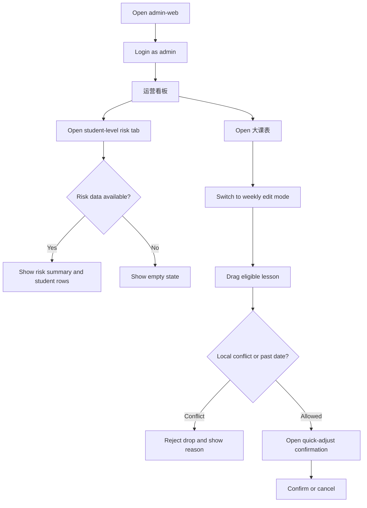
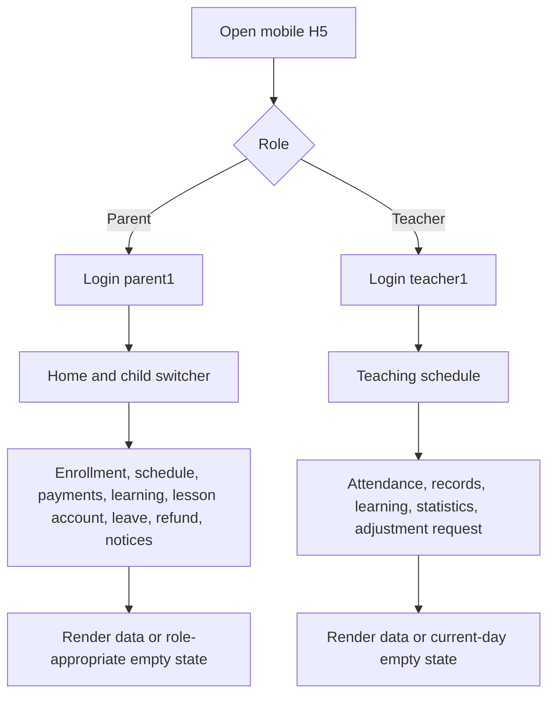

# Dogfood Report — dev/iteration-next

> Diff-scoped browser QA of `dev/iteration-next` against `master`, performed on 2026-09-07.

## Diff Summary

- Added the student loss-risk scoring panel, follow-up status, notification and export flows.
- Added SSE notification hardening and an outbound notification channel abstraction.
- Added the visual weekly schedule editor, drag/drop guardrails, conflict hints and CAS quick-adjust API.
- Added related backend migrations, tests, observability changes and v1.2 planning documents.

## Personas

No standalone persona document was found; personas are inferred from the product requirements and the current UI.

- **教务管理员/超级管理员** — maintain classes and schedules, detect conflicts quickly, and follow up with at-risk students.
- **财务管理员** — inspect payments, refunds, lesson balances and salaries without seeing unauthorized operational controls.
- **家长** — check a child’s enrollment, schedule, attendance, learning records, balance and notices.
- **教师** — check teaching schedules, attendance, learning records, statistics and adjustment requests.

## Flows Tested

### 管理后台：风险预警与排课

### 移动端：家长与教师工作台

## Test Matrix & Results

| # | Flow | Journey / Scenario | Status | Issue | Fix | Commit |
|---|------|--------------------|--------|-------|-----|--------|
| 1 | Runtime | Initialize local `edu_admin` database and start backend on 8080 | Pass | Database was absent before initialization; seeded with `sql/reset.sql` | - | - |
| 2 | Admin | Login as `admin`, load dashboard metrics and risk-warning tab | Pass | Risk panel displayed 15 students, including high/medium risk summary | - | - |
| 3 | Admin | Open big schedule weekly view and inspect populated lessons | Pass | Weekly schedule rendered populated lesson cards | - | - |
| 4 | Admin | Enable big schedule edit mode and inspect guardrail copy | Pass | Edit switch and “past/conflict/backend final check” hint rendered | - | - |
| 5 | Admin | Perform native drag/drop quick-adjust interaction in in-app browser | Pass | Native browser drag moved the 2026-09-08 水彩画课次 from 09:00 to 10:00; the confirmation dialog showed the time change and notification scope, and confirming produced a success toast | - | - |
| 6 | Admin | Open 17 core admin pages and wait for seeded data | Pass | All pages loaded; list totals matched seeded data (12 students, 12 courses, 12 classes, 232 lessons, etc.) | - | - |
| 7 | Parent | Login as `parent1` and open enrollment page | Pass | Courses, prices, enrollment state and class counts rendered | - | - |
| 8 | Parent | Open schedule, enrollment history, payments, learning, lesson account, leave, refund and notices | Pass | All requested pages rendered data or a valid form/empty state | - | - |
| 9 | Teacher | Login as `teacher1` and open schedule, attendance, records, learning, statistics and adjustment request | Pass | All pages loaded; current-day attendance correctly showed no lesson data for that day | - | - |
| 10 | Auth | As finance user, open a forbidden `/admin/users` route | Pass | Router redirected back to dashboard; finance menu only exposed finance operations | - | - |
| 11 | Export | Click dashboard “导出课时消耗”; inspect backend response | Pass | Browser click reached `/api/export/lesson-flows`; response was HTTP 200, XLSX MIME, attachment filename, 5680 bytes, and ZIP/XLSX magic `PK 03 04`. The in-app automation still did not surface a download-complete event/file | - | - |
| 12 | Regression | Run backend, admin-web and mobile automated tests | Pass | Backend 464 tests, admin-web 116 tests, mobile 6 tests passed | - | - |

## What Was Fixed

None. No repository code was changed during this validation run.

## Paper Cuts (by persona)

- **财务管理员** — initial dashboard load briefly emitted several `无权访问该接口` toasts while unauthorized analysis requests settled; the dashboard then displayed valid finance-visible metrics — medium — deferred.
- **教务管理员** — the first CUA drag attempt did not trigger the HTML5 drop callback, but a coordinate-based native browser drag later completed the confirmation and save flow successfully — low tooling friction — resolved during follow-up verification.
- **开发/验收人员** — Element Plus logs a deprecation warning for the pagination `small` API; it does not affect the current flow — low — deferred.

## Console Errors

No browser-level errors were observed in admin-web or mobile H5. Admin-web emitted Element Plus deprecation warnings only. The first backend run also logged `Unknown database 'edu_admin'`; after seeding the database, subsequent requests and scheduled tasks completed normally.

## Human Verifications

- Native drag/drop quick-adjust confirmation and final save passed in the visible in-app browser; the save produced a success toast and a mobile notification.
- Export returned a valid XLSX response (HTTP 200, correct MIME/disposition, 5680 bytes, `PK 03 04` header); only the in-app automation layer’s download-complete event/file visibility remains unavailable.
- Payment and SMS are intentionally simulated in this project; no real external transaction or message delivery was attempted.

## Decisions for a Human

None required to continue the current validation. The finance-dashboard unauthorized-toast behavior is a product/UX cleanup candidate rather than a blocker for the tested finance lists.

## Learnings

- The local database must be initialized before judging page data; the backend can start before the first scheduled database access and then log errors until `edu_admin` exists.
- Page-level smoke checks need a wait after navigation; several pages briefly showed empty tables while their asynchronous API requests were still loading.
- The current branch’s browser-visible changes are backed by focused tests: `BigSchedule`, `EditableWeekGrid`, `useScheduleDrag`, `RiskWarningPanel` and the backend risk/quick-adjust tests. The manual drag/save replay also produced a mobile notification titled “课次时间已调整”.

## Final Status

The branch is runnable locally and the core admin, parent and teacher journeys were verified in the in-app browser with seeded data. Automated verification is green: backend 464/464, admin-web 116/116 and mobile 6/6. Overall verdict: **ready for continued development/demo; the export response is verified as a valid XLSX, with only the in-app download UI event remaining opaque**.
