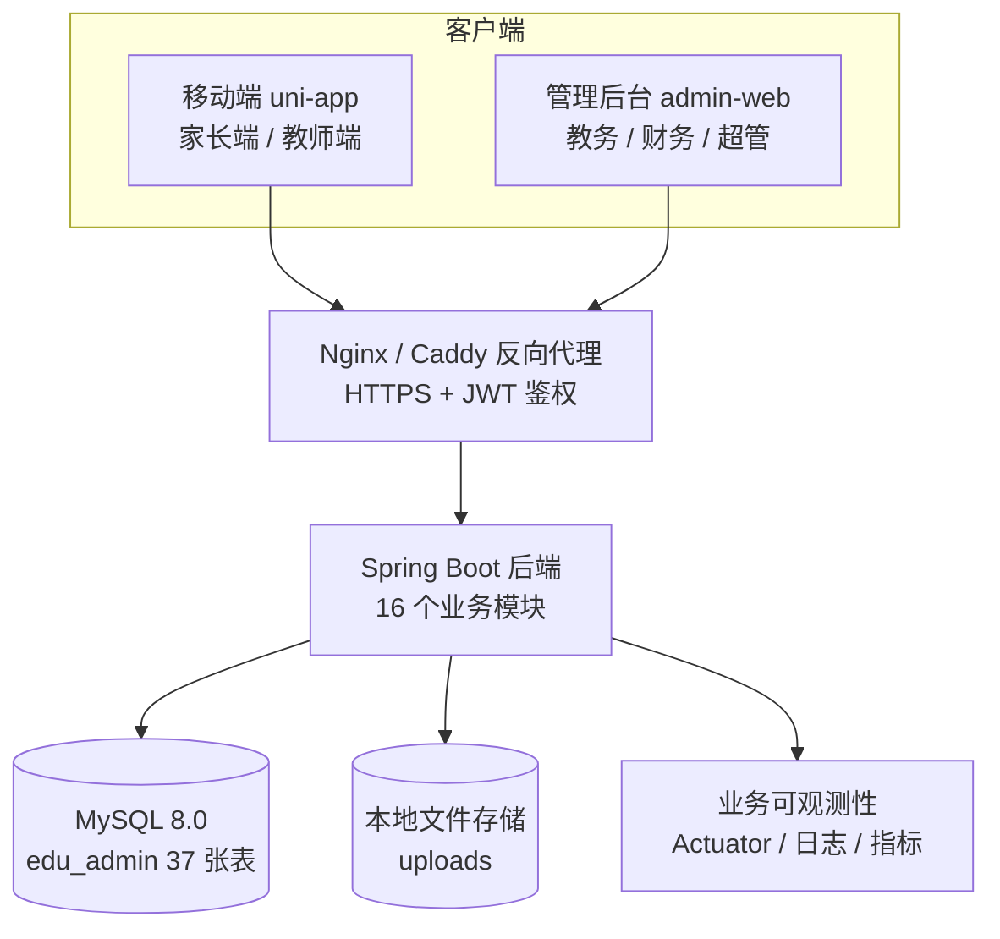
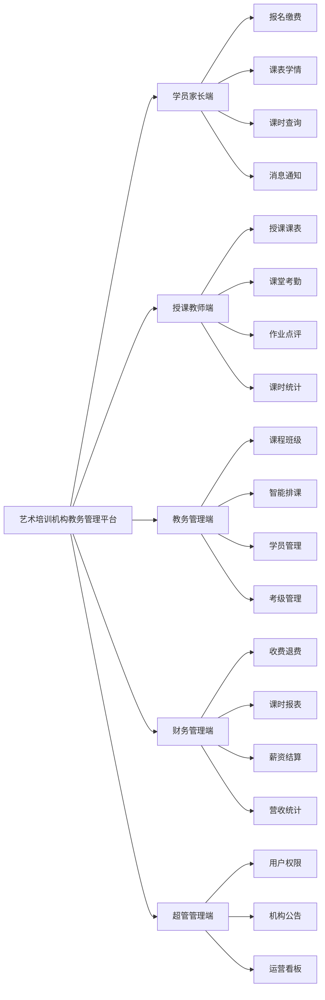
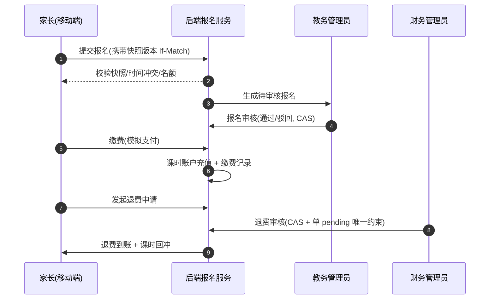
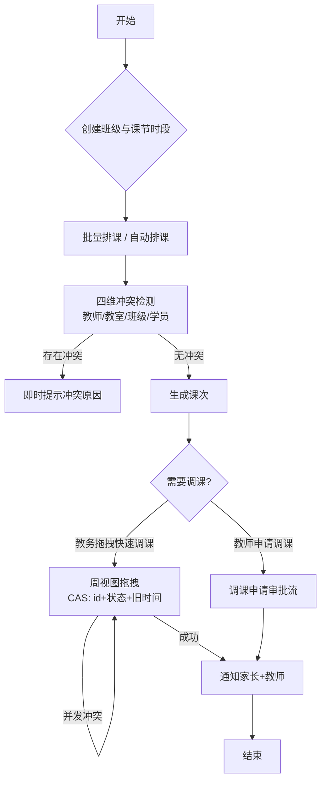
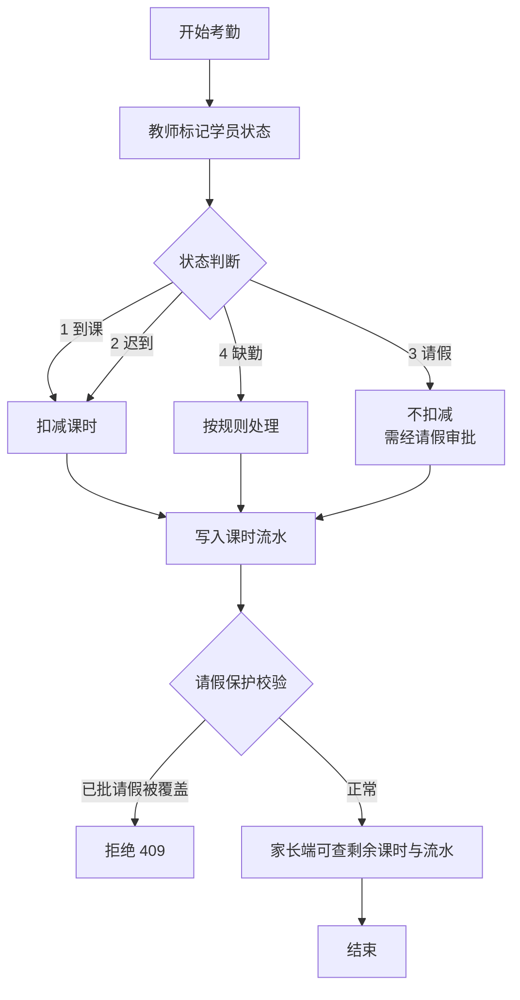
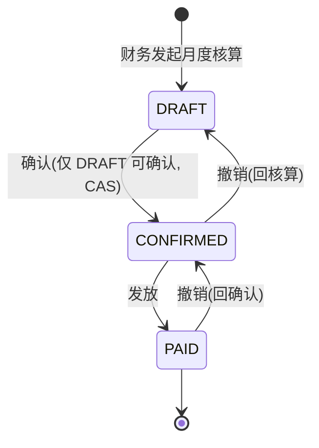
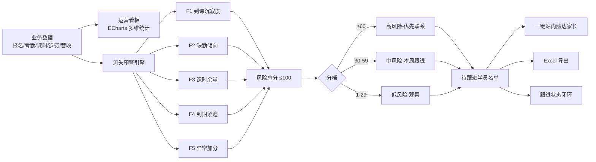
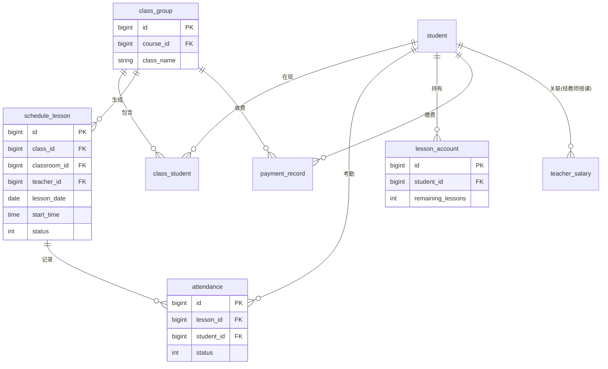

# 2  系统设计

## 2.1 系统总体设计

本系统采用前后端分离的 B/S 架构。前端划分为管理后台与移动端两个工程：管理后台面向教务管理员、财务管理员与超级管理员，承载复杂表格、表单与统计图表等重交互场景；移动端面向学员家长与授课教师，承载课表查看、报名缴费、考勤打卡、学情记录等高频轻量场景。后端采用 Spring Boot 提供统一的 RESTful 业务接口，两类前端共用同一套接口与业务规则，避免规则重复实现与数据不一致。

系统后端划分为 16 个功能模块：用户权限（user、auth）、学员课程（student、course、enrollment）、排课调课（schedule）、考勤学情（attendance、learning）、财务薪资（finance、salary）、考级通知（exam、notice、notification）、运营统计（statistics、risk）与文件服务（file），其中用户角色、权限与菜单等实体归属于用户模块统一管理。系统面向五类角色提供服务：学员家长（报名缴费、课表学情、课时查询、消息接收）、授课教师（授课课表、课堂考勤、作业点评、课时统计）、教务管理员（课程班级、排课调课、报名审核、考级管理）、财务管理员（收费退费、课时账户、薪资结算、营收统计）与超级管理员（用户权限、机构配置、公告管理、全局看板）。

系统总体架构如图 2.1 所示。

图 2.1  系统总体架构图

## 2.2 系统功能结构设计

本系统的主要功能按角色划分如表 2.1 所示。

表 2.1  系统功能结构表

| 角色 | 功能模块 | 核心功能点 |
|------|---------|-----------|
| 学员家长 | 报名缴费 | 课程查看、在线报名、报名状态查询、缴费记录 |
| 学员家长 | 课表与学情 | 周课表、考勤状态、教师评语、作业内容 |
| 学员家长 | 课时管理 | 剩余课时、消耗流水、到期提醒 |
| 学员家长 | 消息通知 | 上课提醒、调课通知、机构公告 |
| 授课教师 | 教学任务 | 个人课表、上课提醒、调课申请 |
| 授课教师 | 课堂管理 | 课堂考勤（4 状态）、请假审批、作业发布 |
| 授课教师 | 学情与统计 | 学情点评、成长档案、月度课时统计 |
| 教务管理员 | 课程与班级 | 课程类型、班级管理、课节时段设置 |
| 教务管理员 | 排课管理 | 自动排课、批量排课、拖拽快速调课、冲突检测、教室预约 |
| 教务管理员 | 学员管理 | 学员档案、报名审核、分班、转班、调课审批 |
| 教务管理员 | 考级管理 | 考级项目、报名、成绩录入、证书归档 |
| 财务管理员 | 收费管理 | 学费登记、续费、退费审核、收费台账 |
| 财务管理员 | 薪资管理 | 薪资规则、自动核算、确认发放、课时消耗报表 |
| 财务管理员 | 营收统计 | 月度营收、课程盈利、收费率统计 |
| 超级管理员 | 系统管理 | 用户、角色、权限、菜单、机构配置、公告 |
| 超级管理员 | 运营看板 | 招生数据、流失预警、教师工作量、全局统计 |

管理后台与移动端的主要页面如下：管理后台包含课程管理、班级管理、排课管理、大课表、学员管理、报名管理、考勤管理、考级管理、收费管理、课时账户、课时流水、退费管理、薪资管理、教室管理、运营看板、公告管理、用户管理、角色管理、菜单管理、机构配置与操作日志等页面；移动端家长端包含课程报名、缴费记录、学员课表、学情详情、课时账户、消息通知等页面，教师端包含我的课表、课堂考勤、作业发布、学情点评、调课申请与课时统计等页面。

系统功能结构如图 2.2 所示。

图 2.2  系统功能结构图

## 2.3 系统业务流程设计

### 2.3.1 报名、缴费与退费业务流程

学员家长在移动端选择课程并提交报名申请，教务管理员在管理后台对报名进行审核，审核通过后家长完成缴费，系统自动向对应课时账户充值课时并生成缴费记录。当学员因故退班时，家长发起退费申请，财务管理员审核通过后系统按规则计算应退金额，完成退费并回冲课时。报名申请提交前，系统通过报名决策快照对课程名额、时间冲突与报名状态进行一致性校验；退费审核采用并发安全控制，同一笔报名只允许存在一条待审核退费记录。报名缴费退费业务流程如图 2.3 所示。

图 2.3  报名-缴费-退费业务时序图

### 2.3.2 排课与调课业务流程

教务管理员创建班级后，可为班级批量生成课次，或基于教室、教师与班级的空闲情况执行自动排课；系统对教师、教室、班级、学员四个维度进行冲突检测，冲突课次会被即时提示。日常授课计划调整时，教务管理员可在周视图大课表上直接拖拽课次完成快速调课（仅限待上课且未开始的课次），系统以乐观并发控制防止多名教务同时操作同一课次造成相互覆盖；教师因个人原因需要调整课时时，通过移动端发起调课申请，教务管理员审批通过后生成调课记录。排课调课业务流程如图 2.4 所示。

图 2.4  排课-调课业务流程图

### 2.3.3 考勤与课时扣减业务流程

授课教师按课次进行课堂考勤，对学员标记到课、迟到、请假或缺勤四种状态。考勤记录提交后，系统自动执行课时扣减：到课与迟到状态扣减对应课时，请假状态（经审批）不扣减，缺勤状态按规则处理，并生成课时流水供家长与财务查询。系统对请假保护、重复考勤与并发考勤做了专项防护，避免已批准的请假被静默覆盖或课时被重复扣减。考勤课时扣减业务流程如图 2.5 所示。

图 2.5  考勤与课时自动扣减流程图

### 2.3.4 薪资核算业务流程

系统为每个课程建立薪资规则（按课次单价或按课时单价），财务管理员可按月度发起薪资核算。核算引擎按"课次 → 班级 → 课程 → 薪资规则"的映射关系，统计每位教师当月授课课次并自动计算应发薪资，生成薪资明细。财务管理员确认后发放薪资，发放记录支持撤销。核算、确认、发放与撤销均采用状态机与并发控制，确保薪资数据不被并发操作破坏。薪资核算业务流程如图 2.6 所示。

图 2.6  薪资核算状态流转图

### 2.3.5 运营分析与流失预警业务流程

系统定时采集报名、考勤、课时、退费与营收数据，在运营看板中以图表呈现招生人数、到课率、课时消耗趋势、营收趋势与班级活跃度等指标。在此基础上，系统运行流失预警引擎，综合学员到课沉寂度、近期缺勤倾向、剩余课时与到期时间等多因子计算流失风险分，按高/中/低三档生成待跟进学员清单；教务人员可对风险学员进行跟进标记并一键发送续费或到课提醒。运营分析业务流程如图 2.7 所示。

图 2.7  运营统计与流失预警流程图

## 2.4 数据库设计

系统数据库命名为 edu_admin，共设计 37 张数据表，按业务域划分为用户权限、学员课程、排课调课、考勤学情、课时流水、财务薪资、考级通知与运营管理八大域。数据库主要表清单如表 2.2 所示。

表 2.2  数据库核心表清单

| 业务域 | 核心表 | 说明 |
|--------|--------|------|
| 用户权限 | user / role / permission / sys_menu / role_permission | 用户、角色与权限 |
| 学员课程 | student / parent_student / course / class_group / class_student / enrollment | 学员、课程班级与报名 |
| 排课调课 | classroom / room_booking / period / schedule_lesson / schedule_adjust_request / schedule_lock | 教室、课节时段、排课与调课 |
| 考勤学情 | attendance / leave_request / homework / learning_record | 考勤、请假、作业与档案 |
| 课时流水 | lesson_account / lesson_flow | 课时账户与流水 |
| 财务薪资 | payment_record / refund_record / teacher_course / salary_rule / teacher_salary / salary_adjustment | 收费、退费与薪资 |
| 考级通知 | exam_level / exam_signup / notice / notification | 考级、公告与站内信 |
| 运营管理 | statistics_snapshot / student_risk_followup / operation_log / organization | 统计、预警、日志与机构 |

在数据库设计中遵循以下约定：用户表等核心表启用逻辑删除（is_deleted 字段），业务查询默认过滤已删除数据，同时为财务历史流水等场景提供绕过逻辑删除的数据访问接口；退费记录等关键表通过数据库生成列与唯一索引实现"同一报名仅允许一条待审核退费"的约束；课程、班级、课次等高频查询场景建立组合索引。数据库结构变更由 Flyway 版本化迁移管理，已包含 V6（高价值查询索引）、V7（单待审核退费约束）与 V8（流失预警跟进表）等迁移脚本。

系统核心数据实体关系如图 2.8 所示。

图 2.8  核心实体关系（E-R）图
