# 3  系统功能实现

## 3.1 招生报名与退费管理

### 3.1.1 报名决策快照与在线报名

家长端报名页面早期版本存在"逐课程串行加载班级并检查报名状态"导致的请求扇出问题：页面需遍历多个课程、逐个请求班级信息与报名状态，不仅响应慢，且用户基于不同时间点的数据做决策容易产生误判。系统在迭代优化中将报名页重构为"一次决策快照"模式。

后端新增报名决策快照服务：一次请求内聚合返回课程列表、可选班级、实时名额、当前报名状态、学员时间冲突与占位到期时间，并为快照生成版本令牌（versionToken）。快照以 5 分钟 TTL 缓存在内存中，前端提交报名时通过 If-Match 请求头携带快照版本，后端校验版本仍有效且决策数据未变化后才创建报名记录。核心实现如下：

```java
// 聚合读模型：一次返回课程+班级+名额+冲突的决策快照
public ParentEnrollmentSnapshotVO getParentEnrollmentSnapshot(Long parentUserId, Long studentId) {
    LocalDateTime snapshotAt = LocalDateTime.now(parentSnapshotClock);
    LocalDateTime snapshotExpiresAt = snapshotAt.plus(PARENT_SNAPSHOT_TTL);
    List<CourseDecision> decisions = buildParentEnrollmentDecisions(studentId);
    String versionToken = snapshotFingerprint(decisions);   // 对决策数据生成指纹
    parentSnapshotRecords.put(versionToken, new ParentSnapshotRecord(decisions, snapshotExpiresAt));
    return new ParentEnrollmentSnapshotVO(snapshotAt, snapshotExpiresAt, versionToken, decisions);
}
```

家长端首页与报名页面如图 3.1 所示。

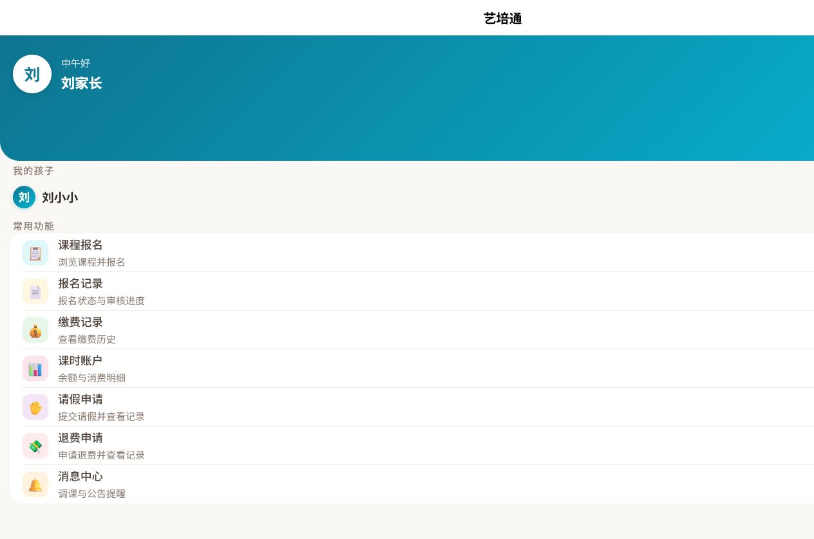

图 3.1  家长端首页界面

### 3.1.2 报名审核与退费审核

教务管理员在报名管理页面对家长提交的报名进行审核，审核操作采用并发安全控制：后端通过乐观条件更新（CAS）保证只有处于"待审核"状态的报名才能被审核通过或驳回，重复操作返回冲突提示。退费审核同时具备数据库层约束兜底：退费记录表通过生成列与唯一索引保证同一笔报名至多存在一条待审核退费记录，从数据库层面杜绝重复退费。

管理后台报名管理页面与退费管理页面如图 3.2、图 3.3 所示。

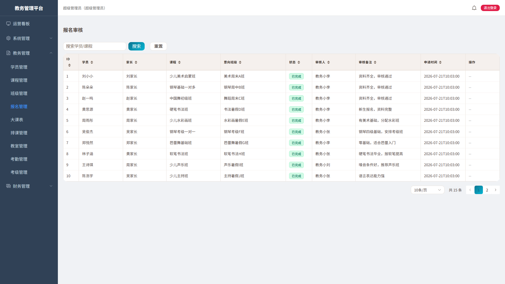

图 3.2  报名管理界面

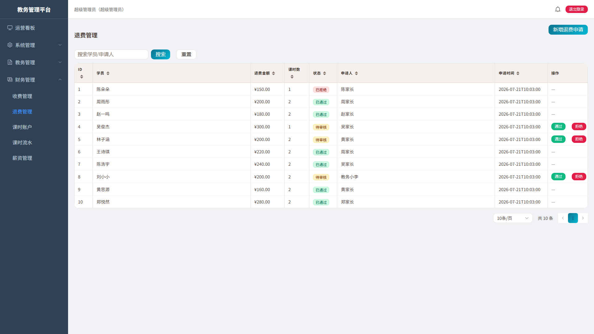

图 3.3  退费管理界面

## 3.2 排课与调课管理

### 3.2.1 智能排课与冲突检测

教务管理员创建课程、班级与课节时段后，可对班级执行批量排课（按班级上课频次批量生成课次）或自动排课（根据教室、教师、班级的空闲时间自动安排课次）。系统提供独立的冲突检测服务，从教师（同一教师同一时间冲突）、教室（同一教室同一时间冲突）、班级（同一班级同一时间冲突）与学员（学员跨班时间冲突）四个维度进行检测，冲突结果以中文提示返回前端即时展示。

排课管理页面与大课表页面如图 3.4、图 3.5 所示。

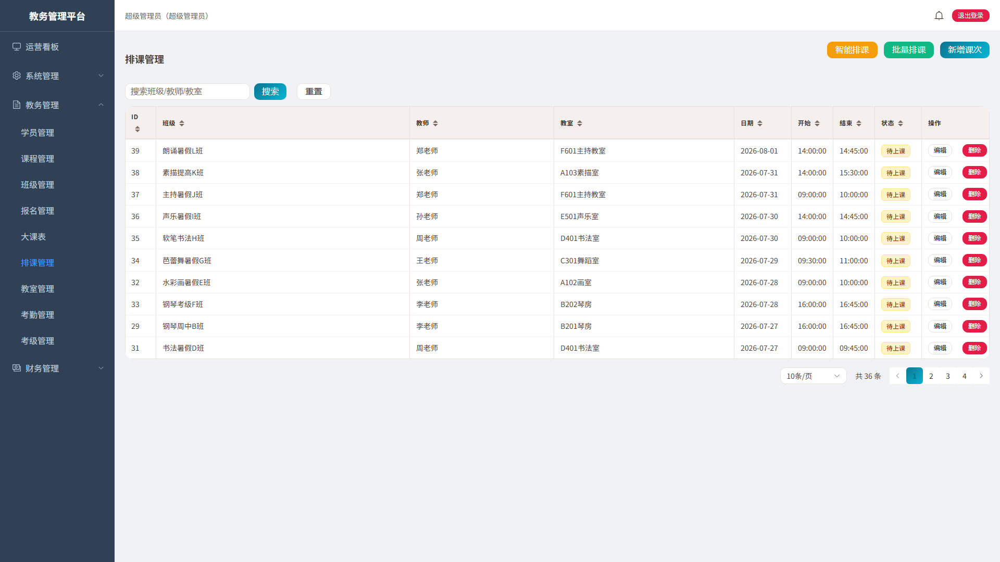

图 3.4  排课管理界面

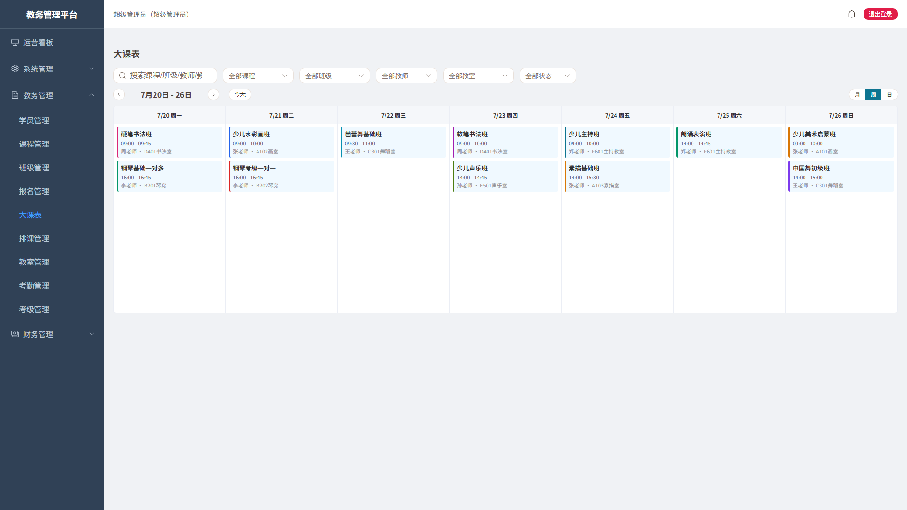

图 3.5  大课表界面

### 3.2.2 拖拽快速调课与并发控制

为实现"教务在大课表上直接拖拽课次、秒级完成日常调课"的体验，系统在周视图大课表提供编辑模式，使用原生 HTML5 拖放 API 实现课次拖拽（不引入第三方拖拽库）。拖动悬停目标时段时前端基于当前课次做本地预检（教师/教室/班级），将冲突格标红并就地提示；保存时后端以冲突检测结果为最终裁决。快速调课不改变课次的授课教师与教室归属，仅更新上课日期与起止时间，且只允许对"待上课且未开始"的课次操作。

由于快速调课保持课次状态不变（不翻转状态字段），仅靠"状态等于待上课"的乐观条件无法拦截两名教务对同一课次的并发拖拽。为此后端在乐观更新条件中追加"原日期、原起止时间"三个条件：并发第二笔更新时旧时间已不匹配，更新行数为 0，接口返回冲突提示，从而防止一方改动被静默覆盖。核心实现如下：

```java
// CAS：id + 状态 + 旧时间三条件 → 并发第二笔 updated=0 → 409
int updated = scheduleLessonMapper.update(null, new LambdaUpdateWrapper<ScheduleLesson>()
        .eq(ScheduleLesson::getId, id)
        .eq(ScheduleLesson::getStatus, 1)
        .eq(ScheduleLesson::getLessonDate, lesson.getLessonDate())
        .eq(ScheduleLesson::getStartTime, lesson.getStartTime())
        .eq(ScheduleLesson::getEndTime, lesson.getEndTime())
        .set(ScheduleLesson::getLessonDate, request.getLessonDate())
        .set(ScheduleLesson::getStartTime, request.getStartTime())
        .set(ScheduleLesson::getEndTime, request.getEndTime()));
if (updated == 0) {
    throw new BusinessException(409, "课次已被其他教务调整，请刷新后重试");
}
```

调课成功后，系统在事务提交后向该课次关联班级的家长与该课次教师发送调课通知，并记录操作日志。快速调课与教师发起的调课申请审批流（原课次标记已调课、生成新课次并关联来源）双轨并存：前者面向教务日常高频微调，后者面向教师个人冲突与留痕场景。

## 3.3 考勤与课时管理

### 3.3.1 课堂考勤

授课教师在移动端按课次对学员进行课堂考勤，支持到课、迟到、请假、缺勤四种状态，并可为请假学员关联审批记录。后端对考勤状态做严格校验：仅允许有效状态码写入，同一学员同一课次只保留一条有效考勤；存在已批准请假的学员不允许被覆盖为到课或迟到，除非先撤销请假审批，从而保证"请假不扣课时"的业务规则不被绕过。

管理后台考勤记录页面如图 3.6 所示。

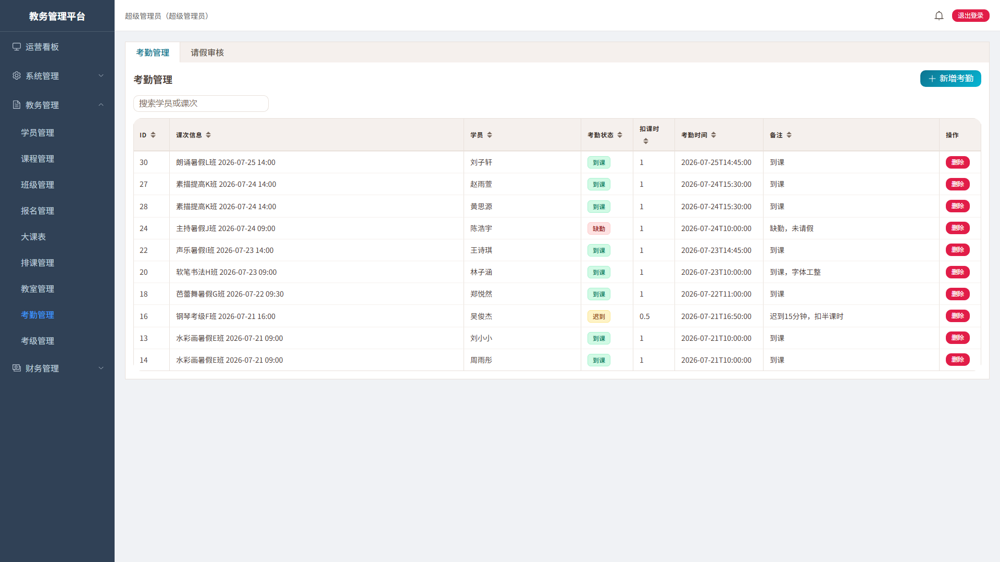

图 3.6  考勤管理界面

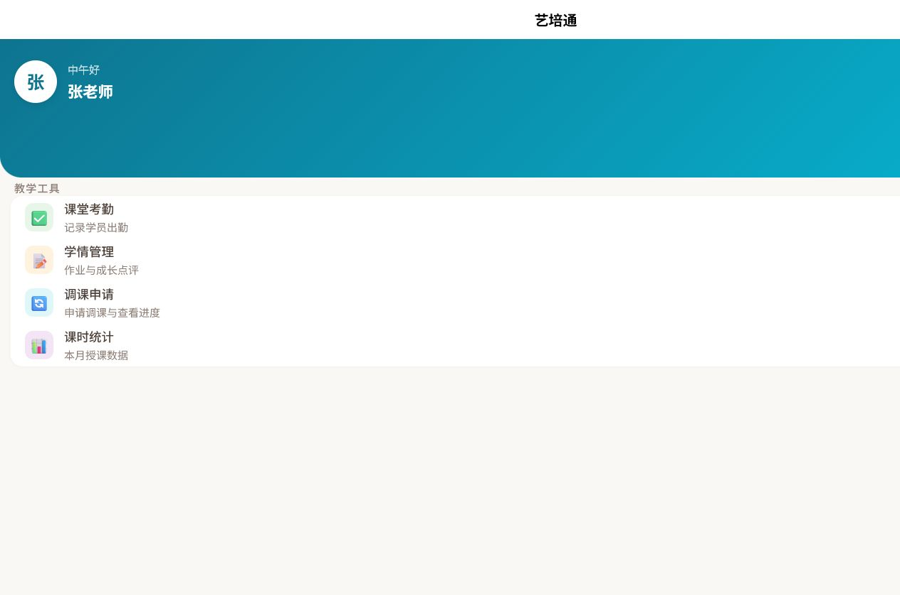

图 3.7  教师端首页界面

### 3.3.2 课时自动扣减

考勤提交后系统自动执行课时扣减：到课、迟到状态扣减对应课时并写入课时流水；请假状态经审批通过不扣减；缺勤按机构规则处理。系统对扣减操作实现并发安全（乐观锁 + 行数校验）与幂等防护：重复提交同一考勤不会重复扣减；对已扣减记录的回冲（如撤销考勤）将课时扣减标记置零，防止重复回冲。家长端可实时查询剩余课时与消耗流水，财务端可导出课时消耗报表。

课时账户、课时流水页面如图 3.8、图 3.9 所示。

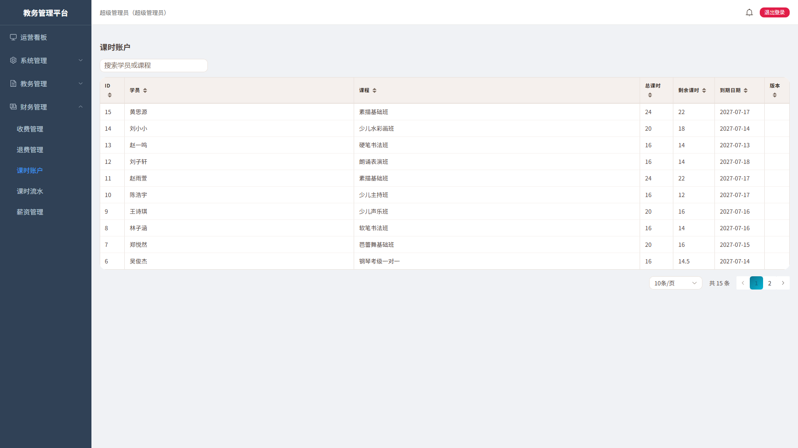

图 3.8  课时账户界面

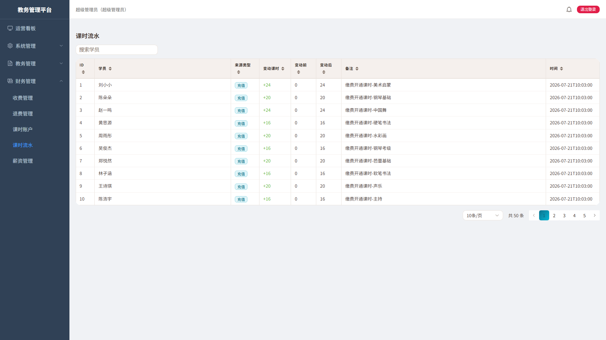

图 3.9  课时流水界面

## 3.4 财务与薪资管理

### 3.4.1 收费与续费管理

财务管理员可登记学费收费、办理续费并审核退费，收费记录关联报名与学员，形成收费台账。系统支持按日期、学员、课程等条件筛选并导出 Excel 台账。

收费管理页面如图 3.10 所示。

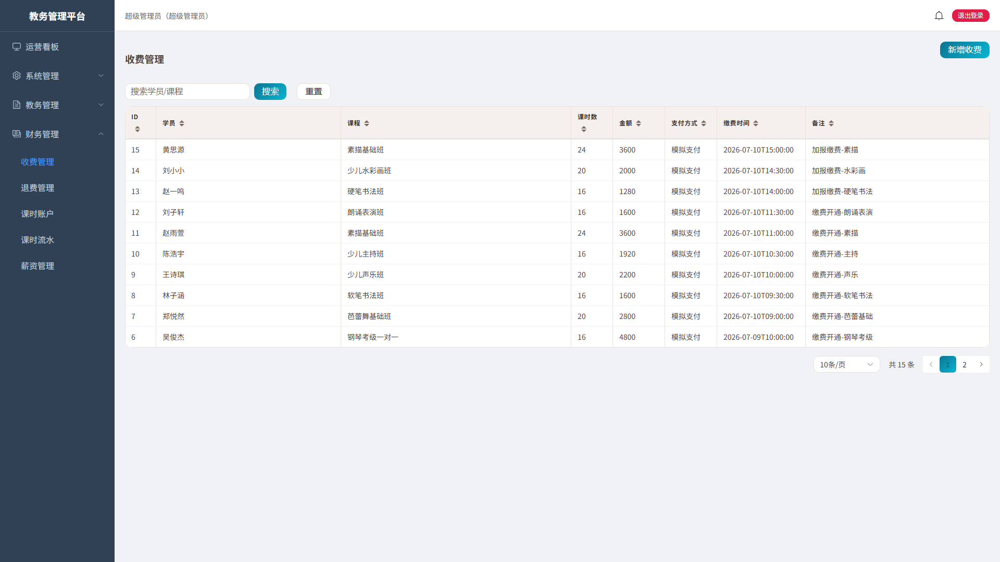

图 3.10  收费管理界面

### 3.4.2 薪资自动核算

系统按"课次 → 班级 → 课程 → 薪资规则"的映射关系实现教师薪资自动核算：每个课程可配置按课次或按课时的薪资规则，财务发起月度核算时，核算引擎统计每位教师当月实际完成课次并按规则单价计算应发薪资。薪资数据采用状态机管理（核算 → 确认 → 发放 → 撤销），关键状态流转均使用乐观条件更新，配合规则变更的历史留痕，保证薪资核算结果可追溯、防并发篡改。

薪资管理页面如图 3.11 所示。

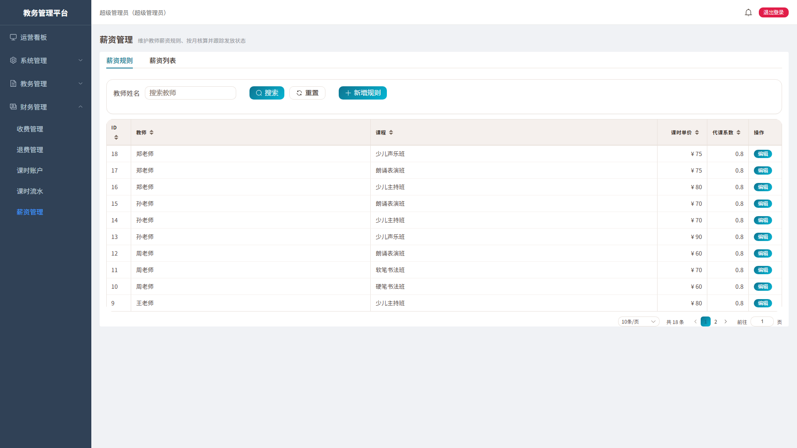

图 3.11  薪资管理界面

## 3.5 学情与考级管理

### 3.5.1 作业与成长档案

教师可对课次发布作业，并在课后对学员课堂表现进行点评，点评与作业自动沉淀到学员成长档案。家长端可查看对应学员的作业内容、教师评语与阶段性成长记录，形成"上课 → 考勤 → 作业 → 点评 → 档案"的学情闭环。

学情相关页面由 LearningController 提供作业（homeworks）、点评（learning-records）与档案（archive）三类接口支撑，管理端与家长端分别展示。

### 3.5.2 考级管理

教务管理员可维护考级项目与费用，组织学员考级报名，录入考级成绩并对证书进行归档，家长可查看考级报名状态与成绩。考级管理页面如图 3.12 所示。

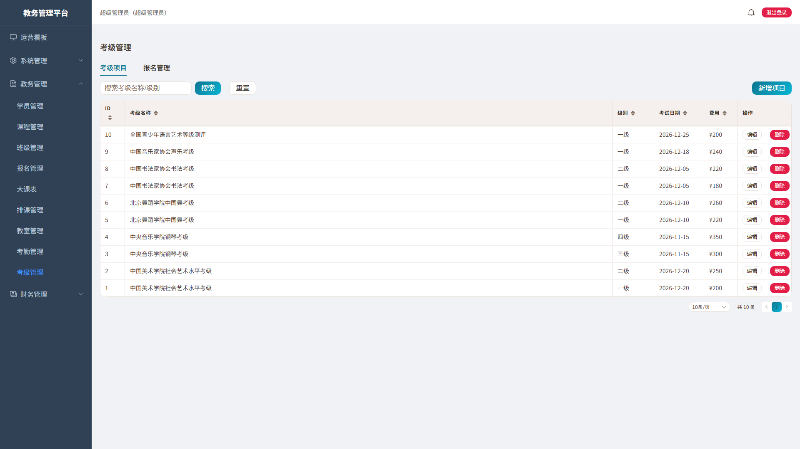

图 3.12  考级管理界面

## 3.6 运营看板与流失预警

### 3.6.1 多维统计与图表可视化

运营看板面向财务与教务等角色提供多维运营分析：以统计卡片呈现在册学员、本月课次、本月营收与到课率；以 ECharts 图表呈现月度课时趋势、营收趋势与到课率趋势；以多维分析页签呈现教师工作量、学员流失率（月度）、班级活跃度、课程盈利与收费率等指标。看板接口按角色隔离，财务等只读角色可查看统计结果但不能执行管理操作。

运营看板页面如图 3.13 所示。

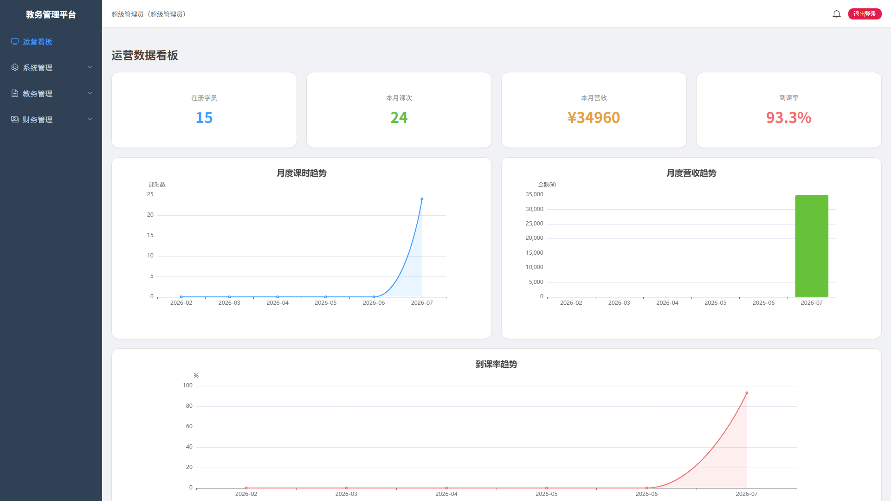

图 3.13  运营看板界面

### 3.6.2 学员流失预警引擎

系统在月度流失率统计的基础上实现学员级流失预警：流失预警引擎以五类因子对在班学员进行打分，分别为到课沉寂度（距最近到课天数）、近期缺勤倾向（近 28 天缺勤占比）、课时余量不足、到期紧迫度与异常出勤加分，总分封顶 100，按分数划分为高风险（≥60）、中风险（30-59）与低风险（1-29）三档。

预警引擎采用可解释的多因子规则（非黑盒模型），每个学员的风险分均可还原为各因子得分与命中原因，便于教务人员理解并采取针对性行动。系统设置防误报规则：班级近期无排课的学员不因沉寂计分；已批准请假不计入缺勤；已退班学员不进名单。预警名单支持按班级/课程/风险档筛选、一键站内触达风险学员家长与 Excel 导出，并记录跟进状态形成闭环。

核心打分逻辑如下：

```java
// F1 到课沉寂度：按距最近到课天数分档计分
private int scoreF1(RiskStudentFacts facts) {
    long days = Math.max(0, DAYS.between(facts.lastAttendanceDate(), LocalDate.now()));
    if (days > 45) return 70; else if (days > 30) return 50;
    else if (days > 21) return 35; else if (days > 14) return 20;
    else if (days > 7) return 10; else return 0;
}
```

流失预警面板作为运营看板的独立页签呈现，与月度流失率统计口径分离、互为补充。教务与超管视角看板界面如图 3.14、图 3.15 所示。


图 3.14  教务视角运营看板界面

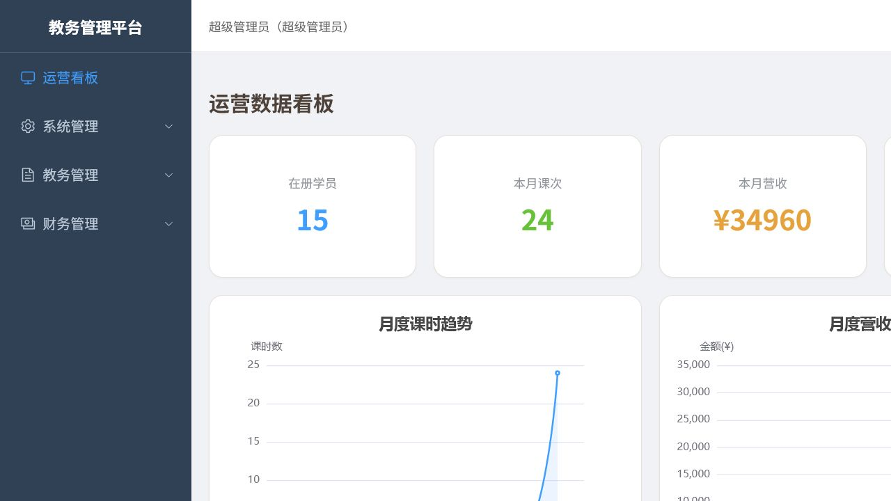

图 3.15  超级管理员视角运营看板界面
