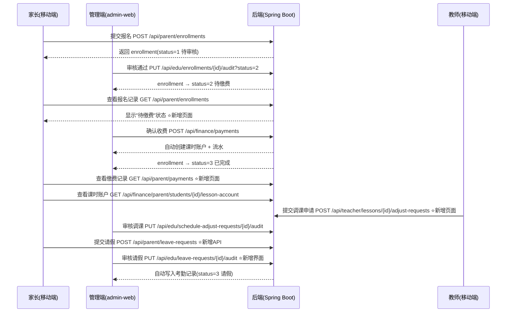

# 打通管理端与移动端业务流程闭环

## Summary

艺术培训机构教务管理平台的管理端（admin-web）与移动端（mobile-uniapp）之间存在业务流程断裂：管理端完成的报名审核、缴费等操作在移动端无对应界面，家长无法感知 enrollment 状态变化，教师无法在移动端发起调课申请。本计划通过新增 4 个移动端页面、新增 2 个后端 API、增强 2 个现有页面，打通从报名→审核→缴费→上课→调课→请假的完整业务闭环。

---

## Problem Frame

当前系统的核心业务生命周期为：学员创建 → 报名提交 → 审核 → 缴费 → 排课 → 考勤 → 课时消耗。管理端已实现全流程操作，但移动端存在以下断裂：

1. **报名状态不可见**：家长提交报名后，无法在移动端查看审核状态（待审核/待缴费/已完成/已拒绝），不知道是否需要缴费
2. **缴费记录不可见**：后端已有 `GET /api/parent/payments` 接口，但移动端无对应页面，家长看不到缴费历史和金额
3. **教师调课不可操作**：后端已有教师调课申请 API（`GET/POST /api/teacher/...adjust-requests`），但移动端无入口
4. **请假流程缺失**：家长无法在移动端为学员请假，后端也无家长发起请假的 API
5. **消息中心功能单一**：仅显示公告，未集成报名状态变更、缴费提醒等通知

这些断裂导致家长需要线下联系机构才能了解报名进度和缴费情况，教师需要到管理端才能申请调课，整体效率低下。

---

## Requirements

| ID | Requirement | Priority |
|----|-------------|----------|
| R1 | 家长可在移动端查看报名记录及状态（待审核/待缴费/已完成/已拒绝/已失效），包含审核备注 | Must |
| R2 | 家长可在移动端查看缴费记录（金额、时间、课程、课时数），了解待缴费项目 | Must |
| R3 | 教师可在移动端查看自己的调课申请列表及审批状态 | Must |
| R4 | 教师可在移动端为指定课次提交调课申请（选择目标日期/时间） | Must |
| R5 | 家长可在移动端为学员提交请假申请（选择日期、课程、原因） | Should |
| R6 | 教务管理员可在管理端审核家长的请假申请 | Should |
| R7 | 首页菜单更新，新增入口导航到以上新页面 | Must |
| R8 | 清理已废弃的 parent/index.vue 和 teacher/index.vue 文件 | Should |

---

## Key Technical Decisions

### KTD-1: 请假审批复用考勤状态码

后端考勤状态已有 `3=请假`，但当前仅由教师/管理员手动录入。新增家长请假申请功能时，采用独立的 `leave_request` 表存储申请，审批通过后由后端写入考勤记录（status=3）。理由：考勤表是按课次×学员的明细记录，请假申请是面向日期的请求，两者粒度不同，需要分离。

### KTD-2: 报名状态变更不新增推送机制

报名审核结果已由后端写入 enrollment 记录。家长端通过 `GET /api/parent/enrollments` 拉取最新状态即可，无需引入 WebSocket 或轮询。缴费提醒同理，家长进入"报名记录"页面时自动刷新。理由：小型培训机构场景下，家长主动查看即可满足需求，推送系统成本过高。

### KTD-3: 缴费仍为管理端操作，移动端仅做展示

现有流程中缴费由管理员在管理端完成（`POST /api/finance/payments`），自动开通课时账户。移动端家长仅查看缴费记录和"待缴费"状态提示，不引入在线支付。理由：小型培训机构通常线下收费，在线支付涉及支付牌照和对账，超出当前范围。

### KTD-4: 调课申请复用现有 ScheduleAdjustRequest 实体

教师调课申请已有完整的后端实体和 API。移动端直接对接 `POST /api/teacher/schedules/{lessonId}/adjust-requests` 和 `GET /api/teacher/adjust-requests`，无需后端改动。

---

## Scope Boundaries

### In Scope

- 移动端新增 4 个页面：报名记录、缴费记录、教师调课、家长请假
- 后端新增 2 个 API：家长请假申请提交、家长请假申请列表
- 管理端新增请假审核界面（在考勤管理页增加 Tab）
- 首页菜单更新，集成新页面入口
- 清理已废弃的 parent/index.vue 和 teacher/index.vue

### Outside Scope

- 在线支付集成（支付宝/微信支付）
- 实时推送通知（WebSocket / 消息队列）
- 微信小程序原生消息推送（订阅消息）
- 考级报名移动端支持
- 管理端报名审核流程改造（现有流程已可用）

---

## High-Level Technical Design

### Business Flow Diagram



---

## Implementation Units

### U1. 家长报名记录页面

**Goal:** 家长可查看自己所有报名记录及当前状态，了解审核进度

**Requirements:** R1, R7

**Dependencies:** 无

**Files:**
- `mobile-uniapp/src/pages/parent/enrollment-history.vue` (新建)
- `mobile-uniapp/src/pages.json` (修改，注册新页面)
- `mobile-uniapp/src/pages/home/index.vue` (修改，首页菜单添加入口)

**Approach:**
- 调用 `GET /api/parent/enrollments` 获取报名列表（已有分页支持）
- 按状态分 Tab 展示：全部 / 待审核 / 待缴费 / 已完成 / 已拒绝
- 每条记录显示：课程名称、报名学员、报名时间、当前状态标签、审核备注（如有）
- 状态标签颜色：待审核=橙色、待缴费=蓝色、已完成=绿色、已拒绝=红色、已失效=灰色
- "待缴费"状态的记录高亮提示"请联系机构完成缴费"
- 使用 StudentSwitcher 组件支持多学员切换
- 遵循现有 art academy 设计风格（#0E7490 主色、28rpx 圆角卡片、content.css 样式类）

**Patterns to follow:** `parent/lesson-account.vue` 的卡片布局 + StudentSwitcher 集成模式

**Test scenarios:**
- Happy: 家长登录后能看到自己的报名记录，状态标签颜色正确
- Happy: "待缴费"记录显示缴费提示文案
- Edge: 无报名记录时显示空状态
- Edge: 切换学员后列表正确刷新
- Error: API 请求失败时显示 toast 提示

**Verification:** 在微信开发者工具中打开该页面，用 parent1 账号登录，能看到报名记录且状态标签正确

---

### U2. 家长缴费记录页面

**Goal:** 家长可查看缴费历史，了解已缴金额和课时购买情况

**Requirements:** R2, R7

**Dependencies:** 无

**Files:**
- `mobile-uniapp/src/pages/parent/payments.vue` (新建)
- `mobile-uniapp/src/pages.json` (修改)
- `mobile-uniapp/src/pages/home/index.vue` (修改，首页菜单添加入口)

**Approach:**
- 调用 `GET /api/parent/payments` 获取缴费记录列表（后端已有，返回 PaymentRecord 列表）
- 顶部汇总区：总缴费金额、总购买课时数（前端计算）
- 列表每条显示：课程名称、缴费金额（¥格式）、购买课时数、缴费时间、支付方式（现金/模拟/其他）
- 支付方式映射：1=现金、2=模拟支付、3=其他
- 按缴费时间倒序排列
- 使用 StudentSwitcher 组件

**Patterns to follow:** `parent/lesson-account.vue` 的汇总栏 + 列表模式

**Test scenarios:**
- Happy: 家长能看到缴费记录，金额格式正确（¥xxx.xx）
- Happy: 顶部汇总显示正确的总金额和总课时
- Edge: 无缴费记录时显示空状态
- Edge: 切换学员后数据正确刷新
- Error: API 失败时显示 toast

**Verification:** 用 parent1 登录后能看到该学员的缴费记录列表

---

### U3. 教师调课申请页面

**Goal:** 教师可在移动端查看课次列表、提交调课申请、查看申请审批状态

**Requirements:** R3, R4, R7

**Dependencies:** 无

**Files:**
- `mobile-uniapp/src/pages/teacher/adjust-request.vue` (新建)
- `mobile-uniapp/src/pages.json` (修改)
- `mobile-uniapp/src/pages/home/index.vue` (修改，教师菜单添加入口)

**Approach:**
- 页面分两个 Tab：「我的申请」和「新建申请」
- **我的申请 Tab：**
  - 调用 `GET /api/teacher/adjust-requests` 获取教师自己的调课申请列表
  - 显示：原课次信息、申请调整到的时间、状态（待审核/已通过/已拒绝）、审核备注
- **新建申请 Tab：**
  - 调用 `GET /api/teacher/lessons?pageNum=1&pageSize=50` 获取近期课次
  - 选择一条课次后，填写调课原因、期望的新日期/时间
  - 调用 `POST /api/teacher/lessons/{lessonId}/adjust-requests` 提交
  - 提交成功后自动切换到「我的申请」Tab

**Patterns to follow:** `teacher/learning.vue` 的 Tab 切换模式 + `teacher/attendance.vue` 的课次选择模式

**Test scenarios:**
- Happy: 教师能看到自己的调课申请及状态
- Happy: 选择课次后填写信息并提交，申请创建成功
- Edge: 无课次可选时，新建 Tab 显示提示
- Edge: 无历史申请时，列表 Tab 显示空状态
- Error: 提交失败时显示错误信息

**Verification:** 用 teacher1 登录后能提交调课申请，在管理端能看到该申请

---

### U4. 家长请假申请（后端 API）

**Goal:** 后端新增家长请假申请的提交和查询接口

**Requirements:** R5, R6

**Dependencies:** 无（可与 U5 并行开发）

**Files:**
- `backend/src/main/java/com/pzhu/eduadmin/modules/attendance/entity/LeaveRequest.java` (新建)
- `backend/src/main/java/com/pzhu/eduadmin/modules/attendance/mapper/LeaveRequestMapper.java` (新建)
- `backend/src/main/java/com/pzhu/eduadmin/modules/attendance/controller/ParentLeaveRequestController.java` (新建)
- `backend/src/main/java/com/pzhu/eduadmin/modules/attendance/service/LeaveRequestService.java` (新建)
- `backend/src/main/java/com/pzhu/eduadmin/modules/attendance/service/LeaveRequestServiceImpl.java` (新建)
- `backend/sql/migrations/V_add_leave_request.sql` (新建，建表 DDL)

**Approach:**

leave_request 表结构：

| 字段 | 类型 | 说明 |
|------|------|------|
| id | BIGINT PK AUTO_INCREMENT | 主键 |
| student_id | BIGINT NOT NULL | 学员 ID |
| parent_user_id | BIGINT NOT NULL | 家长用户 ID |
| lesson_date | DATE NOT NULL | 请假日期 |
| schedule_id | BIGINT NULL | 关联课次 ID（可选，按日期匹配） |
| reason | VARCHAR(500) | 请假原因 |
| status | INT DEFAULT 1 | 1=待审核, 2=已通过, 3=已拒绝 |
| audit_user_id | BIGINT NULL | 审核人 |
| audit_remark | VARCHAR(200) | 审核备注 |
| create_time | DATETIME | 创建时间 |
| update_time | DATETIME | 更新时间 |

API 设计：
- `POST /api/parent/leave-requests` — 家长提交请假（参数：studentId, lessonDate, reason）
- `GET /api/parent/leave-requests?studentId=X` — 家长查看自己的请假记录
- `GET /api/edu/leave-requests` — 管理端查看请假列表（分页）
- `PUT /api/edu/leave-requests/{id}/audit?status=X&remark=Y` — 管理端审核请假

审核通过后，Service 层自动在 attendance 表中写入一条 status=3（请假）的记录，并扣除 0 课时（请假不扣课时）。

安全校验：家长只能为自己绑定的学员提交请假（复用 `checkParentBinding` 逻辑）。

**Patterns to follow:** `ParentAttendanceController` 的安全校验模式 + `EnrollmentController` 的审核模式

**Test scenarios:**
- Happy: 家长提交请假申请，记录入库 status=1
- Happy: 管理员审核通过，自动创建考勤记录(status=3)
- Happy: 管理员审核拒绝，不创建考勤记录
- Edge: 家长为非绑定学员提交请假，返回 403
- Edge: 同一天重复提交请假，返回已有申请
- Error: studentId 不存在时返回错误

**Verification:** 通过 curl 测试 API 端点，CRUD 操作正常，审核联动考勤写入正常

---

### U5. 家长请假申请页面（移动端）

**Goal:** 家长可在移动端为学员提交请假申请并查看审批结果

**Requirements:** R5, R7

**Dependencies:** U4

**Files:**
- `mobile-uniapp/src/pages/parent/leave-request.vue` (新建)
- `mobile-uniapp/src/pages.json` (修改)
- `mobile-uniapp/src/pages/home/index.vue` (修改，首页菜单添加入口)

**Approach:**
- 页面分两部分：顶部「新建请假」表单 + 下方「请假记录」列表
- **新建请假：**
  - StudentSwitcher 选择学员
  - 日期选择器选择请假日期
  - 文本域填写请假原因
  - 提交调用 `POST /api/parent/leave-requests`
- **请假记录：**
  - 调用 `GET /api/parent/leave-requests?studentId=X`
  - 显示：请假日期、原因、状态（待审核/已通过/已拒绝）、审核备注
  - 状态标签颜色同报名状态体系

**Patterns to follow:** `parent/enrollment.vue` 的表单 + 列表混合布局

**Test scenarios:**
- Happy: 家长选择学员、日期、填写原因后提交成功
- Happy: 请假记录列表正确显示状态
- Edge: 不选择学员时提交按钮禁用
- Edge: 不填写原因时提示必填
- Error: 提交失败时显示 toast

**Verification:** 家长提交请假后，在管理端考勤管理能看到该请假申请

---

### U6. 管理端请假审核界面

**Goal:** 教务管理员可在管理端查看和审核家长提交的请假申请

**Requirements:** R6

**Dependencies:** U4

**Files:**
- `admin-web/src/views/edu/AttendanceList.vue` (修改，新增"请假审核"Tab)
- `admin-web/src/api/edu.ts` (修改，新增 leaveRequestApi)

**Approach:**
- 在现有考勤管理页面顶部增加 Tab 切换：「考勤记录」|「请假审核」
- 请假审核 Tab：
  - 表格列：学员姓名、请假日期、关联课次、请假原因、状态、审核人、操作
  - 操作按钮：待审核记录显示"通过"/"拒绝"按钮
  - 通过：调用 `PUT /api/edu/leave-requests/{id}/audit?status=2`
  - 拒绝：弹出对话框填写拒绝原因，调用 `PUT /api/edu/leave-requests/{id}/audit?status=3&remark=xxx`
  - 支持按学员、日期范围筛选

**Patterns to follow:** `EnrollmentList.vue` 的审核操作模式（通过/拒绝按钮 + 拒绝原因对话框）

**Test scenarios:**
- Happy: 管理员看到待审核请假列表
- Happy: 点击"通过"后状态变为"已通过"，考勤表新增一条请假记录
- Happy: 点击"拒绝"弹出原因对话框，提交后状态变为"已拒绝"
- Edge: 已审核的记录不显示操作按钮
- Error: 审核 API 失败时显示错误提示

**Verification:** 管理端审核通过后，移动端请假记录状态同步更新

---

### U7. 首页菜单更新与死代码清理

**Goal:** 首页导航菜单集成所有新功能入口，清理废弃文件

**Requirements:** R7, R8

**Dependencies:** U1, U2, U3, U5

**Files:**
- `mobile-uniapp/src/pages/home/index.vue` (修改)
- `mobile-uniapp/src/pages/parent/index.vue` (删除)
- `mobile-uniapp/src/pages/teacher/index.vue` (删除)

**Approach:**
- **家长菜单更新为 6 项：**
  1. 📋 课程报名 — 浏览课程并报名 → `/pages/parent/enrollment`
  2. 📝 报名记录 — 查看审核状态与缴费提醒 → `/pages/parent/enrollment-history`（新增）
  3. 📅 我的课表 — 近期课程安排 → `/pages/parent/schedule`
  4. ⭐ 学情记录 — 考勤与作业点评 → `/pages/parent/learning`
  5. 📊 课时账户 — 余额与消费明细 → `/pages/parent/lesson-account`
  6. 💰 缴费记录 — 缴费历史与明细 → `/pages/parent/payments`（新增）
  7. 📋 请假申请 — 提交与查看请假 → `/pages/parent/leave-request`（新增）
  8. 🔔 消息中心 — 调课与公告提醒 → `/pages/parent/notices`

- **教师菜单更新为 5 项：**
  1. 📅 课程排班 — 查看我的课表 → `/pages/teacher/schedule`
  2. ✅ 课堂考勤 — 记录学员出勤 → `/pages/teacher/attendance`
  3. 📝 学情管理 — 作业与成长点评 → `/pages/teacher/learning`
  4. 📊 课时统计 — 本月授课数据 → `/pages/teacher/statistics`
  5. 🔄 调课申请 — 发起与查看调课 → `/pages/teacher/adjust-request`（新增）

- **删除死代码：**
  - 删除 `pages/parent/index.vue`（已被 `pages/home/index.vue` 替代，未在 pages.json 中注册）
  - 删除 `pages/teacher/index.vue`（同上）

**Patterns to follow:** 现有 `home/index.vue` 的 parentMenus/teacherMenus 数组模式

**Test scenarios:**
- Happy: 家长首页显示 8 个菜单项，点击新增项能正确跳转
- Happy: 教师首页显示 5 个菜单项，点击调课申请能正确跳转
- Edge: 死代码文件已删除，不影响其他页面编译

**Verification:** 首页菜单所有入口可正确跳转到对应页面，编译无错误

---

### U8. 集成测试与微信小程序重新编译

**Goal:** 验证完整业务流程端到端可用

**Requirements:** R1-R8

**Dependencies:** U1, U2, U3, U4, U5, U6, U7

**Files:** 无新文件

**Approach:**
- 重启后端服务（加载新 API）
- 重新编译微信小程序（`npm run build:mp-weixin`）
- 端到端验证完整流程：
  1. 家长报名 → 管理端审核通过 → 家长看到"待缴费" → 管理端确认缴费 → 家长看到"已完成"和缴费记录
  2. 教师提交调课申请 → 管理端审核
  3. 家长提交请假 → 管理端审核通过 → 考勤记录出现请假条目
- 验证 admin-web Vite 热更新后新 Tab 正常渲染

**Test scenarios:**
- Integration: 报名→审核→缴费→移动端可见 完整链路
- Integration: 教师调课申请→管理端可见 链路
- Integration: 家长请假→管理端审核→考勤联动 链路
- Error: 后端未启动时移动端显示网络错误

**Verification:** 上述三条完整链路均可走通，微信小程序编译无报错

---

## Execution Sequence

```
Phase 1 (可并行):
  U1 家长报名记录页面
  U2 家长缴费记录页面
  U3 教师调课申请页面
  U4 后端请假 API

Phase 2 (依赖 Phase 1):
  U5 家长请假页面 (依赖 U4)
  U6 管理端请假审核 (依赖 U4)

Phase 3 (依赖 Phase 1+2):
  U7 首页菜单更新与清理 (依赖 U1, U2, U3, U5)

Phase 4:
  U8 集成测试与编译验证
```

---

## Risks and Mitigations

**R1: 后端请假 API 与现有考勤表结构不兼容**
- 概率：低。考勤表已有 status=3(请假) 状态，只需确保 leave_request 审核通过后写入的 attendance 记录字段完整
- 缓解：U4 开发时先写 API 测试验证 attendance 写入兼容性

**R2: 微信小程序编译产物过大**
- 概率：低。新增页面均为轻量级列表/表单页，不引入新依赖
- 缓解：编译后检查主包大小，必要时将新页面全部放入 subPackage

**R3: 家长请假与教师调课时间冲突**
- 概率：中。家长请假后教师可能不知道该学员缺课
- 缓解：当前版本不做联动通知，作为 Deferred 后续处理

---

## Open Questions

无阻塞性问题。以下为非阻塞的待优化项：

1. 未来是否需要给家长推送报名状态变更的微信订阅消息？（当前方案：家长主动查看）
2. 请假是否需要支持批量日期（连续多天）？（当前方案：单日请假）
3. 缴费记录是否需要导出功能？（当前方案：仅查看）

---

## Definition of Done

- 家长可在移动端完成：查看报名状态、查看缴费记录、提交请假申请
- 教师可在移动端完成：提交和查看调课申请
- 管理员可在管理端审核请假申请
- 微信小程序编译无报错，所有新增页面可正常访问
- 管理端和移动端 API 联调通过，无 404/500 错误
