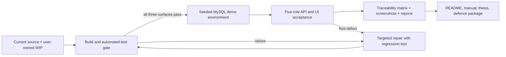

# Graduation Delivery Readiness - Plan

## Goal Capsule

Bring the current v0.9 system to a demonstrably runnable, requirement-traceable graduation-project delivery state. The work starts by restoring the current frontend build and test baseline, then proves the five-role business flow in a controlled environment, and finally updates the source, database, test, user, and graduation-delivery artifacts from that evidence.

`项目.md` is the functional and delivery authority. Existing source code, SQL, and current test output are the implementation truth. Preserve the user's uncommitted work; do not reset, discard, or overwrite it without resolving its intent. Stop and request direction before adding a real third-party payment provider, changing financial business rules, deleting data, or publishing external artifacts.

---

## Product Contract

### Summary

This plan turns the existing feature-complete prototype into an answerable delivery: every required role can complete its critical flow, every shipped surface builds, and the accompanying documents state the verified behavior and known limits.

### Problem Frame

The backend currently has passing unit and service coverage, but the working tree cannot build the management frontend because `SalaryList.vue` has malformed source. The frontend test suite also contains stale expectations and incomplete UI-library/chart mocks. The H5 build has not produced current evidence because its output directory is locked. Historical reports conflict in time and scope, while the README and graduation documents still describe a planned rather than final delivery.

### Requirements

#### Runnable product baseline

- R1. Restore a successful management-frontend typecheck/build and a green frontend test suite without discarding the current user-owned changes.
- R2. Produce a successful uni-app H5 build or record and remove the environmental lock through an approved, non-destructive process.
- R3. Keep the Spring Boot backend's current passing coverage green and compile all current source, including the parent-refund work in the working tree.

#### Requirement evidence

- R4. Verify the `项目.md` 家长、教师、教务管理员（`EDU_ADMIN`）、财务管理员（`FINANCE_ADMIN`）和超级管理员（`SUPER_ADMIN`）requirements through an end-to-end acceptance matrix, with authorization and financial data boundaries included.
- R5. Verify the core flow from course and enrollment through payment, scheduling, attendance or leave, lesson-account changes, refund, salary, notification, and statistics.
- R6. Treat the current payment implementation as a graduation-demo simulated payment unless the user authorizes a real provider; communicate that boundary consistently in the UI and documents.

#### Delivery package

- R7. Replace placeholder or planning-status documents with final, evidence-backed project documentation: setup, database initialization, test report, user manual, interface/database consistency review, and known limitations.
- R8. Assemble the remaining graduation deliverables named in `项目.md`: final thesis material and defence presentation material, with references to verified screenshots, data, and tests.
- R9. Make a clean-environment demonstration reproducible from the repository, initialization scripts, versioned prerequisites, and documented accounts.
- R10. Make the released H5 mobile artifact reach the intended API without depending on the Vite development proxy or device-local `localhost`.
- R11. Apply and prove the minimum demonstration security posture for JWT secrets, SSE authentication, role authorization, row-level ownership, and financial record integrity.

### Actors

- A1. 家长（`PARENT`）can act only for a student bound through `parent_student`.
- A2. 教师（`TEACHER`）can act only for assigned course, class, and lesson resources.
- A3. 教务管理员（`EDU_ADMIN`）owns course, class, enrollment, scheduling, room, attendance, and exam operations.
- A4. 财务管理员（`FINANCE_ADMIN`）owns payment, refund, lesson-account, and salary operations.
- A5. 超级管理员（`SUPER_ADMIN`）owns users, roles, permissions, menus, organization settings, notices, logs, and the global dashboard.

### Acceptance Examples

- AE1. A checked-out workspace with the approved source and initialized database builds the backend, management frontend, and mobile H5 artifact without source errors.
- AE2. A parent can enroll and pay in the demo flow; a 教务管理员（`EDU_ADMIN`）can audit and schedule; a teacher can record attendance or approved leave and learning data; a 财务管理员（`FINANCE_ADMIN`）can settle refund and salary; a 超级管理员（`SUPER_ADMIN`）can inspect the resulting statistics and audit trail.
- AE3. An unauthorized role cannot perform the protected action or read another party's records.
- AE4. The final report records the exact revision, environment, test coverage, failures if any, and the disposition of every `项目.md` requirement.

### Scope Boundaries

In scope: repairing current build/test regressions, acceptance evidence, integration defects exposed by those checks, reproducible demo setup, and final graduation documents.

Out of scope: a live payment-provider contract, production hosting, unrelated redesigns, schema redesign, or broad refactors that do not block delivery.

#### Deferred to Follow-Up Work

- Live WeChat/Alipay or other third-party payment integration, callback verification, reconciliation, and provider compliance.
- Production hardening beyond the graduation demonstration, including secret management, monitoring, capacity testing, and external deployment topology.

---

## Planning Contract

### Key Technical Decisions

- KTD1. Repair the current working tree in place after inspecting its intended changes. The failing `admin-web/src/views/finance/SalaryList.vue` is modified locally, so a reset could destroy valid salary and refund work.
- KTD2. Use an evidence ladder: static build gate, automated unit/component gate, authenticated API gate, then five-role UI/H5 acceptance. A lower-level pass never substitutes for a higher-level result.
- KTD3. Keep financial rules and the existing simulated payment model unchanged unless a failed acceptance case demonstrates a defect. `backend/.../ExportService.java` labels pay type 2 as simulated payment, so the final materials must not claim a live payment integration.
- KTD4. Regenerate the final test report from the validated revision and environment. Older reports remain historical repair evidence only because they disagree on pass counts and one records a stale running jar.
- KTD5. Freeze a small, resettable demonstration dataset after integration validation. The demo must use `sql/schema.sql`, `sql/data.sql`, and reset guidance rather than undocumented local state.
- KTD6. Use environment-specific, non-secret mobile API configuration. Retain the H5 development proxy, require an explicit reachable API base or reverse proxy for the built H5 artifact, and use a reachable LAN/tunnel address for any device smoke check.
- KTD7. Treat fixed JWT secrets and unrestricted query-string tokens as delivery blockers, not production-only concerns. The demo must inject a non-default secret, restrict token query parameters to the SSE stream, and prevent token exposure in documentation, screenshots, and test logs.

### Assumptions

- The target is a graduation-demo delivery, so simulated payment is acceptable when labelled clearly; a real payment provider remains deferred.
- The current uncommitted refund, JWT, pagination, and UI changes are intended work that should be completed and tested rather than removed.
- A local MySQL instance and the five seeded role accounts are available for final cross-surface acceptance.

### High-Level Technical Design

The delivery gate is directional guidance, not implementation code. Each stage must produce evidence before the next stage consumes it.

### System-Wide Impact

The repair touches shared frontend compilation and test harnesses; it must not change salary calculations merely to make the view parse. The acceptance phase crosses JWT role checks, parent/teacher ownership checks, financial transactions, lesson-account optimistic locking, notifications, and statistics. A row-ownership matrix must cover every parent student-scoped endpoint and representative teacher-scoped endpoints, not just the new refund route. Documentation must use the actual endpoint and database behavior after those checks, not the earlier planned wording.

### Risks & Dependencies

- User-owned dirty files may contain partial work. Mitigation: review every changed/untracked file before editing, and keep the repair limited to observed failures.
- A Windows process may hold `mobile-uniapp/dist/build`. Mitigation: identify the locking process or use a confirmed alternative output location; never recursively remove a locked directory blindly.
- Financial flows can leave inconsistent demo data after partial failure. Mitigation: run each acceptance cycle from resettable SQL data and verify lesson flows, refund status, and salary status before reuse.
- Historical test reports are not current evidence. Mitigation: stamp the final report with revision, runtime, database initialization, and generated artifact paths.
- Graduation format requirements are external to this repository. Mitigation: obtain the current Panzhihua University/department thesis, defence, and submission rules before finalizing the thesis or slides; this is a hard prerequisite for claiming R8 complete.

### Documentation and Operational Notes

The final delivery keeps historical audits such as `docs/audit-backend-logic-2026-07-17.md` and the July fix reports as context, but replaces their completion claims with one current report. `README.md`, `docs/00-文档说明.md`, `docs/01-可行性研究报告.md`, `docs/03-软件需求规格说明书.md`, `docs/04-概要设计说明书.md`, `docs/05-详细设计说明书.md`, `docs/06-测试计划.md`, `docs/07-用户操作手册.md`, `docs/16-艺术培训机构教务管理平台毕业设计综合文档.md`, and `docs/99-代码文档合规性审查报告.md` require a final-state review.

---

## Implementation Units

### U1. Reconcile the working tree and restore the management-frontend compile gate

**Goal:** Make the current management frontend parse and typecheck while retaining the intended salary, refund, notification, and authorization changes.

**Requirements:** R1, R3, R6, R11.

**Dependencies:** None.

**Files:** `admin-web/src/views/finance/SalaryList.vue`; `admin-web/src/api/notification.ts`; `admin-web/src/views/admin/UserList.vue`; `admin-web/src/views/edu/AttendanceList.vue`; `admin-web/src/views/edu/ExamList.vue`; `backend/src/main/java/com/pzhu/eduadmin/common/PageResult.java`; `backend/src/main/java/com/pzhu/eduadmin/security/JwtInterceptor.java`; `backend/src/main/java/com/pzhu/eduadmin/modules/finance/controller/ParentRefundController.java`; `mobile-uniapp/src/pages.json`; `mobile-uniapp/src/pages/home/index.vue`; `mobile-uniapp/src/pages/parent/refund.vue`.

**Approach:** Classify every dirty file as intentional feature work, mechanical correction, or generated artifact before modifying it. Compare the truncated salary-view regions with the last known-good source to recover the intended Chinese literals and template structure, then retain only the independently intended changes. Validate that labels, state mapping, calculations, and actions still match `salaryApi` and the backend salary status model. Compile the untracked parent-refund controller as part of the real source tree and align its mobile route with the exposed endpoints.

**Patterns to follow:** `admin-web/src/views/finance/PaymentList.vue` for table/dialog patterns; `admin-web/src/api/finance.ts` for API contracts; `backend/src/main/java/com/pzhu/eduadmin/modules/finance/controller/FinanceController.java` for permission and `Result` conventions.

**Test scenarios:**

- The salary page imports and renders its table, status labels, rule list, calculate, confirm, void, and adjustment actions without template or TypeScript parse errors.
- A salary in each supported status exposes only its permitted action and does not send an illegal confirmation or void request.
- The parent refund route rejects unauthenticated and cross-parent access and returns only the caller's eligible enrollment/refund data.
- A configured JWT secret is not the repository default, and a query-string token succeeds only for the SSE notification stream; other routes reject it and do not record it in delivery evidence.
- Existing changed notification, attendance, exam, pagination, and JWT paths retain their prior request/response behavior.

**Verification:** The management build completes; backend compilation includes every current Java file; the dirty-file intent is documented in the final change summary without unrelated source loss.

### U2. Make the management-frontend test suite trustworthy

**Goal:** Align component tests, Element Plus stubs, asynchronous assertions, and ECharts mocks with the current UI so a green suite represents usable views.

**Requirements:** R1, R4.

**Dependencies:** U1.

**Files:** `admin-web/src/__tests__/setup.ts`; `admin-web/src/__tests__/Login.test.ts`; `admin-web/src/__tests__/RoleList.test.ts`; `admin-web/src/__tests__/SalaryList.test.ts`; `admin-web/src/__tests__/Dashboard.test.ts`; affected tests under `admin-web/src/__tests__/`; affected views under `admin-web/src/views/`.

**Approach:** Update assertions to visible, current product text instead of legacy copy. Make tests await the component lifecycle before checking API calls. Expand the shared ECharts mock to support every chart operation exercised by `Dashboard.vue`, and stub UI components/directives at the shared test boundary rather than hiding real component behavior in individual tests.

**Patterns to follow:** `admin-web/src/__tests__/helpers.ts`, `admin-web/src/__tests__/mocks/api.ts`, and the mount configuration already used by list-view tests.

**Test scenarios:**

- Login renders current branding, the expected credential fields, and the demo-account guidance.
- Role list waits through the Vue lifecycle (including `nextTick`) and verifies a single list request plus an error-state-safe mount.
- Dashboard initializes and disposes each chart against the shared mock without unhandled rejections.
- Salary list parses, loads rules and records, and invokes calculation/confirmation actions with the expected payloads.
- All component tests run with no failed suites, failed assertions, or unhandled errors.

**Verification:** The management test suite reports no test, suite, or unhandled-rejection failures and the production build remains green.

### U3. Establish a deterministic mobile H5 artifact and mobile smoke coverage

**Goal:** Produce a current H5 build and demonstrate parent/teacher navigation against the same API contract used by the backend.

**Requirements:** R2, R4, R5, R10.

**Dependencies:** U1.

**Files:** `mobile-uniapp/package.json`; `mobile-uniapp/vite.config.ts`; `mobile-uniapp/src/pages.json`; `mobile-uniapp/src/utils/request.js`; `mobile-uniapp/src/pages/home/index.vue`; `mobile-uniapp/src/pages/parent/*.vue`; `mobile-uniapp/src/pages/teacher/*.vue`; `docs/13-移动端与管理后台开发详细文档.md`.

**Approach:** Treat the existing `dist/build` permission error as an environment diagnosis first. Release the owning process or use an explicitly configured, ignored output directory only after confirming it cannot mask an artifact needed by the user. Keep the Vite `/api` proxy for development, then add a versioned non-secret configuration path for the built H5 artifact and record the reverse-proxy or reachable API URL used in validation. Check that role-specific pages are registered, navigable, authenticated, and use the same response-handling conventions. A WeChat mini-program build may be recorded as supplementary evidence but is not a release gate for this H5-focused plan.

**Patterns to follow:** `mobile-uniapp/src/pages/parent/enrollment.vue`, `mobile-uniapp/src/pages/teacher/attendance.vue`, and `mobile-uniapp/src/utils/request.js`.

**Test scenarios:**

- The H5 build succeeds from a workspace with no locked previous output, and its asset directory is produced outside source paths.
- A built H5 page, served without the Vite development proxy, logs in and completes an authenticated request to the documented reachable API.
- Parent navigation reaches enrollment, payment history, schedule, learning, lesson account, notices, leave request, and the new refund page when authorized.
- Teacher navigation reaches schedule, attendance, adjustment request, learning, and statistics pages when authorized.
- Expired/invalid tokens and API failures take the existing request error path without exposing stale protected data.

**Verification:** A reproducible H5 artifact exists and a browser/device smoke run records each role's successful login and protected-route behavior.

### U4. Add cross-layer verification for financial and role-boundary changes

**Goal:** Prove that the current backend, including refund and salary work, enforces authorization, data ownership, and financial state transitions when compiled from the current tree.

**Requirements:** R3, R4, R5, R6, R11.

**Dependencies:** None for the existing backend baseline; U1 only before adding tests for the intended parent-refund source.

**Files:** `backend/src/test/java/com/pzhu/eduadmin/FinanceServiceMockTest.java`; `backend/src/test/java/com/pzhu/eduadmin/SalaryServiceMockTest.java`; `backend/src/test/java/com/pzhu/eduadmin/LessonAccountServiceTest.java`; `backend/src/test/java/com/pzhu/eduadmin/JwtInterceptorTest.java`; new focused tests under `backend/src/test/java/com/pzhu/eduadmin/`; `backend/src/main/java/com/pzhu/eduadmin/modules/finance/`; `backend/src/main/java/com/pzhu/eduadmin/security/JwtInterceptor.java`; `sql/schema.sql`; `sql/data.sql`.

**Approach:** Prefer focused test additions at the controller/service boundary over broad test rewrites. Cover the parent-refund surface and any changed pagination or JWT behavior, while retaining existing refund CAS, lesson-account optimistic-lock, and confirmed-salary immutability rules. Make the server canonicalize refund/payment relationships from the enrollment and reject conflicting client-supplied relationships. Use resettable seeded data for any real API smoke test so result counts remain explainable.

**Patterns to follow:** `FinanceServiceMockTest` nested financial-flow tests, `AttendanceServiceTest` lesson-account transition coverage, and `AuthServiceMockTest` role behavior.

**Test scenarios:**

- A parent can list eligible records and submit a refund only for a linked student; another parent, an unrelated enrollment, and a duplicate pending request each receive the correct denial.
- For every parent student-scoped endpoint, a linked student succeeds while another parent's, an unbound, and a nonexistent student are denied with no PII, lesson-account, payment, refund, or learning data in the response; representative teacher class/lesson ownership cases receive the same proof.
- A finance review cannot approve twice or exceed the permitted financial/account boundary. Cross-student enrollment, cross-enrollment payment record, and client-tampered applicant/status/amount fields are rejected or canonicalized without partial refund, lesson-flow, or account writes.
- Attendance or approved leave creates the correct lesson-flow/account effect, and a duplicate/insufficient-balance attempt is rejected without partial updates.
- Salary calculation honors completed lessons, status transitions, and post-confirm adjustment rather than overwriting a confirmed result.
- Simulated payment accepts only a payable enrollment, derives the amount from server-side data, rejects or safely deduplicates a repeated request, and leaves enrollment, payment, lesson account, lesson flow, revenue, and statistics mutually consistent.
- Changed JWT query-token support works only for the supported SSE case and preserves ordinary authorization rejection.

**Verification:** Backend tests stay green, targeted endpoint smoke checks return the intended status codes and data-minimization behavior, and database records show no orphaned or duplicated financial transitions.

### U5. Execute the five-role acceptance matrix and freeze demo evidence

**Goal:** Turn the `项目.md` checklist into repeatable proof of the complete business loop.

**Requirements:** R4, R5, R9.

**Dependencies:** U2, U3, U4.

**Files:** `项目.md`; `docs/03-软件需求规格说明书.md`; `docs/06-测试计划.md`; `test_all_endpoints.py`; `test_runner.py`; `sql/reset-all.ps1`; `sql/reset.sql`; `sql/data.sql`; `docs/test-report-2026-07-19.md`.

**Approach:** Create a traceability matrix with each `项目.md` requirement, role/account, surface, precondition, observed result, screenshot or response evidence, and defect disposition. Begin every full cycle from the reset script and seeded data. Modernize the existing root `test_all_endpoints.py` and `test_runner.py` so base URL, source path, report path, accounts, and generated data are configurable rather than tied to one developer machine or July report. Extend the endpoint baseline with the new parent-refund routes. Separate automated test output from manual UI/H5 acceptance and do not treat an endpoint response as proof of a rendered screen.

**Test scenarios:**

- Covers AE2. Parent enrollment and simulated payment create the expected enrollment, payment, and lesson-account records.
- Covers AE2. Education audit, class assignment, conflict-free scheduling or adjustment, and notification update the parent/teacher schedules.
- Covers AE2. Teacher attendance, leave, homework, and learning record are visible to the linked parent and update lesson usage under the established rules.
- Covers AE2. Finance refund and salary settlement update only permitted records and are represented correctly in revenue/statistics views.
- Covers AE3. 家长、教师、教务管理员（`EDU_ADMIN`）、财务管理员（`FINANCE_ADMIN`）和超级管理员（`SUPER_ADMIN`）accounts each receive allowed capabilities and are denied a representative protected capability.

**Evidence design:** Each matrix row records requirement ID, actor/account, client surface, viewport/device, entry route, seeded precondition, action, visible before/after state, API/database cross-check, revision, timestamp, and stable screenshot/export filename. Capture an action-before and successful-result image for every user-facing flow; capture a recognizable denial state for every authorization case. Separately capture scheduling conflict and correction, room booking, payment/salary/refund state transitions, export file, notice delivery, permission/menu change, and dashboard filter/chart behavior.

**Verification:** The final report contains a complete matrix, reproducible data-reset steps, response/UI evidence, the result of every required item, and no unexplained failed core flow.

### U6. Reconcile technical, user, and graduation documentation with verified behavior

**Goal:** Replace planning/template language with final documentation that a reviewer can use to build, operate, test, and evaluate the system.

**Requirements:** R6, R7, R8, R9, R11.

**Dependencies:** U5.

**Files:** `README.md`; `README.en.md`; `docs/00-文档说明.md`; `docs/01-可行性研究报告.md`; `docs/03-软件需求规格说明书.md`; `docs/04-概要设计说明书.md`; `docs/05-详细设计说明书.md`; `docs/06-测试计划.md`; `docs/07-用户操作手册.md`; `docs/09-接口规范.md`; `docs/10-数据库规范.md`; `docs/13-移动端与管理后台开发详细文档.md`; `docs/16-艺术培训机构教务管理平台毕业设计综合文档.md`; `docs/99-代码文档合规性审查报告.md`; `docs/test-report-2026-07-19.md`; agreed school-format thesis and defence source files.

**Approach:** First obtain and record the current Panzhihua University/department thesis, defence, and submission requirements; if they are unavailable, keep R8 blocked rather than calling it complete. Make `README.md` the practical entry point: architecture, prerequisites, database initialization, launch/build commands, accounts, demo-payment scope, tests, and troubleshooting. Mark the user manual and comprehensive document as final only after screenshots and accounts are verified. Reconcile feasibility, requirements, overview, detailed design, interface, and database documents against current routes/schema; record true limitations rather than silently deleting discrepancies. Create the thesis and defence material from the approved system design, data model, implementation, test evidence, and screenshots instead of copying planning prose. Do not include JWTs, real passwords, personal data, or local production endpoints in text or screenshots.

**Test scenarios:**

- A new evaluator follows the README on a clean machine and reaches login using only documented prerequisites and scripts.
- Every screenshot and navigation label in the user manual matches the delivered UI and role permissions.
- Every documented endpoint/table cited by the acceptance matrix exists in the current source/schema, or has an explicit known-limit entry.
- The thesis and slides state simulated payment and other scope limitations consistently with the implementation.
- The thesis checklist confirms the required template, abstract/keywords, contents, chapter structure, figure/table numbering, references, citations, and required render format; the defence deck and demo script meet the supplied department rules.

**Verification:** No `xxxx`, “规划版”, “待执行”, or unqualified historical pass-count claims remain in final-delivery documents; a reviewer can trace each required feature to code, test evidence, and user instructions. R8 remains explicitly blocked if the school format/submission requirements have not been supplied.

### U7. Perform a clean-environment release rehearsal and package the delivery

**Goal:** Prove that the repository, scripts, artifacts, and documents form a coherent graduation submission rather than a developer-local setup.

**Requirements:** R1, R2, R3, R7, R8, R9.

**Dependencies:** U3, U4, U5, U6.

**Files:** `backend/pom.xml`; `backend/src/main/resources/application.yml`; `admin-web/package.json`; `mobile-uniapp/package.json`; `sql/README.md`; `sql/schema.sql`; `sql/data.sql`; `sql/reset-all.ps1`; `docs/15-开发到部署执行计划.md`; final generated build artifacts outside tracked source directories.

**Approach:** Rehearse in a separate directory from the identified final commit or delivery archive, not in the developer's accumulated working tree. Record the revision, clean-worktree state, runtime versions, lockfile-resolved dependencies, database configuration, build outputs, seeded role accounts, upload-directory behavior, and the handoff order for backend/admin/mobile surfaces. Keep generated artifacts and local credentials out of tracked source; capture only manifests, versions, screenshots, and results in the delivery record.

**Test scenarios:**

- Clean database initialization creates the schema and seed data without manual SQL edits.
- Each surface starts from its documented manifest and reaches the configured API endpoint.
- The built H5 smoke check uses its configured non-development API path, not an inherited Vite development proxy.
- The complete smoke flow succeeds after reset, not only in the developer's accumulated database.
- A missing database, invalid credentials, or unavailable backend produces a documented, diagnosable failure rather than silent broken UI.

**Verification:** A reviewer can reproduce the demo with the documented environment; all three build gates and the five-role matrix are green on the final revision; the submission folder contains source, SQL, final reports, thesis, and defence materials.

---

## Verification Contract

Use the repository's existing backend Maven tests, `admin-web` Vitest suite and production build, and `mobile-uniapp` H5 build as distinct gates. After these pass, execute the authenticated API scripts and the UI/H5 acceptance matrix from a reset database. Preserve the generated test report, role matrix, screenshots, runtime versions, and final revision identifier together.

The release rehearsal is successful only when all automated gates pass, mobile output is reproducible, no core role flow remains blocked, and documentation claims match the evidence collected in the same validation cycle.

---

## Definition of Done

- U1-U7 verification outcomes are satisfied on one identified final revision.
- The management frontend builds and its tests have no failures or unhandled errors.
- The backend has no failing tests, and the mobile H5 build succeeds without relying on a manually preserved stale artifact.
- 家长、教师、教务管理员（`EDU_ADMIN`）、财务管理员（`FINANCE_ADMIN`）和超级管理员（`SUPER_ADMIN`）critical flows have current evidence and authorization checks.
- Simulated payment, known limitations, and production-deployment deferrals are explicit in UI and documents.
- The root README, feasibility/requirements/design documents, user manual, technical documents, final test report, thesis materials, and defence presentation are complete and internally consistent; the school-format checklist is signed off or R8 is explicitly marked blocked.
- The final delivery contains no accidental generated files, stale reports presented as current evidence, or abandoned repair experiments.
