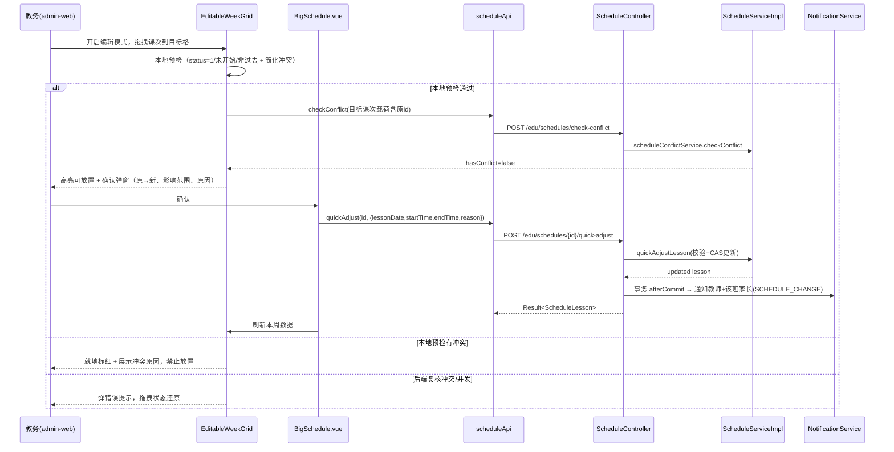
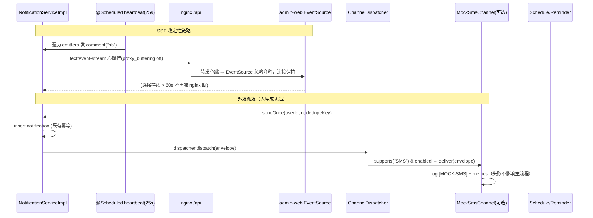
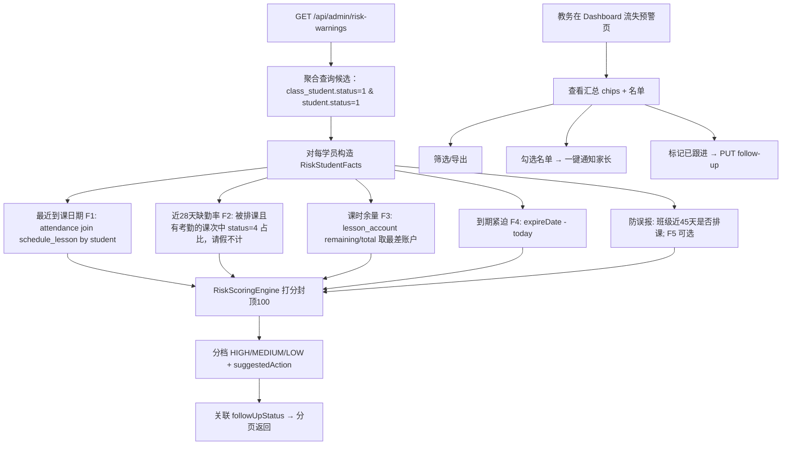

# v1.2 三方向增量设计包：D-P1 排课可视化拖拽 / D-P2 SSE 修复+外发通道 / D-P4 流失预警清单

> 产出：架构师 ｜ 输入：v1.1.0 代码基线与 PM《2026-09-07-001-v1.2-prd.md》 ｜ 状态：设计草案，待主理人/用户决策
> 约束：只读仓库调研后形成设计，**不改写代码**；后端现有 425 测试、admin-web 76 测试、mobile 6 测试基线在实现阶段不得破坏。

---

## 〇、总览

### 三个方向的共同上下文

- 全部为**增量**设计，主战场在 admin-web 与 backend；mobile-uniapp 除 D-P2 涉及通知呈现外基本不受影响。
- 后端沿用既有工程惯例：MyBatis-Plus Wrapper 查询、**CAS 状态原子更新**、操作日志失败不回滚、通知在事务 `afterCommit` 派发、`@RequireRole` 角色控制、Controller 侧 mass-assignment 清洗。
- **SSE 技术债修复是已获用户同意的既有决定**，放在 D-P2；D-P1/D-P4 不依赖它，但 D-P4 的"一键站内触达"与 D-P1 的"调课通知家长"都经由 NotificationService 走同一条通道，若与 D-P2 同批落地，收益叠加。

### 决策点总表（实现前必须拍板，多数已在 PRD 中以 Q 标注）

| # | 决策点 | 本设计推荐 | 备选 |
|---|---|---|---|
| D1 | P1 拖拽快速调课的落库语义 | 直接更新原课次时间（不置 status=4、不生成 sourceLessonId） | 走强留痕（置 4+新课次），成本更高、语义与编辑课次分裂 |
| D2 | P1 冲突窗口是否扩 8 周 | 不扩；保持"单课次、单日期"检测（与 PRD 一致） | 批量/系列迁移需引入"课次系列"概念，量级跳至 XL，本期不建议 |
| D3 | P2 外发通道的落点 | 先落地"通道抽象 + 模拟短信"（无表、记录进操作日志/指标）；独立二期再做 `outbound_message` 表+管理页 | 直接建表+页面（量级 +1） |
| D4 | P4 规则存储 | 常量+可配置属性类（`app.risk.*`），默认均衡档，不做 UI 调参 | 配置表（改 schema、加管理 UI），本期不建议 |
| D5 | P4 跟进状态 | 新增极简 `student_risk_followup` 表（PM 推荐的勾选闭环，改动小） | 不做人工状态，名单每次实时重算（需用户确认可接受） |
| D6 | P4 与 statistics_snapshot 关系 | **不写快照**，实时计算名单；月度流失率趋势沿用现有 `getStudentLossTrend` | 每日风险分布落快照（stat_type=risk_count），需要调度写库，二期 |

---

# D-P1 排课可视化 + 拖拽调课（量级 L）

## 1. 目标与范围

**目标**：让教务管理员在"大课表→周视图"内开启编辑模式后，用**拖拽**把单节课次移到本周另一日期×时段；落库前即时看到教师/教室/班级/学员冲突，保存确认时看到"将通知 N 位家长与 1 位教师"，并自动写操作日志。为管理后台高频排课微调提供"秒级完成"路径。

**范围（做）**：
- 周视图可编辑网格（时段行 × 7 天列），原生 HTML5 Drag & Drop（不引入新依赖）；
- 拖拽悬停即时本地预检 + 后端 `POST /edu/schedules/check-conflict` 复核；
- 确认弹窗（原时间 → 新时间、影响人数、可选原因）→ 调专用后端快速调课端点；
- 成功后通知教师 + 该班学员家长（SCHEDULE_CHANGE），写操作日志；
- 只读月视图/默认周视图完全不变；ScheduleList 表格编辑、移动端教师调课申请审批流全部保留。

**范围（不做）**：
- 不做跨周/批量复制拖拽、不做拖拽换教师/代课（换人走调课审批，保薪资主/代课语义）；
- 不做月视图拖拽、不做移动端拖拽；
- 不扩展冲突检测既有口径/窗口（见决策 D2）；
- **不新增数据库表**（复用 schedule_lesson 更新 + notification + operation_log）。

## 2. 改动文件清单

### 现有文件（修改）

| 路径 | 改什么 |
|---|---|
| `admin-web/src/views/edu/BigSchedule.vue` | 增加"编辑模式"开关（仅周视图可见、仅 SUPER_ADMIN/EDU_ADMIN）；周视图在编辑模式下渲染新的可编辑网格替代只读 `WeeklyCalendar`；保存成功后刷新并提示 |
| `admin-web/src/api/edu.ts` | `scheduleApi` 增加 `quickAdjust(id, data)`（POST `/edu/schedules/{id}/quick-adjust`）；可复用已有 `checkConflict` |
| `backend/.../schedule/controller/ScheduleController.java` | 新增 `POST /api/edu/schedules/{id}/quick-adjust`（`@RequireRole({"SUPER_ADMIN","EDU_ADMIN"})`）；mass-assignment 清洗；调 service |
| `backend/.../schedule/service/ScheduleService.java` | 接口新增 `quickAdjustLesson(...)` |
| `backend/.../schedule/service/ScheduleServiceImpl.java` | 实现快速调课：校验状态/已开始/过去日期 → 合并时间 → 冲突检测 → CAS 更新 → afterCommit 通知教师+家长 → 操作日志（注入 ClassStudentMapper、ParentStudentMapper） |
| `backend/src/test/java/com/pzhu/eduadmin/ScheduleServiceMockTest.java` 或新增 `ScheduleQuickAdjustTest.java` | 新增用例（见任务清单） |

### 新增文件

| 路径 | 职责 |
|---|---|
| `admin-web/src/views/edu/components/EditableWeekGrid.vue` | 可编辑周网格：节次行×7 天列，用 `periodApi.list()` 拉节次；课次卡片可拖；悬停高亮/标红；drop → 收集 {lesson, 目标日期, 目标 startTime/endTime} 发 `scheduleMove` 事件 |
| `admin-web/src/views/edu/components/useScheduleDrag.ts` | 纯逻辑 composable/工具（可单测）：目标格 → 时间计算、可编辑判定（仅 status=1、未开始、非过去）、本地预检（与后端 check-conflict 语义对齐的简化版）、载荷组装 |
| `admin-web/src/__tests__/useScheduleDrag.test.ts` | 对上述纯逻辑的 Vitest 单测 |
| `admin-web/src/__tests__/EditableWeekGrid.test.ts` | 组件测试：渲染、拖拽事件、冲突态展示（stub Element Plus） |

> 说明：现网 `views/edu/components/WeeklyCalendar.vue` 为日列堆叠视图（无时段行），不满足"拖到某时段"的落点判定，故不直接改造它；保留为只读展示组件。已存在的 `components/ScheduleCalendar.vue`、`views/edu/components/WeeklyTable.vue` 在 admin-web 中未被引用（经查 import），本设计不依赖。

## 3. 接口 / 数据模型改动

### 后端新增请求 DTO（backend `modules/schedule/dto/QuickAdjustRequest.java`）

```java
@Data
public class QuickAdjustRequest {
    @NotNull private LocalDate lessonDate;   // 目标日期（不早于今天）
    @NotNull private LocalTime startTime;    // 目标开始时间
    @NotNull private LocalTime endTime;      // 目标结束时间（必须晚于 startTime、不跨午夜）
    private String reason;                    // 可选原因，写入操作日志
}
```

### 新增响应（直接返回 `ScheduleLesson` + 附加字段，轻量）

复用现有 `ScheduleLesson` 实体并在 Service 返回时设置非 DB 字段（className/teacherName/classroomName/courseName）即可；通知人数通过 `notifyScope` 另行提供。

### 复用端点

- `POST /api/edu/schedules/check-conflict`：拖拽悬停时后端复核（请求体即"目标课次"，前端带上原 `id` 以排除自身）。已有实现 `ScheduleConflictServiceImpl.checkConflict` 会忽略 `id == existing.id` 的自冲突。

### 建议新增轻量端点（可选，若希望"提示影响人数"在确认弹窗前就能看到）

- `GET /api/edu/schedules/{id}/notify-scope` → `{ teacherId, teacherName, parentCount }`
  - 实现：由 lesson.classId 查 class_student(status=1) → studentId 集合 → parent_student → 去重家长 userId 数。若不做该端点，则确认弹窗文案改为"将通知该班教师与相关家长"（保存结果为准）。

## 4. 关键交互流程



## 5. 有序任务清单（D-P1）

| # | 任务 | 依赖 | 验证方式 | 对应测试 |
|---|---|---|---|---|
| P1-T1 | 后端：新增 `QuickAdjustRequest` DTO + `ScheduleService/ScheduleServiceImpl.quickAdjustLesson`（校验/CAS/日志骨架）+ 占位通知 | — | `mvn test` 全绿；手测校验分支 | 新增 `ScheduleQuickAdjustTest`：非法状态 409、过去日期 400、已开始 409、冲突 409、CAS 失败 409、成功路径 mock 验证 update |
| P1-T2 | 后端：`ScheduleController` 新增 quick-adjust 端点 + mass-assignment 清洗 + 操作日志 + 通知教师（afterCommit） | P1-T1 | curl 冒烟；`mvn test` | 在 `ScheduleController` 相关测试/`ScheduleQuickAdjustTest` 覆盖请求清洗 |
| P1-T3 | 后端：通知家长范围解析（class_student→parent_student，注入 Mapper）+ `notify-scope` 端点（可选） | P1-T2 | 演示账号手测家长数 | 单测：mock Mapper 验证去重集合 |
| P1-T4 | 前端：`useScheduleDrag.ts` 纯逻辑 + 单测 | — | `npx vitest --run` | `useScheduleDrag.test.ts` |
| P1-T5 | 前端：`EditableWeekGrid.vue` 组件（原生 DnD、节次行×天列、高亮/标红、确认弹窗） | P1-T4 | `npm run build` + `vitest` | `EditableWeekGrid.test.ts` |
| P1-T6 | 前端：`BigSchedule.vue` 编辑模式接线 + `edu.ts` quickAdjust + 整体联调 | P1-T2、P1-T5 | 手工场景（PRD §1.3 七条）+ 回归 76 测试 | 扩展 `BigSchedule`/ScheduleList 测试（新增，不改既有断言） |

**说明**：P1-T4 可与 P1-T1 并行；P1-T6 完成后跑 `bash acceptance_test.sh` 与 `mvn test` 回归。

## 6. 量级 / 风险重估

- **量级 L**（比 PM 初判一致）。最大风险在**前端拖拽交互与 Element Plus stubbing**；通过"纯逻辑抽离 + 原生 DnD"降低复杂度与测试成本。
- **后端风险低**：全部改动为新增方法/端点，未触碰既有 17 个 Service 的既有路径，425 测试安全。
- **前端风险中**：BigSchedule 目前无独立测试文件，新增组件测试即可；`Dashboard` 等既有 76 测试不涉及 schedule 视图，预期零回归。
- **并发**：沿用 CAS `UPDATE ... WHERE status=1`（等价调课审批 CAS 模式），防"两教务同时拖同一课次"。
- **不引入新依赖**：原生 HTML5 DnD，避免离线 npm 环境与体积风险。

---

# D-P2 家长触达闭环：SSE 修复 + 外发通道（量级 M）

## 1. 目标与范围

**目标**：修复 admin-web 实时通知链路的可用性隐患（nginx 缓冲 + 无心跳 → 长连静默断连），使 SSE 在真实 H5/Caddy→nginx→backend 链路上稳定；同时以"通道抽象 + 模拟短信"打通"站内通知 + 外发触达"的统一派发模型，为毕设"消息触达"章节提供可演示素材。

**范围（做）**：
- ① **SSE 最小修复**：nginx `/api` 反代取消缓冲、延长读超时、透传 `X-Accel-Buffering: no`；后端 SSE 增加周期性注释心跳（25s）；前端现有 EventSource 重连逻辑保持兼容（心跳事件对现有监听器透明）。
- ② **外发通道抽象**：新增 `NotificationChannel` 接口 + `InAppNotificationChannel`（现有 SSE+入库）+ `MockSmsNotificationChannel`（默认关闭、写操作日志/指标），接入 `sendOnce`/`sendToUsers` 的派发点；不做真实短信网关。

**范围（不做）**：
- 不做 WebSocket 迁移（SSE 够用且改动最小）；
- 不新增 `outbound_message` 表与管理页（决策 D3：本期无表，靠日志+指标演示；建表版本留二期）；
- 不改动 ReminderService 的定时触发语义与去重键设计；
- mobile-uniapp 本期不接 EventSource（H5 由页面 onShow 拉取最新消息，属既有行为，保持）。

## 2. 改动文件清单

### 现有文件（修改）

| 路径 | 改什么 |
|---|---|
| `deploy/nginx/default.conf` | `location /api/` 增加 `proxy_buffering off;`、`proxy_read_timeout 300s;`、`proxy_send_timeout 300s;`；保证流式响应不被缓冲、静默 60s 不断连 |
| `deploy/Caddyfile` | 无需必改；若验证 Caddy 侧对 SSE 有缓冲则加 `flush_interval`（默认不配；写进验证清单） |
| `backend/.../notification/service/NotificationServiceImpl.java` | ① 心跳方法：`@Scheduled(fixedRate = 25000)` 遍历 `emitters` 发注释事件（`SseEmitter.event().comment("hb")`），失败移除并记 `BusinessMetrics.recordNotificationConnectionFailure`；② 抽出可测试的心跳执行体 |
| `backend/.../notification/controller/NotificationController.java` | `stream()` 增加 `HttpServletResponse` 参数并 `setHeader("X-Accel-Buffering","no")`（双保险）；不影响 token 校验 |
| `backend/.../common/SseConfig.java` | 心跳线程池可复用 `sseExecutor`，仅当需要独立调度时新增 `sseHeartbeatScheduler`（默认不加） |
| `backend/src/test/java/com/pzhu/eduadmin/NotificationServiceTest.java` | 心跳测试（见任务清单） |

### 新增文件（外发通道抽象，backend notification 模块内）

| 路径 | 职责 |
|---|---|
| `.../notification/channel/NotificationChannel.java` | 通道接口：`boolean supports(String channelType)`、`void deliver(OutboundEnvelope envelope)` |
| `.../notification/channel/OutboundEnvelope.java` | 信封 DTO：userId、phone(可空)、title、content、type、relatedId、dedupeKey |
| `.../notification/channel/InAppNotificationChannel.java` | 现有能力的封装：调用 NotificationMapper.insert 已由 `sendOnce` 完成；本通道主要占位/打指标，说明"站内即默认通道" |
| `.../notification/channel/MockSmsNotificationChannel.java` | 模拟短信：`@ConditionalOnProperty(app.notification.mock-sms.enabled=true)` 默认关；收到 envelope 后 `log.info("[MOCK-SMS] ...")` + BusinessMetrics 计数 |
| `.../notification/channel/NotificationChannelDispatcher.java` | 组合派发器：遍历已注册 channel，`supports("SMS")` 命中即 `deliver`；被 `NotificationServiceImpl.sendOnce/sendToUsers` 在入库成功后调用（不阻塞主流程、异常吞掉） |
| `backend/src/test/java/com/pzhu/eduadmin/NotificationChannelDispatcherTest.java` | 派发器单测 |

> `app.notification.mock-sms.enabled=false` 写入 `application.yml`（默认关，演示时 prod/dev 任一 profile 打开即可）。

## 3. 接口 / 数据模型改动

- **无表结构改动**。
- 心跳事件不改变现有 SSE 事件协议：注释行对浏览器 EventSource 完全透明，现有 `admin-web/src/stores/notification.ts` 无需改动即可兼容（验证时观察 `onopen` 后不再周期性触发 `onerror` 即达成）。
- 新增配置项：

```yaml
app:
  notification:
    sse:
      heartbeat-ms: 25000   # 供 @Scheduled fixedRateString 引用
    mock-sms:
      enabled: false        # true 时开启模拟短信派发
```

- `NotificationChannelDispatcher` 使用 Spring 收集 `List<NotificationChannel>`（构造注入），无 Spring 强耦合的纯逻辑尽量下沉以利单测。

## 4. 关键交互流程



## 5. 有序任务清单（D-P2）

| # | 任务 | 依赖 | 验证方式 | 对应测试 |
|---|---|---|---|---|
| P2-T1 | 部署层：`nginx/default.conf` 反代流式参数（buffering off、read/send timeout） | — | 部署到 staging 后用浏览器 Network 观察 SSE 连接 >2min 无断连；本地 nginx 配置 lint | 无单测（部署验证脚本：`curl --no-buffer -m 120 .../notifications/stream`） |
| P2-T2 | 后端：SSE 心跳方法 + controller `X-Accel-Buffering` 头 | — | `mvn test`；本地起服务观察心跳注释行 | `NotificationServiceTest` 新增：心跳对空 map 无副作用；异常 emitter 被移除并记指标（mock BusinessMetrics） |
| P2-T3 | 外发通道：接口/信封/InApp 占位/MockSms/Dispatcher + `application.yml` 开关 | P2-T2 | `mvn test`；开 `mock-sms.enabled=true` 冒烟看到 `[MOCK-SMS]` 日志 | `NotificationChannelDispatcherTest`（supports 命中、失败不抛） |
| P2-T4 | 集成验证：连 P1/P4 的通知调用点验证 `sendOnce` → Dispatcher → 日志 | P2-T3 | 手工演示 + 回归全部测试 | 回归 `NotificationServiceTest`/`ScheduleQuickAdjustTest` 等 |

## 6. 量级 / 风险重估

- **量级 M**。SSE 修复部分为 S；外发通道抽象为 M 中的主要工作量。
- 风险低：不触碰既有通知入库幂等与去重键；Dispatcher 异常全部 try-catch，不侵入主链路。
- 与 425 测试基线兼容：`NotificationServiceTest` 现有用例只加不改；`subscribe` 返回真实 SseEmitter 的逻辑不变。
- 部署验证需在 staging 做一次长连接观察，属本轮唯一"验证成本"。

---

# D-P4 流失预警清单（量级 M）

## 1. 目标与范围

**目标**：把 Dashboard 上"事后月度流失率"延伸到"现在该联系谁"的学员级名单：多因子打分（到课沉寂度/近期缺勤/课时余量/到期紧迫度，可选异常出勤加分），按风险分排序分档，教务可按班级/课程/风险档筛选、勾选跟进状态、一键向家长发站内通知、导出 Excel。规则默认"均衡档"，可配置但不做 UI。

**范围（做）**：
- 规则引擎（纯计算、可解释、无 ML）：F1 沉寂、F2 缺勤倾向、F3 余量、F4 到期、（F5 加分默认关）；
- 防误报规则（班级近期无排课不计 F1；请假不记缺勤；仅 class_student.status=1 & student.status=1 入名单）；
- 名单接口 + 分档汇总 + 一键站内触达家长 + 跟进状态（新增小表）+ Excel 导出；
- Dashboard"多维运营分析"新增"流失预警（学员级）"页签（并列于现有"学员流失率"）。

**范围（不做）**：
- 不做预测模型/ML、不做自动退班/扣款/短信外呼；
- 不做 CRM 工单；不写 `statistics_snapshot`（决策 D6）；不改现有月度流失率口径；
- 不做规则 UI 可视化配置（决策 D4）。

## 2. 改动文件清单

### 现有文件（修改）

| 路径 | 改什么 |
|---|---|
| `backend/.../statistics/controller/StatisticsController.java` | 新增 `/api/admin/risk-warnings`、`/risk-warnings/summary`、`/risk-warnings/{studentId}/follow-up`、`/risk-warnings/notify`（均 `@RequireRole({"SUPER_ADMIN","EDU_ADMIN","FINANCE"})` 视权限） |
| `backend/.../statistics/service/ExportService.java` 或新增方法 | `exportRiskStudents(...)` 复用 SXSSF 导出名单 xlsx |
| `backend/.../statistics/controller/ExportController.java` | 新增 `GET /api/export/risk-students` |
| `admin-web/src/api/auth.ts` | `statisticsApi` 增加 `riskWarnings/summary/followUp/notify` |
| `admin-web/src/views/dashboard/Dashboard.vue` | 新增 `el-tab-pane` "流失预警"：汇总 chips（高/中/低/总数）+ 可筛选/可分页表格 + 跟进勾选 + 一键通知 + 导出按钮；与现有 `analysisTab` 并列 |
| `admin-web/src/__tests__/Dashboard.test.ts` | 追加新页签渲染与 API 调用断言（不修改既有断言） |
| `admin-web/src/__tests__/mocks/factory.ts` | statisticsApi mock 增加 risk 方法 |
| `sql/schema.sql` + 新增 Flyway 迁移 `backend/src/main/resources/db/migration/V8__add_student_risk_followup.sql` | 新建 `student_risk_followup` 表（见 §3） |

### 新增文件

| 路径 | 职责 |
|---|---|
| `backend/.../modules/risk/RiskRuleProperties.java` | `@ConfigurationProperties(prefix="app.risk")` 规则阈值（默认均衡档、F5 开关） |
| `backend/.../modules/risk/RiskScoringEngine.java` | 纯计算引擎：入参 `RiskStudentFacts` → `RiskScoreResult`（无 Spring 依赖，便于纯单测） |
| `backend/.../modules/risk/RiskWarningService.java` / `Impl.java` | 聚合查询（class_student/student/class_group/lesson_account/attendance/schedule_lesson）+ 分页 + 汇总 + 跟进状态 + 通知派发 |
| `backend/.../modules/risk/controller/RiskWarningController.java` | 若不想膨胀 StatisticsController，可独立 `@RequestMapping("/api/admin/risk-warnings")`（推荐，模块内聚） |
| `backend/.../modules/risk/dto/RiskStudentVO.java` | 名单行 VO（见 §3） |
| `backend/.../modules/risk/dto/RiskSummaryVO.java`、`FollowUpRequest.java`、`NotifyRequest.java` | 汇总/跟进/通知 DTO |
| `backend/src/test/java/com/pzhu/eduadmin/RiskScoringEngineTest.java` | 规则引擎纯单测（覆盖示例：总分 68 → 高风险） |
| `backend/src/test/java/com/pzhu/eduadmin/RiskWarningServiceTest.java` | Service mock 单测（防误报、分页、空集合防护） |
| `admin-web/src/views/dashboard/components/RiskWarningPanel.vue`（推荐，控制 Dashboard 膨胀） | 页签内容组件 |

## 3. 接口 / 数据模型改动

### Flyway V8 表（决策 D5：跟进状态）

```sql
CREATE TABLE IF NOT EXISTS `student_risk_followup` (
  id BIGINT PRIMARY KEY AUTO_INCREMENT,
  student_id BIGINT NOT NULL,
  status TINYINT NOT NULL DEFAULT 0 COMMENT '0-待跟进，1-已跟进，2-暂不跟进',
  remark VARCHAR(255),
  operator_id BIGINT,
  followup_time DATETIME,
  create_time DATETIME NOT NULL DEFAULT CURRENT_TIMESTAMP,
  update_time DATETIME NOT NULL DEFAULT CURRENT_TIMESTAMP ON UPDATE CURRENT_TIMESTAMP,
  UNIQUE KEY uk_student (student_id)
) ENGINE=InnoDB DEFAULT CHARSET=utf8mb4 COMMENT='流失预警跟进状态';
```

> 同步加入 `sql/schema.sql`（全新建库基线）与 Flyway V8（生产迁移），遵循 v1.1.0 确立的"schema.sql 冻结为基线，增量走 Flyway"策略。

### 配置属性 `RiskRuleProperties`（对应 `application.yml`）

```yaml
app:
  risk:
    enabled: true
    preset: balanced            # balanced|conservative|sensitive
    f5-extra-enabled: false
    thresholds:
      high: 60
      medium: 30
    factor-cap:
      f1: 70
      f2: 30
      f3: 35
      f4: 25
      f5: 10
    attendance-window-days: 28   # F2 窗口
    absence-lookback-days: 45    # F1 沉寂判定上限
```

### 名单行 VO（`RiskStudentVO`）

```java
// studentId, studentName, className(s), courseName, classId,
// riskScore, riskLevel(HIGH/MEDIUM/LOW), factors: {f1,f2,f3,f4,f5},
// lastAttendDate, absentCount28d, scheduledCount28d, absenceRate28d,
// remainingLessons, totalLessons, expireDate, daysToExpire,
// suggestedAction(续费提醒/到课回访/观察),
// followUpStatus(0/1/2), followUpRemark
```

### 接口草案

| 方法 | 路径 | 入参 | 返回 |
|---|---|---|---|
| GET | `/api/admin/risk-warnings` | pageNum/pageSize、level、classId、courseId、keyword、followUpStatus | `PageResult<RiskStudentVO>` |
| GET | `/api/admin/risk-warnings/summary` | — | `RiskSummaryVO{total, high, medium, low, byLevel[]}` |
| PUT | `/api/admin/risk-warnings/{studentId}/follow-up` | `{status, remark}` | 更新结果 |
| POST | `/api/admin/risk-warnings/notify` | `{studentIds[], message?}` | `{notifiedParentCount}` |
| GET | `/api/export/risk-students` | level/classId/courseId | xlsx |

**一键通知语义**：`studentIds` → 各自家长（parent_student 关联，去重）→ 对每个家长 `notificationService.sendOnce(parentId, n, "RISK_FOLLOWUP:"+parentId+":"+today)` 幂等去重；type 使用 `RISK_REMINDER`（mobile 端 notices 页已有未知类型兜底为"通知"）。

## 4. 关键计算/交互流程



## 5. 有序任务清单（D-P4）

| # | 任务 | 依赖 | 验证方式 | 对应测试 |
|---|---|---|---|---|
| P4-T1 | DB：`student_risk_followup` 表（schema.sql + Flyway V8，幂等） | — | 全新库 `schema.sql` 建库成功；已有 prod 库走 V8 迁移成功 | Flyway 迁移 smoke（启动 prod profile 于 H2/MySQL 验证） |
| P4-T2 | 规则属性 + 纯引擎：`RiskRuleProperties`、`RiskScoringEngine` | — | 纯单测跑通（示例 68→HIGH、边界、F5 开/关、封顶） | `RiskScoringEngineTest` |
| P4-T3 | Service：候选聚合 + 分档 + 防误报 + 分页 + 跟进状态读写 | P4-T1、P4-T2 | `mvn test`；SQL 空集合防护 | `RiskWarningServiceTest`（mock Mapper） |
| P4-T4 | Controller：risk-warnings 四个端点 + export + 一键通知（afterCommit 派发，去重） | P4-T3 | curl 冒烟 + `mvn test` | Service/Controller 测试新增端点用例 |
| P4-T5 | 前端：`RiskWarningPanel.vue` + Dashboard 页签 + `auth.ts` statisticsApi + mocks | P4-T4 | `npm run build`；手工验证 PRD §2.3 七条 | `Dashboard.test.ts` 追加断言 + `RiskWarningPanel.test.ts` |
| P4-T6 | 整体回归：425/76/6 + acceptance 冒烟 + 文档（README 版本说明、docs 数据库规范补表） | P4-T5 | `mvn test`、`npx vitest --run`、`bash acceptance_test.sh` | — |

## 6. 量级 / 风险重估

- **量级 M**。主体是"聚合查询 + 纯规则引擎 + 一个页签"，无复杂并发/事务。
- 规则引擎独立成纯类 → **测试友好、论文可写**（可解释打分公式）。
- 性能：候选=在班学员数（毕设规模 ≤ 数百），聚合用 MyBatis-Plus 批量 in 查询 + 内存打分即可；预留"数据量大后再加每日快照/缓存"的演进说明（与 D6 呼应）。
- 与测试基线兼容：全部新增，不触碰既有 statistics 425 用例；Dashboard 测试只追加不删改。
- 表结构风险：新增表仅 1 张，FK 不落库（沿用全库无物理外键惯例），软删除/逻辑删除字段规范保持一致。

---

## 七、整体任务依赖与建议执行顺序

```mermaid
graph LR
    subgraph P1[P1 排课可视化 L]
        P1T1[P1-T1 后端Service] --> P1T2[P1-T2 端点+通知]
        P1T2 --> P1T3[P1-T3 家长范围(可选)]
        P1T4[P1-T4 useScheduleDrag纯逻辑]
        P1T5[P1-T5 EditableWeekGrid组件] --> P1T6[P1-T6 BigSchedule接线联调]
        P1T4 --> P1T5
        P1T3 --> P1T6
        P1T2 --> P1T6
    end
    subgraph P2[P2 SSE+外发 M]
        P2T1[P2-T1 nginx参数] 
        P2T2[P2-T2 心跳] --> P2T3[P2-T3 外发通道]
        P2T3 --> P2T4[P2-T4 集成验证]
    end
    subgraph P4[P4 流失预警 M]
        P4T1[P4-T1 表迁移] --> P4T3[P4-T3 Service]
        P4T2[P4-T2 规则引擎] --> P4T3
        P4T3 --> P4T4[P4-T4 Controller+通知]
        P4T4 --> P4T5[P4-T5 前端页签]
        P4T5 --> P4T6[P4-T6 回归]
    end
```

- **三条线相互独立**，可并行；同批合入时注意 **P1/P4 共用 NotificationService/SendOnce 派发点**（若 D-P2 同批，则 P1 家长通知与 P4 一键通知自动带上外发通道，收益叠加）。
- **Flyway 版本协调**：若 P2 二期与 P4 都建表，迁移号统一在合入分支上重排（P4 用 V8，P2 未来表用 V9…），避免同 PR 双 V8。
- 建议合入顺序（决策向）：先合 P2（小、独立、含已批准修复）→ 再 P1 或 P4 按用户答辩侧重选择；P1 优先于 P4 可让大功能先成型。

## 八、待主理人确认（承接 PM 三问，架构侧再补二问）

1. P1 拖拽快速调课是否接受"直接更新原课次时间"语义（决策 D1 推荐项）？
2. P4 是否接受新增 `student_risk_followup` 表以支持"已跟进"勾选闭环（决策 D5 推荐项）？
3. P4 规则档位本期只做"默认均衡档 + 参数预留"，不做 UI 切换，可否？
4. P2 外发通道本期"抽象+模拟短信、无表无页面"的裁剪是否满足演示需求（决策 D3）？
5. 三个方向的 Flyway 迁移若撞号，是否允许在合入分支上统一重排（推荐允许）？
