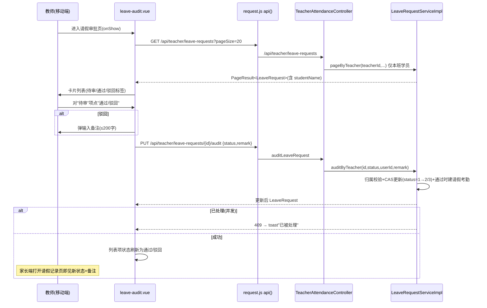
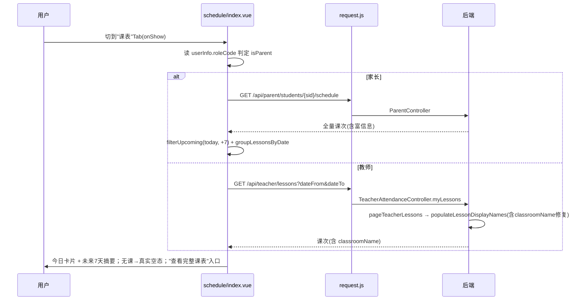
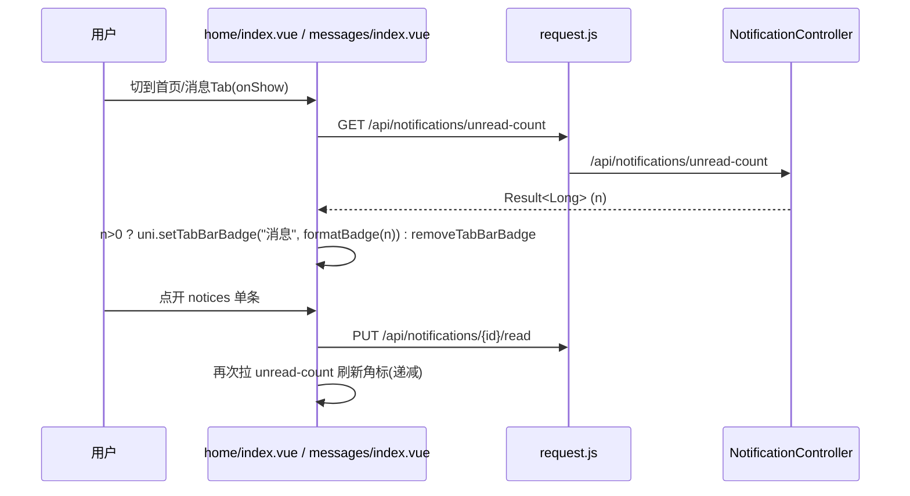

# v1.3 移动端补齐：增量架构设计 + 任务分解

> 产出：架构师（高见远） ｜ 输入：PM《2026-09-08-001-v1.3-mobile-prd.md》 ｜ 状态：设计草案，待主理人/用户决策
> 约束：只读仓库调研后形成设计，**不改写代码**；沿用基线分支 `dev/iteration-next`。后端 464 测试、admin-web 116 测试、mobile 6 测试基线在实现阶段不得破坏。
> 用户已拍板 4 个开放问题（见 PRD 文末），本设计严格遵照，不偏离。

---

## 〇、一句话方案

以 **mobile-uniapp 为主体**补齐"教师请假审批页 / 课表 Tab 真实化 / 教师课表富信息 / 消息角标 / 学情上下文"，仅 backend `AttendanceServiceImpl` 做一处 `classroomName` 填充小改，admin-web 因请假审批能力已存在故**本轮零改动**。

---

## A. 实现方案综述（模块边界）

| 模块 | 本轮动作 | 说明 |
|---|---|---|
| **mobile-uniapp** | 主战场 | 新增教师请假审批页（分包内）；改造课表 Tab、教师课表页、消息中心/首页角标、家长学情页；新增纯逻辑 utils + vitest |
| **backend** | 一处小改 | `AttendanceServiceImpl.populateLessonDisplayNames` 补 `classroomName` 填充（复用已注入的 `ClassroomMapper`）。**无其他后端改动**——教师请假审批、未读计数接口均已备 |
| **admin-web** | **不动** | 管理端请假审批已在 `AdminLeaveRequestController`（`/api/edu/leave-requests` GET+PUT audit，教务可批全部）存在；教师"优先、教务兜底"由同一份数据自然满足，无需改 admin-web |

**关键结论（已与 PRD 核对，纠正若干假设，见 §G）**：
- 教师请假审批 = **纯前端**：`GET/PUT /api/teacher/leave-requests` 后端已备且权限模型完整（按教师授课班级过滤 + 归属校验）。
- 教室名 = **唯一后端小改**：`ScheduleLesson.classroomName` 字段存在但 `populateLessonDisplayNames` 未赋值。
- 消息角标 = **纯前端**：`GET /api/notifications/unread-count` 已备，且为**全角色通用**单端点（非 `/api/teacher/...` 或 `/api/parent/...` 前缀）。

---

## B. 文件清单及相对路径

### 新增文件（5 个）

| 路径 | 职责 |
|---|---|
| `mobile-uniapp/src/pages/teacher/leave-audit.vue` | 教师"学员请假审批"页：拉取本班待处理请假列表（学员/日期/原因/状态）→ "通过/驳回+备注" 操作；复用家长请假记录视觉风格 |
| `mobile-uniapp/src/utils/schedule-summary.js` | 纯函数：`groupLessonsByDate`、`filterUpcoming(lessons, from, to)`、`isToday(date)`、`todayPlusDays(n)`，供课表 Tab 与教师课表复用 |
| `mobile-uniapp/src/utils/leave-status.js` | 纯函数：`leaveStatusText(status)`（1待审/2通过/3驳回）、`leaveStatusClass(status)`、`canAudit(status)`（仅 status=1 可操作） |
| `mobile-uniapp/src/utils/unread-count.js` | 纯函数：`formatBadge(n)`（>99 显示 "99+"）、`shouldShowBadge(n)` |
| `mobile-uniapp/src/utils/schedule-summary.test.js` `mobile-uniapp/src/utils/leave-status.test.js` `mobile-uniapp/src/utils/unread-count.test.js` | 上述纯函数 vitest 单测（延续 enrollment-snapshot 抽离 + `.test.js` 同目录模式） |

### 修改文件（7 个）

| 路径 | 改什么 |
|---|---|
| `backend/src/main/java/com/pzhu/eduadmin/modules/attendance/service/AttendanceServiceImpl.java` | `populateLessonDisplayNames(List<ScheduleLesson>)`（约 437–455 行）补充 `classroomName`：收集 `classroomId` → `classroomMapper.selectBatchIds(...)` → 设 `s.setClassroomName(...)`。`ClassroomMapper` 已在类内注入（第 58 行），无需新增依赖 |
| `mobile-uniapp/src/pages.json` | 在 `subPackages[].pages`（root=`pages/teacher`）新增 `"leave-audit"` 条目 |
| `mobile-uniapp/src/pages/home/index.vue` | `teacherMenus` 新增"请假审批"cell（emoji✋/label 请假审批/desc 本班学员请假处理），跳 `/pages/teacher/leave-audit`；可选显示待处理数（onShow 拉 `GET /api/teacher/leave-requests?pageSize=1` 取 total） |
| `mobile-uniapp/src/pages/schedule/index.vue` | 课表 Tab 真实化：按角色加载"今日 + 未来 7 天"紧凑摘要（家长=`/api/parent/students/{sid}/schedule` 客户端过滤今日+7天；教师=`/api/teacher/lessons?dateFrom=今日&dateTo=今日+7`）；保留"查看完整课表"入口；无课显示真实空态 |
| `mobile-uniapp/src/pages/teacher/schedule.vue` | 课表信息补齐：每条显示 课程名/班级名/教室名/时间/状态；按日期分组、今日组高亮；移除"班级ID/教室ID"裸编号（降级为次级信息）；点击待上课课次跳考勤 |
| `mobile-uniapp/src/pages/messages/index.vue` + `mobile-uniapp/src/pages/home/index.vue` | 消息角标：`onShow` 调 `GET /api/notifications/unread-count`，`uni.setTabBarBadge`/`removeTabBarBadge` 控制"消息"Tab 红点数字；进入消息中心/切点回自动刷新 |
| `mobile-uniapp/src/pages/parent/notices.vue` | 顶部增加"未读 N 条"提示与未读/全部区分（已有 `item.isRead` 与 `unread-dot`，聚合未读数展示即可），单条点开已读即时更新（既有逻辑保留） |
| `mobile-uniapp/src/pages/parent/learning.vue` | 学情上下文：考勤行由 `课次{{a.lessonId}}` 改为展示后端已返回的 `a.lessonInfo`（格式"班级 日期 时间"） |

> 说明：`pages/schedule/index.vue`、`pages/messages/index.vue`、`pages/home/index.vue` 属主 `pages` 包（非分包），已在 `pages.json` 顶层注册，无需再注册；教师页放 `pages/teacher` 分包。

---

## C. 数据结构 / 接口契约

### C.1 与现有工具的关系

- **`utils/request.js` 的 `api()`**：所有请求经 `api({url, method, ...})` 统一封装（自动注入 Bearer token、401 跳转、业务码弹 toast、`_handled` 标记）。本轮全部新增/改造请求沿用 `api()`，**不新增请求封装**。
- **`getCurrentStudentId()` / `getMyStudents()` / `StudentSwitcher`**：家长端课表 Tab、学情页沿用 `getCurrentStudentId()` 取当前学员；`StudentSwitcher` 仅家长端渲染（`isParent` 由 `uni.getStorageSync('userInfo').roleCode !== 'TEACHER'` 判定，已有约定）。
- **角色判定约定（全移动端统一）**：`isParent = userInfo.roleCode !== 'TEACHER'`。课表 Tab、首页菜单均复用此判定，不新增全局 store。

### C.2 后端 classroomName 小改（精确位置）

- 文件：`backend/src/main/java/com/pzhu/eduadmin/modules/attendance/service/AttendanceServiceImpl.java`
- 方法：`private void populateLessonDisplayNames(List<ScheduleLesson> list)`（约 437–455 行）
- 现状：已设 `className`、`courseId`、`courseName`；**未设 `classroomName`**。
- 改法（局部，无新方法、无新 Mapper）：
  ```java
  Set<Long> classroomIds = list.stream().map(ScheduleLesson::getClassroomId)
          .filter(Objects::nonNull).collect(Collectors.toSet());
  Map<Long, String> classroomNameMap = classroomIds.isEmpty() ? Collections.emptyMap()
          : classroomMapper.selectBatchIds(classroomIds).stream()
              .collect(Collectors.toMap(Classroom::getId, Classroom::getName, (a,b)->a));
  // 在 for 循环内追加：
  s.setClassroomName(classroomNameMap.getOrDefault(s.getClassroomId(), ""));
  ```
- 影响面：`pageTeacherLessons`（教师课表页 + 课表 Tab 教师数据源）共用此方法，一处改动同时覆盖 §B 中教师课表页与课表 Tab 的教室名展示。
- 实体：`ScheduleLesson.classroomName` 已声明（`@TableField(exist=false)`，第 57–58 行）；`Classroom.name` 字段存在（第 20 行）。`ClassroomMapper` 已在 `AttendanceServiceImpl` 注入（第 58 行）。**零新增依赖**。

### C.3 教师请假审批接口（已备，纯前端消费）

| 项 | 内容 |
|---|---|
| 列表 | `GET /api/teacher/leave-requests?pageNum=1&pageSize=20` → `Result<PageResult<LeaveRequest>>` |
| 审批 | `PUT /api/teacher/leave-requests/{id}/audit`，body `{ "status": 2, "remark": "同意" }`（status: 2=通过, 3=驳回） |
| 权限 | `@RequireRole({"TEACHER","SUPER_ADMIN","EDU_ADMIN"})`；`pageByTeacher` 仅返回"该教师授课班级内、在班(status=1)学员"的请假；`auditByTeacher` 二次校验"教师确在该学员请假日期有授课课次"，否则 403 |
| 防重复 | 审批用 CAS：`UPDATE ... WHERE status=1`，已处理则 `updated==0` → 抛 `409 该请假申请已被处理` |
| 返回 | 更新后的 `LeaveRequest`（含 `status`、`auditRemark`） |
| 家长可见 | 家长端 `GET /api/parent/leave-requests?studentId=` 读取该条 `status`（1待审/2通过/3驳回）与 `auditRemark`；**拉取式可见**（家长打开/刷新页面即见），后端不在审批时主动推送通知——与现有 PRD 验收"处理后家长端即时显示"一致（以页面刷新为触发） |

`LeaveRequest` 关键字段：`id, studentId, studentName(已填), parentUserId, lessonDate, scheduleId, reason, status, auditUserId, auditRemark, createTime`。

### C.4 消息未读角标接口（已备）

- `GET /api/notifications/unread-count`（`NotificationController` 第 45 行）→ `Result<Long>`。
- **全角色通用**（基于 `CurrentUserHolder`，无角色前缀），家长/教师/教务共用同一端点。
- 返回示例：`{ code:0, data: 3 }`。角标展示用 `formatBadge(data)`（>99 显示 `99+`）。

### C.5 课表 Tab 数据源

- 家长：`GET /api/parent/students/{sid}/schedule` → 返回数组（每项含 `courseName/className/teacherName/classroomName/lessonDate/startTime/endTime/status/leaveStatus`）。前端按 `lessonDate ∈ [today, today+7]` 过滤并分组。
- 教师：`GET /api/teacher/lessons?dateFrom={today}&dateTo={today+7}&pageNum=1&pageSize=100` → `Result<PageResult<ScheduleLesson>>`；教师课表页用无 dateFrom/dateTo 拉全量。

---

## D. 调用流程

### D.1 教师请假审批流



### D.2 课表 Tab 加载流（角色自适应）



### D.3 消息角标刷新流



---

## E. 有序任务列表（依赖顺序，含验收要点）

| # | 任务 | 依赖 | 验收要点 | 测试 |
|---|---|---|---|---|
| **T1** | backend：`AttendanceServiceImpl.populateLessonDisplayNames` 补 `classroomName` | — | `GET /api/teacher/lessons` 返回项含非空 `classroomName`（对照 classroom 表）；既有 `className/courseName` 不受影响；`mvn test` 全绿 | 复用既有 `AttendanceService` 测试，必要时补 1 例断言 classroomName 填充 |
| **T2** | mobile：教师请假审批页 + 注册 + 首页入口 | — | ①列表仅显示**本班学员**请假（归属过滤）②待审项可"通过/驳回+备注"③重复审批被 409 拦截 toast④驳回备注≤200 字⑤审批后本地状态即时更新 | 纯前端，不强制单测；若抽审批载荷构造可并入 T7 |
| **T3** | mobile：课表 Tab 真实化（`pages/schedule/index.vue`） | T1(教师教室名) | ①家长今日有课展示课程/时间②教师今日展示课程/班级/教室③无课显示真实空态而非"恒无课"④保留"查看完整课表"⑤未来7天摘要按日分组 | 复用 T7 的 `schedule-summary` 单测覆盖过滤/分组 |
| **T4** | mobile：教师课表信息补齐（`pages/teacher/schedule.vue`） | T1 | ①每条显示课程名/班级名/教室名/时间/状态②按日期分组且今日高亮③不再仅显示裸"班级ID/教室ID"④点击待上课课次跳考勤 | 复用 T7 单测 |
| **T5** | mobile：消息角标（`home/index.vue`+`messages/index.vue`+`notices.vue`） | — | ①消息 Tab 显示未读数红点②进入/切回自动刷新③单条已读后角标递减④`unread-count` 异常不崩（保留上次值） | 纯前端；角标格式化并入 T7 |
| **T6** | mobile：学情上下文（`parent/learning.vue`） | — | ①考勤行显示 `lessonInfo`（班级/日期/时间）②不再裸"课次ID"③空态/加载态正常 | 纯前端 |
| **T7** | mobile：纯逻辑抽离 + vitest（`schedule-summary.js`/`leave-status.js`/`unread-count.js` + 各 `.test.js`） | — | ①核心纯逻辑均有单测②`npx vitest run` 全绿且既有 6 测试不破 | `npx vitest run` |

**依赖图**：`T1 → T3、T4`；`T2、T5、T6、T7` 互相独立，可与 T1 并行；建议实现顺序 T1 → (T2,T3,T4,T5,T6) → T7（T7 的 utils 应在 T3/T4/T5 落目前先抽，便于复用）。

**测试纪律**：仅本轮新增/改动逻辑补 vitest（用户拍板 Q4），不拉高移动端整体覆盖率；后端仅 T1 可能补 1 例断言，不动 464 基线。

---

## F. 共享知识（跨文件约定）

1. **页面注册**：新页面加进 `pages.json` 对应 `subPackages[].pages`（root=`pages/teacher` 或 `pages/parent`），`pages/schedule|messages|home` 已在主 `pages` 包顶层，勿重复注册。tabBar 三项（首页/课表/消息）固定，新增教师页走分包 + 首页菜单入口，不新增 tabBar。
2. **请求封装**：一律 `import { api } from '@/utils/request'`，`api({url, method, data/params})`；业务/HTTP 错误已由 `api()` 弹 toast 并打 `_handled`，调用处仅需 `catch` 未处理异常，勿重复弹窗。
3. **角色判定**：`isParent = userInfo.roleCode !== 'TEACHER'`（`uni.getStorageSync('userInfo')`）；家长页用 `getCurrentStudentId()` 取学员，教师页用 `CurrentUserHolder` 服务端过滤，**前端不再按 teacherId 二次过滤**（既有 teacher/schedule.vue 注释已警示类型不一致清空问题）。
4. **日期工具复用**：新建 `src/utils/schedule-summary.js` 集中放 `isToday`/`todayPlusDays`/`filterUpcoming`/`groupLessonsByDate`，避免各页面重复实现（现有 parent/schedule.vue 内联了多份 `formatDay/isToday/isPast`，新逻辑统一收敛到此 util）。
5. **测试文件命名**：纯函数 `xxx.js` 配同名 `xxx.test.js` 同目录（沿用 `enrollment-snapshot.js` + `enrollment-snapshot.test.js` 模式），用 vitest `describe/it/expect`，不引 DOM。
6. **状态语义统一**：请假 `status` 1=待审/2=通过/3=驳回（后端 `LeaveRequest` 与 parent/teacher 展示共用）；考勤 `status` 1到课/2迟到/3请假/4缺勤；课次 `status` 1待上课/2已完成/3已取消/4已调课——与既有页面映射表保持一致。
7. **消息角标 API**：全角色用 `GET /api/notifications/unread-count`（无角色前缀），角标用 `uni.setTabBarBadge({ index:2, text })` / `uni.removeTabBarBadge({ index:2 })`（消息 Tab 序号 2）。

---

## G. 待明确事项 + PRD 偏差纠正

### 经后端实查，对 PRD 假设的纠正（均已清零，无需再问用户）

| # | PRD 原假设 | 实际代码核对结论 | 设计处置 |
|---|---|---|---|
| 1 | "独立 TeacherLessonController 提供 `/api/teacher/lessons`" | 实际无独立 Controller；`/api/teacher/lessons` 与 `/api/teacher/leave-requests` 均在 **`TeacherAttendanceController`**（`@RequestMapping("/api/teacher")`，modules/attendance）内（`myLessons` / `myLeaveRequests` / `auditLeaveRequest`） | 路径与参数不变，纯前端直接消费；文档已注明真实类名/方法名 |
| 2 | "MOB-P0-1 后端接口已备，无需后端新增" | ✅ 确认：`GET /api/teacher/leave-requests`（`pageByTeacher` 按教师授课班级过滤）+ `PUT /api/teacher/leave-requests/{id}/audit`（body `{status,remark}`，CAS+归属校验）完整存在 | 纯前端实现，无后端改动 |
| 3 | "若需显示教室名，`pageTeacherLessons` 未填 classroomName，需后端小改" | ✅ 确认：`ScheduleLesson.classroomName` 字段已声明，但 `populateLessonDisplayNames` 未赋值；`ClassroomMapper` 已注入 | T1 一处小改，覆盖教师课表页 + 课表 Tab |
| 4 | "复用 `/api/notifications/unread-count`" | ✅ 确认：存在且为 **`GET /api/notifications/unread-count`**（非 `/api/teacher|parent/...` 前缀），返回 `Result<Long>`，全角色通用 | 家长/教师共用单端点，T5 直接消费 |
| 5 | "admin-web 是否涉及待核实" | 管理端请假审批已存在于 `AdminLeaveRequestController`（`/api/edu/leave-requests` GET+PUT audit，教务批全部） | **admin-web 本轮零改动**；教师优先、教务兜底由同一数据自然满足 |
| 6 | "家长学情只显示课次ID" | 确认 `parent/learning.vue` 第 19 行显示 `课次{{a.lessonId}}`；后端 `Attendance.lessonInfo` 已回填"班级 日期 时间"（`populateAttendanceNames`） | T6 改为展示 `a.lessonInfo`，纯前端 |

### 需主理人/工程师实现时注意的隐含约束（非阻塞）

- **家长端"审批结果可见性"为拉取式**：后端审批时不主动推通知给家长，家长需打开/刷新请假记录页才见新状态。若演示希望"审批后家长即时弹通知"，需额外后端派发（超出本轮范围，建议留 P2 或单独议题）。本轮按"页面刷新即见"满足 PRD 验收。
- **课表 Tab 教师"未来一周"用 `dateFrom/dateTo` 参数**：`pageTeacherLessons` 已支持该参数（AttendanceServiceImpl 第 425–430 行），前端传 `yyyy-MM-dd` 字符串即可。
- **`populateLessonDisplayNames` 同时服务教师课表页与课表 Tab**：T1 改动须保证两处 `classroomName` 均生效，测试用教师课表接口验证即可。
- **无 P0/P1 涉及数据库 schema 变更**：本轮零 Flyway / 零新表，无迁移风险。

### 若仍要先澄清的点（按用户拍板已可推进，以下仅为实现侧提示，非阻塞）

- 教师请假审批页入口形态：本设计选"首页教师菜单新增'请假审批'cell（含待处理数徽标）"。若团队更希望并入"课堂考勤"页 Tab，可在 T2 实现时调整，不影响后端契约。

---

## 附：本轮改动规模速览

- 新增文件：5（1 页面 + 3 util + 3 测试 = 7 文件，含测试）
- 修改文件：7（backend 1 + mobile 6）
- 后端改动：1 处方法内 4~6 行（classroomName 填充）
- 测试：移动端 vitest 文件由 1（enrollment-snapshot.test.js，6 测试）→ 4（新增 3 个纯逻辑 `.test.js`，沿用 `.test.js` 同目录模式）；仅新增、不拉高整体覆盖率；后端基线 464 不受影响
- admin-web：0 改动
