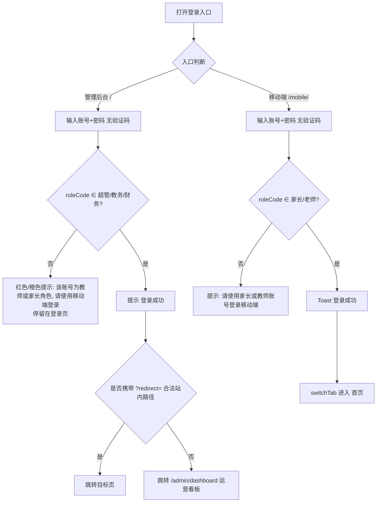
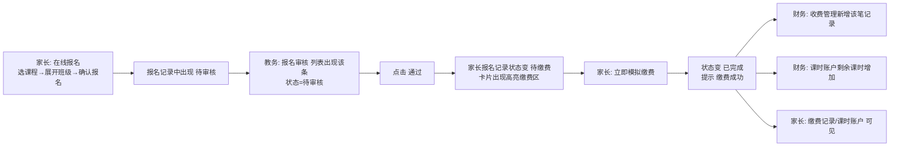

# 艺培通 · 浏览器 UI 测试计划（面向「浏览器自动化 + 视觉识别 AI」）

> 版本：v1.0 ｜ 日期：2026-09-10 ｜ 适用产品：艺培通（艺术培训机构全流程教务管理平台）
> 对应生产部署：`docs/deployment-2026-09-10.md`（镜像 `v1.3.0-20260908`）
> 本计划为 **UI 层 + 视觉层** 测试，重点交付给「能操作真实浏览器并具备图像识别/N‑VLM 能力」的 AI 执行者。

---

## 0. 给执行者的三条硬规则

1. **断言必须是视觉断言**：只认「截图里能看/能读到的东西」——文字内容、文字颜色、状态标签颜色、数值、金额、图表是否存在、元素是否可见。**禁止**用「验证数据正确」「界面正常」「功能可用」这类无法判定的表述。
2. **测试手段只能是界面操作**：打开 URL、点击菜单/按钮、在输入框键入、选择下拉项、切换 Tab、拖动、上传文件、截图。**禁止**通过「调用 API」「查询数据库」「看控制台日志」来当作测试手段（控制台/网络面板仅允许作为排查“白屏/报错”的辅助，最终判定仍以截图为准）。
3. **视觉为主、DOM 为辅**：列表分页、表单校验气泡、Toast 等瞬时/精细元素，可用括号内给出的 DOM 选择器提示辅助定位；**判定结论始终以视觉断言为准**。

---

## 1. 测试环境信息

### 1.1 访问入口

| 项目 | 值 |
|------|-----|
| 管理后台（PC 浏览器） | `http://101.35.239.218/` |
| 移动端 H5 | `http://101.35.239.218/mobile/` |
| 移动端登录页直达 | `http://101.35.239.218/mobile/#/pages/login/login` |
| 健康检查（非测试目标） | `http://101.35.239.218/healthz` |
| 版本信息（非测试目标） | `http://101.35.239.218/version` |
| 部署形态 | Docker Compose：caddy → nginx(web) → backend → mysql8 |

> 说明：管理端为 Vue3 SPA（history 路由）；移动端为 uni‑app 编译的 H5（hash 路由）。两者同域不同路径，共用同一套后端 `/api`。

### 1.2 五角色账号表（密码统一 `123456`）

| 角色 | 角色码 | 主账号 | 中文名 | 登录入口 | 其他同类账号 |
|------|--------|--------|--------|----------|--------------|
| 超级管理员 | SUPER_ADMIN | `admin` | 超级管理员 | 管理后台 | `admin2`、`admin3` |
| 教务管理员 | EDU_ADMIN | `edu` | 教务小李 | 管理后台 | `edu2`、`edu3` |
| 财务管理员 | FINANCE | `finance` | 财务小王 | 管理后台 | `finance2`、`finance3` |
| 授课教师 | TEACHER | `teacher1` | 张老师 | 移动端 H5 | `teacher2`…`teacher6` |
| 学员家长 | PARENT | `parent1` | 刘家长 | 移动端 H5 | `parent2`…`parent7` |

> ⚠️ **入口互斥**：管理后台只接受 SUPER_ADMIN / EDU_ADMIN / FINANCE；移动端只接受 PARENT / TEACHER。用错入口会被拒绝（见 TC-LOGIN-004/005/010）。

### 1.3 浏览器与视口建议

| 端 | 浏览器 | 视口 | 备注 |
|----|--------|------|------|
| 管理后台 | Chromium（Chrome/Edge）最新版 | **1440 × 900**，DPR=1 | 侧边栏 220px 展开态；表格/图表为 PC 布局 |
| 移动端 H5 | Chromium（DevTools 移动仿真） | **390 × 844**，DPR=2~3，Mobile UA | 模拟 iPhone 12/13/14 尺寸；使用触摸事件 |

其它要求：允许弹窗/Toast/新窗口；截图存 PNG；每张截图命名 `TC-编号_步骤号_阶段.png`（如 `TC-LOGIN-001_03_dashboard.png`）。

### 1.4 登录方式说明（已核对登录页源码，**无验证码**）

**管理后台登录页**（`admin-web/src/views/login/Login.vue`）：
- 左侧品牌区：大字 **「艺培通」**、副标题 **「艺术培训机构全流程教务管理平台」**、三个特性词 **「智能排课 · 课时管理 · 学员成长」**。
- 右侧表单：标题 **「欢迎回来」**、副标题 **「登录您的管理账号」**。
- 字段：**用户名**（占位符 `用户名`）、**密码**（占位符 `密码`，带显示/隐藏小眼睛）。
- 按钮：**「登 录」**（“登”与“录”之间有空格，悬停/点击态为蓝色主色）。
- **无图形验证码、无滑块**。
- 底部演示账号提示：**「管理端演示账号」** + 三个标签 `admin / 123456`、`edu / 123456`、`finance / 123456` + 提示文字 **「教师和家长请使用移动端登录」**。

**移动端登录页**（`mobile-uniapp/src/pages/login/login.vue`）：
- 顶部渐变头部 + 导航标题 **「登录」**；品牌区显示 **「艺培通」**、副标题 **「艺术培训管理平台」**。
- 表单卡片字段标签为 **「账号」**、**「密码」**，占位符 `请输入用户名` / `请输入密码`。
- 按钮 **「登 录」**（加载态显示 **「登录中...」**）。
- 底部：**「演示账号：parent1 / teacher1 密码：123456」**、**「还没有账号？立即注册」**、页脚 **「艺培通 EduAdmin」**。
- **无图形验证码、无滑块**。

### 1.5 演示数据基线（预期数值的来源）

> 数据库由 `sql/data.sql` 初始化；以下数字为“初始基线”。UI 测试中若执行了增删改，后续用例的预期值需相应调整（本计划在涉及写操作的用例中已标注）。

| 数据 | 数量/内容 | 关键标识 |
|------|-----------|----------|
| 用户 | **22**（超管3 / 教务3 / 财务3 / 教师6 / 家长7） | 密码统一 `123456` |
| 学员 | **12**（刘小小、陈朵朵、赵一鸣…） | 年龄 6~11 岁 |
| 课程 | **12**（美术/钢琴/舞蹈/书法/声乐/主持 6 类） | 单价 ¥1280~¥4800 |
| 教室 | **10**（A101画室、B201琴房…） | 全部“启用” |
| 班级 | **12**（美术周末A班…朗诵暑假L班） | 开班日期 2026‑07 |
| 报名记录 | **15**，**全部为「已完成」** | ⚠️ 初始无“待审核”报名 |
| 收费记录 | **15**，支付方式均为 **模拟支付** | 缴费时间 2026‑07‑08~07‑10 |
| 课时账户 | **15** 个（学员×课程唯一） | 剩余课时 12~22 |
| 排课课次 | **232**（2026‑07~2026‑12，每周循环） | 2026‑07 前的多为“已完成” |
| 考勤 | **24** 条（到课/迟到/请假/缺勤齐全） | 关联已完成课次 |
| 退费记录 | **10**：**3 待审核**/6 已通过/1 已拒绝 | 待审核 id=4,5,8 |
| 调课申请 | **10**：**4 待审核**/4 已通过/2 已驳回 | 待审核为默认筛选 |
| 薪资记录 | **12**：2026‑07 有 6 条「待确认」；2026‑06 有 6 条 | 规则 18 条 |
| 考级项目 | **10**；考级报名 **15** | 双 Tab |
| 通知公告 | **12**（公告/调课通知/上课提醒/课时不足/报名留位/考级通知） | 接收范围 全体/教师/家长 |
| 作业 | **15**；学情记录 **30+** | 关联已完成课次 |
| 操作日志 | **15** | — |
| 机构 | 名称 **「知行艺术培训中心」**、校区 **「本部校区」** | 联系电话 010‑88889999 |

**由演示数据推出的看板预期**（详见 §7 已知限制）：本月（测试当月，演示数据为 2026‑07）**「本月营收（净额）」应为负数或 0**（演示数据当月缴费为 0、存在已通过退费），属正常口径，**不得判为缺陷**。

---

## 2. 用例统计总览

| 模块 | 用例数 | P0 | P1 | P2 |
|------|--------|----|----|----|
| A 登录与权限隔离 | 10 | 7 | 3 | 0 |
| B 超级管理员（管理后台） | 10 | 3 | 6 | 1 |
| C 教务管理员（管理后台） | 15 | 4 | 10 | 1 |
| D 财务管理员（管理后台） | 8 | 4 | 3 | 1 |
| E 授课教师（移动端） | 7 | 4 | 3 | 0 |
| F 学员家长（移动端） | 10 | 5 | 4 | 1 |
| G 越权与安全视觉验证 | 6 | 5 | 1 | 0 |
| H 移动端专项 | 3 | 1 | 2 | 0 |
| **合计** | **69** | **33** | **32** | **4** |

覆盖角色：超级管理员、教务管理员、财务管理员、授课教师、学员家长（全部 5 个）。
覆盖模块：登录/权限隔离、运营看板、用户与角色、机构配置、公告、课程、班级、排课、智能排课、调课审核、大课表（拖拽）、报名审核、教室、学员、考级、考勤、收费、退费、课时账户、课时流水、薪资、教师课表/考勤/学情/调课/请假审批、家长报名/缴费/课表/学情/课时/请假/退费/消息、移动端适配。

---

## 3. 关键流程

### 3.1 登录与角色路由流程图

### 3.2 家长报名 → 教务审核 → 家长缴费 → 财务/课时联动 闭环

---

## 4. 通用约定

- **截图核对点**：凡标注 **【截图】** 的步骤，执行者必须截图，并在报告中给出“截图中识别到的关键视觉元素清单”。
- **数字格式**：金额统一 `¥12,345.67`（千分位 + 两位小数）；看板卡片在数据未加载时为 `--`，加载后必须是数字。
- **状态标签颜色口径**（Element Plus）：`success`=绿、`warning`=橙、`danger`=红、`primary`=蓝、`info`=灰。移动端为自绘标签，按 §附录A 的色值判定。
- **失败判定通用原则**：出现以下任一即判失败——预期文字缺失或文字不符；状态标签颜色不符；数值为空/不符；预期不应出现的元素却出现；页面白屏或持续 loading 超过 10s；弹窗/跳转目标与预期不符。
- **数据漂移处理**：本计划中标注「(基线)」的预期数字基于初始演示数据；若前置用例已改变数据，执行者应在报告中说明“因前序写操作导致数量变化”，不判失败。

---

## 5. 用例集

> 用例编号规则：`TC-<模块>-<序号>`。每条用例字段固定：用例编号 / 优先级 / 前置条件 / 操作步骤 / 视觉断言 / 失败判定 / 关联需求。

---

### A. 登录与权限隔离

#### TC-LOGIN-001 · 管理端超级管理员登录成功并进入运营看板
| 项 | 内容 |
|----|------|
| 优先级 | P0 |
| 前置条件 | 浏览器视口 1440×900；无登录态（可先清 localStorage/cookie） |
| 操作步骤 | 1. 打开 `http://101.35.239.218/`，等待登录页加载 2. 在「用户名」框输入 `admin` 3. 在「密码」框输入 `123456` 4. 点击 **「登 录」** 5. 等待跳转完成 |
| 视觉断言 | ①登录成功后 URL 变为 `http://101.35.239.218/admin/dashboard`； ②页面顶部出现大标题 **「运营数据看板」**，其右侧有浅灰副标题「机构核心运营指标一览」； ③左上角侧边栏顶部显示白字 Logo **「教务管理平台」**； ④页面出现绿色成功提示 **「登录成功」**（Toast，可短暂存在）； ⑤右上角用户区显示头像首字 **「超」** 与姓名 **「超级管理员」**； ⑥浏览器标签页标题为 **「运营看板」**。 |
| 失败判定 | 停留在登录页、或未出现「运营数据看板」标题、或 URL 不是 `/admin/dashboard`、或侧边栏 Logo 文字不符 → 失败 |
| 关联需求 | FR-A-05、UC-A02 |

#### TC-LOGIN-002 · 管理端教务管理员登录成功，侧边栏仅显示教务相关菜单
| 项 | 内容 |
|----|------|
| 优先级 | P0 |
| 前置条件 | 无登录态 |
| 操作步骤 | 1. 打开 `http://101.35.239.218/` 2. 用户名输入 `edu`，密码 `123456` 3. 点击 **「登 录」** 4. 登录后观察左侧侧边栏全部一级/二级菜单 |
| 视觉断言 | ①进入 **「运营数据看板」**； ②右上角姓名显示 **「教务小李」**，角色小字为 **「教务管理员」**； ③侧边栏出现分组 **「教务管理」**，其下依次可见菜单：**学员管理、课程管理、班级管理、报名管理、大课表、排课管理、调课审核、教室管理、考勤管理、考级管理**（共 10 项）； ④侧边栏出现菜单 **「运营看板」**； ⑤侧边栏 **不出现** 分组 **「财务管理」**，也 **不出现** 菜单 **用户管理/角色管理/菜单管理/机构配置/操作日志**； ⑥侧边栏存在分组 **「系统管理」**，但展开后 **仅含「公告管理」** 一项。 |
| 失败判定 | 出现「财务管理」分组，或出现用户管理/角色管理/机构配置等超管菜单 → 失败（越权可见） |
| 关联需求 | FR-A-02、§5 安全性 |

#### TC-LOGIN-003 · 管理端财务管理员登录成功，侧边栏仅显示财务相关菜单
| 项 | 内容 |
|----|------|
| 优先级 | P0 |
| 前置条件 | 无登录态 |
| 操作步骤 | 1. 打开 `http://101.35.239.218/` 2. 用户名输入 `finance`，密码 `123456` 3. 点击 **「登 录」** 4. 观察侧边栏 |
| 视觉断言 | ①进入 **「运营数据看板」**； ②右上角姓名 **「财务小王」**、角色 **「财务管理员」**； ③侧边栏出现分组 **「财务管理」**，其下可见：**收费管理、退费管理、课时账户、课时流水、薪资管理**（5 项）； ④侧边栏 **不出现** 分组 **「教务管理」** 与 **「系统管理」**； ⑤侧边栏出现 **「运营看板」**。 |
| 失败判定 | 出现教务或系统管理分组、或缺少任一财务菜单 → 失败 |
| 关联需求 | FR-A-02 |

#### TC-LOGIN-004 · 管理端拒绝教师账号登录（视觉确认“不该能进来”）
| 项 | 内容 |
|----|------|
| 优先级 | P0 |
| 前置条件 | 无登录态；位于管理后台登录页 |
| 操作步骤 | 1. 打开 `http://101.35.239.218/` 2. 用户名输入 `teacher1`，密码 `123456` 3. 点击 **「登 录」** |
| 视觉断言 | ①页面出现橙色/黄色警告提示，文字为 **「该账号为教师或家长角色，请使用移动端（艺培通）登录」**； ②页面 **仍停留在登录页**（仍可见「欢迎回来」「登 录」按钮），URL 不含 `/admin/dashboard`； ③**不出现** 侧边栏与「运营数据看板」。 |
| 失败判定 | 进入后台任意页面，或未出现上述提示 → 失败 |
| 关联需求 | §5 安全性、UC-A01 |

#### TC-LOGIN-005 · 管理端拒绝家长账号登录
| 项 | 内容 |
|----|------|
| 优先级 | P0 |
| 前置条件 | 无登录态；管理后台登录页 |
| 操作步骤 | 1. 用户名输入 `parent1`，密码 `123456`，点击 **「登 录」** |
| 视觉断言 | ①出现同上的教师/家长警告提示；②仍停留在登录页；③不出现后台侧边栏。 |
| 失败判定 | 进入后台，或未出现提示 → 失败 |
| 关联需求 | §5 安全性 |

#### TC-LOGIN-006 · 管理端错误密码给出失败提示
| 项 | 内容 |
|----|------|
| 优先级 | P1 |
| 前置条件 | 管理后台登录页 |
| 操作步骤 | 1. 用户名输入 `admin` 2. 密码输入 `000000` 3. 点击 **「登 录」** |
| 视觉断言 | ①出现 **红色/橙色错误提示**（内容含“密码错误/用户名或密码错误/登录失败”任一类但必须是错误语义，且与“登录成功”绿色的颜色明显不同）； ②仍停留在登录页。 |
| 失败判定 | 进入后台，或无任何错误提示 → 失败 |
| 关联需求 | §3.3 常见提示 |

#### TC-LOGIN-007 · 管理端退出登录返回登录页
| 项 | 内容 |
|----|------|
| 优先级 | P1 |
| 前置条件 | 已用 `admin` 登录，位于「运营数据看板」 |
| 操作步骤 | 1. 点击右上角用户区（显示「超级管理员」的按钮） 2. 在下拉菜单中点击 **「退出登录」** |
| 视觉断言 | ①页面回到登录页，可见 **「欢迎回来」** 与 **「登 录」** 按钮； ②URL 为 `http://101.35.239.218/login`； ③侧边栏、看板卡片全部消失。 |
| 失败判定 | 未返回登录页、或 URL 仍为后台路由 → 失败 |
| 关联需求 | §3.2 退出登录 |

#### TC-LOGIN-008 · 移动端家长账号登录成功进入家长首页
| 项 | 内容 |
|----|------|
| 优先级 | P0 |
| 前置条件 | 移动端视口 390×844；无登录态 |
| 操作步骤 | 1. 打开 `http://101.35.239.218/mobile/`，等待登录页 2. 在「账号」框输入 `parent1` 3. 在「密码」框输入 `123456` 4. 点击 **「登 录」** |
| 视觉断言 | ①登录页可见品牌 **「艺培通」** 与副标题 **「艺术培训管理平台」**、底部 **「艺培通 EduAdmin」**； ②登录后进入首页，顶部渐变头部显示问候语（如「下午好」）+ 姓名 **「刘家长」**； ③出现区块标题 **「我的孩子」**； ④出现区块标题 **「常用功能」**，其下卡片含：**课程报名、报名记录、缴费记录、学情查看、课时账户、请假申请、退费申请、消息中心**（8 项，带 emoji 图标）； ⑤底部出现 tabBar 三项：**首页 / 课表 / 消息**。 |
| 失败判定 | 未进入首页、或缺少「我的孩子」、或功能项不足/命名不符 → 失败 |
| 关联需求 | FR-P-01~08 |

#### TC-LOGIN-009 · 移动端教师账号登录成功进入教师首页
| 项 | 内容 |
|----|------|
| 优先级 | P0 |
| 前置条件 | 移动端视口；无登录态 |
| 操作步骤 | 1. 打开移动端登录页 2. 账号 `teacher1`，密码 `123456` 3. 点击 **「登 录」** |
| 视觉断言 | ①进入首页，问候语 + 姓名 **「张老师」**； ②区块标题为 **「教学工具」**（而非“常用功能”）； ③其下卡片含：**课堂考勤、考勤记录、学情管理、调课申请、课时统计、请假审批**（6 项）； ④**不出现** 区块 **「我的孩子」**。 |
| 失败判定 | 出现「我的孩子」、或未出现「教学工具」、或菜单项不符 → 失败 |
| 关联需求 | FR-T-01~07 |

#### TC-LOGIN-010 · 移动端拒绝管理账号登录
| 项 | 内容 |
|----|------|
| 优先级 | P1 |
| 前置条件 | 移动端登录页 |
| 操作步骤 | 1. 账号输入 `edu`，密码 `123456` 2. 点击 **「登 录」** |
| 视觉断言 | ①出现提示 **「请使用家长或教师账号登录移动端」**； ②仍停留在移动端登录页。 |
| 失败判定 | 进入首页，或未出现提示 → 失败 |
| 关联需求 | §5 安全性 |

---

### B. 超级管理员（管理后台）

> 前置：已用 `admin` 登录。

#### TC-ADMIN-001 · 超级管理员侧边栏为完整四分组菜单
| 项 | 内容 |
|----|------|
| 优先级 | P0 |
| 前置条件 | 已用 `admin` 登录 |
| 操作步骤 | 1. 观察左侧侧边栏；2. 依次展开 **「系统管理」「教务管理」「财务管理」** 三个分组 |
| 视觉断言 | ①直接可见菜单 **「运营看板」**； ②分组 **「系统管理」** 展开含：用户管理、角色管理、菜单管理、机构配置、公告管理、操作日志； ③分组 **「教务管理」** 展开含 10 项（学员管理、课程管理、班级管理、报名管理、大课表、排课管理、调课审核、教室管理、考勤管理、考级管理）； ④分组 **「财务管理」** 展开含 5 项（收费管理、退费管理、课时账户、课时流水、薪资管理）； ⑤侧边栏底部无其它角色专属入口。 |
| 失败判定 | 缺少任一分组或任一菜单项 → 失败 |
| 关联需求 | FR-A-01/02 |

#### TC-ADMIN-002 · 运营看板四个统计卡片数值非空
| 项 | 内容 |
|----|------|
| 优先级 | P0 |
| 前置条件 | 已用 `admin` 登录，位于「运营数据看板」 |
| 操作步骤 | 1. 观察页面上方一排 4 个卡片 2. 【截图】 |
| 视觉断言 | ①出现 4 个统计卡片，标题分别为 **「在册学员」「本月课次」「本月营收（净额）」「到课率」**； ②每个卡片下方数值 **不是 `--`**：在册学员为整数（基线 **12**）；本月课次为整数（≥0）；本月营收为带 `¥` 的金额（**可能为负数**，见 §7）；到课率为形如 `91.7%` 的百分比； ③4 个卡片各有一条不同颜色的底部强调条（主蓝/绿/琥珀/玫红）。 |
| 失败判定 | 任一卡片数值仍为 `--`、或金额缺少 `¥`、或到课率缺少 `%` → 失败 |
| 关联需求 | FR-A-05、FR-S-01/02 |

#### TC-ADMIN-003 · 运营看板三个趋势图渲染且非空白
| 项 | 内容 |
|----|------|
| 优先级 | P1 |
| 前置条件 | 位于「运营数据看板」 |
| 操作步骤 | 1. 向下滚动到图表区 2. 【截图】 |
| 视觉断言 | ①出现 3 张图表卡片，标题分别为 **「月度课时趋势」**（副标题“近 6 月已完成课次数”）、**「月度营收趋势」**（副标题“近 6 月每月收费金额（元）”）、**「月度到课率趋势」**； ②每张卡片内为可渲染的折线/柱状图（非纯空白白板）：可见 X 轴月份刻度标签（形如 `2026-07`）、Y 轴刻度与图元； ③「月度营收趋势」为柱状图（绿色柱）。 |
| 失败判定 | 任一图表区域为空白/仅显示容器无图元 → 失败 |
| 关联需求 | FR-S-03 |

#### TC-ADMIN-004 · 运营看板「多维运营分析」六个 Tab 可切换
| 项 | 内容 |
|----|------|
| 优先级 | P1 |
| 前置条件 | 位于看板，滚动到「多维运营分析」卡片 |
| 操作步骤 | 1. 依次点击标签页：**教师工作量、学员流失率、流失预警（学员级）、班级活跃度、课程盈利、收费率**，每次点击后观察内容区 |
| 视觉断言 | ①卡内出现 6 个 Tab 标签，名称完全一致； ②「教师工作量」页出现表格，表头含 **「教师」「完成课次」**； ③「学员流失率」页表头含 **「月份」「月初在班」「退班人数」「流失率」**； ④「班级活跃度」表头含 **「班级」「学员数」「课次进度」「到课率」「最近上课」**； ⑤「课程盈利」表头含 **「课程」「收入」「退费」「净收入」**； ⑥「收费率」表头含 **「课程」「应收报名数」「已缴费报名数」「收费率」**； ⑦每次切换后内容区标题随之变化。 |
| 失败判定 | Tab 缺失、切换后内容不变化、或表头不符 → 失败 |
| 关联需求 | FR-S-04~07 |

#### TC-ADMIN-005 · 用户管理列表展示 22 个账号
| 项 | 内容 |
|----|------|
| 优先级 | P0 |
| 前置条件 | 已用 `admin` 登录 |
| 操作步骤 | 1. 点击侧栏 **系统管理 → 用户管理** 2. 等待列表加载 3. 【截图】 |
| 视觉断言 | ①页面出现标题 **「用户管理」** 与按钮 **「新增用户」**； ②表格表头包含 **ID、用户名、姓名、教学特长、手机号、角色、状态、最后登录、创建时间、操作**； ③分页总数显示 **22** 条（基线）； ④表格首屏可见用户名 `admin`、`edu`、`finance` 等； ⑤「角色」列为彩色标签（超级管理员/教务管理员/财务管理员/授课教师/学员家长）； ⑥「状态」列显示绿色 **「启用」** 标签。 |
| 失败判定 | 列表为空、总数不为 22（无前置写操作时）、或表头缺失 → 失败 |
| 关联需求 | FR-A-01 |

#### TC-ADMIN-006 · 用户管理按用户名搜索命中
| 项 | 内容 |
|----|------|
| 优先级 | P1 |
| 前置条件 | 位于「用户管理」 |
| 操作步骤 | 1. 在搜索框（占位符「搜索用户名或姓名」）输入 `teacher1` 2. 点击 **「搜索」** |
| 视觉断言 | ①表格仅剩 1 行，用户名列为 **`teacher1`**，姓名列 **「张老师」**，角色列 **「授课教师」**； ②分页总数变为 1。 |
| 失败判定 | 仍显示 22 行、或结果不含 teacher1 → 失败 |
| 关联需求 | FR-A-01 |

#### TC-ADMIN-007 · 用户管理「新增用户」对话框字段完整
| 项 | 内容 |
|----|------|
| 优先级 | P1 |
| 前置条件 | 位于「用户管理」 |
| 操作步骤 | 1. 点击 **「新增用户」** 2. 观察弹窗（不要提交） 3. 【截图】后点击 **「取消」** |
| 视觉断言 | ①弹出对话框，标题含 **「新增用户」**； ②表单可见字段标签：**用户名、密码、姓名、手机号、角色**； ③「角色」为下拉选择，占位符 **「请选择角色」**； ④底部按钮为 **「取消」** 与 **「确定」**（或“保存”）。 |
| 失败判定 | 弹窗未出现、或缺少上述字段/按钮 → 失败 |
| 关联需求 | FR-A-01 |

#### TC-ADMIN-008 · 角色管理的五个内置角色与权限分配入口
| 项 | 内容 |
|----|------|
| 优先级 | P1 |
| 前置条件 | 已用 `admin` 登录 |
| 操作步骤 | 1. 点击侧栏 **系统管理 → 角色管理** 2. 观察列表 3. 点击任一内置角色行的 **「分配权限」**，观察弹窗后关闭 |
| 视觉断言 | ①页面标题 **「角色管理」**，按钮 **「新增角色」**； ②表头含 **角色名称、角色编码、类型、操作**； ③列表含 5 个内置角色：超级管理员/教务管理员/财务管理员/授课教师/学员家长，其「类型」列为橙色 **「内置」** 标签； ④权限弹窗内出现菜单/权限树，含 **「全选」「清空」「重置」** 按钮与 **模块/权限数/选中状态** 表头。 |
| 失败判定 | 角色不足 5 个、或权限弹窗无法打开 → 失败 |
| 关联需求 | FR-A-02 |

#### TC-ADMIN-009 · 机构配置显示演示机构信息
| 项 | 内容 |
|----|------|
| 优先级 | P1 |
| 前置条件 | 已用 `admin` 登录 |
| 操作步骤 | 1. 点击侧栏 **系统管理 → 机构配置** |
| 视觉断言 | ①页面标题 **「机构信息配置」**； ②表单「机构名称」输入框内为 **「知行艺术培训中心」**； ③「校区」为 **「本部校区」**； ④「联系电话」为 **「010-88889999」**； ⑤出现 **「保存」** 按钮。 |
| 失败判定 | 机构名称与演示数据不符（无前置修改时）→ 失败 |
| 关联需求 | FR-A-03 |

#### TC-ADMIN-010 · 公告管理列表含 12 条公告与类型标签
| 项 | 内容 |
|----|------|
| 优先级 | P2 |
| 前置条件 | 已用 `admin` 登录 |
| 操作步骤 | 1. 点击侧栏 **系统管理 → 公告管理** |
| 视觉断言 | ①页面标题 **「公告管理」**，按钮 **「发布公告」**； ②表格总数 **12**（基线）； ③「类型」列出现彩色标签「公告/调课通知/上课提醒/课时不足提醒/报名留位到期/考级通知」； ④「接收范围」列出现「全体/教师/家长」； ⑤可见标题 **「机构暑期课程安排通知」**。 |
| 失败判定 | 列表为空或无类型标签 → 失败 |
| 关联需求 | FR-A-04 |

---

### C. 教务管理员（管理后台）

> 前置：已用 `edu` 登录。

#### TC-EDU-001 · 课程管理展示 12 门课程与分类
| 项 | 内容 |
|----|------|
| 优先级 | P0 |
| 前置条件 | 已用 `edu` 登录 |
| 操作步骤 | 1. 点击侧栏 **教务管理 → 课程管理** 2. 等待加载，【截图】 |
| 视觉断言 | ①页面标题 **「课程管理」**，按钮 **「新增课程」**； ②表头含 **ID、课程名称、分类、总课时、时长(分)、价格、状态、操作**； ③总数 **12**（基线）； ④可见课程 **「少儿美术启蒙班」**（分类 美术，价格 2400.00）、**「钢琴基础一对多」**（钢琴，3000.00）； ⑤「状态」列为绿色 **「启用」** 标签； ⑥每行操作列有 **「编辑」「删除」**。 |
| 失败判定 | 可见课程少于基线且无前置增删、或缺少分类列 → 失败 |
| 关联需求 | FR-E-01 |

#### TC-EDU-002 · 新增课程对话框可打开且字段完整
| 项 | 内容 |
|----|------|
| 优先级 | P1 |
| 前置条件 | 位于「课程管理」 |
| 操作步骤 | 1. 点击 **「新增课程」** 2. 观察弹窗后点击 **「取消」** |
| 视觉断言 | ①弹窗标题 **「新增课程」**； ②字段含 **课程名称、分类、总课时、时长(分钟)、价格、状态**； ③分类为可搜索下拉（占位符「输入关键字搜索已有分类，不匹配则直接新增」）； ④状态下拉含 **「启用」「停用」**； ⑤底部 **「取消」「保存」**。 |
| 失败判定 | 弹窗未出现或缺字段 → 失败 |
| 关联需求 | FR-E-01 |

#### TC-EDU-003 · 班级管理展示 12 个班级及当前人数
| 项 | 内容 |
|----|------|
| 优先级 | P1 |
| 前置条件 | 已用 `edu` 登录 |
| 操作步骤 | 1. 点击侧栏 **教务管理 → 班级管理** |
| 视觉断言 | ①页面标题 **「班级管理」**，按钮 **「新增班级」**； ②表头含 **ID、班级名称、课程、教师、最大人数、当前人数、开课日期、状态、操作**； ③总数 **12**（基线）； ④可见 **「美术周末A班」**（教师 张老师，最大 15）、**「钢琴周中B班」**（李老师，最大 8）； ⑤操作列含 **「编辑」「加入学员」「查看学员」「删除」**。 |
| 失败判定 | 班级不足 12（无前置增删）、或缺少「当前人数」列 → 失败 |
| 关联需求 | FR-E-02 |

#### TC-EDU-004 · 排课管理列表展示课次与四色状态标签
| 项 | 内容 |
|----|------|
| 优先级 | P1 |
| 前置条件 | 已用 `edu` 登录 |
| 操作步骤 | 1. 点击侧栏 **教务管理 → 排课管理** 2. 【截图】 |
| 视觉断言 | ①页面标题 **「排课管理」**，按钮 **「智能排课」「批量排课」「新增课次」**； ②表头含 **ID、班级、教师、教室、日期、开始、结束、状态、操作**； ③状态列出现彩色标签：橙色 **「待上课」**、绿色 **「已完成」**、灰色 **「已取消」**、红色 **「已调课」**（至少能看到「已完成」与「待上课」）； ④「已完成」行的操作按钮为禁用/灰色（仅待上课可编辑）。 |
| 失败判定 | 状态无颜色区分、或表头缺失 → 失败 |
| 关联需求 | FR-E-03 |

#### TC-EDU-005 · 智能排课对话框与生成课表反馈
| 项 | 内容 |
|----|------|
| 优先级 | P1 |
| 前置条件 | 位于「排课管理」 |
| 操作步骤 | 1. 点击 **「智能排课」** 2. 观察弹窗字段（不提交） |
| 视觉断言 | ①弹窗含字段：班级选择、教师选择、教室选择（占位符「自动选择容量合适的教室」）、日期范围（占位符「开始日期」至「结束日期」）、开始/结束时间； ②底部按钮 **「生成课表」**； ③弹窗内不出现“接口/JSON/参数”等原始数据。 |
| 失败判定 | 弹窗未出现或缺关键字段 → 失败 |
| 关联需求 | FR-E-03/04 |

#### TC-EDU-006 · 调课审核默认聚焦「待审核」并有待办计数
| 项 | 内容 |
|----|------|
| 优先级 | P0 |
| 前置条件 | 已用 `edu` 登录 |
| 操作步骤 | 1. 点击侧栏 **教务管理 → 调课审核** 2. 观察顶部与列表 |
| 视觉断言 | ①页面标题 **「调课审核」**； ②顶部提示 **「待审核 N 条」**（N>0，基线 4）； ③筛选按钮组为 **待审核 / 已通过 / 已驳回 / 全部**，默认选中 **「待审核」**（高亮）； ④列表卡片处于“待审核高亮样式”，每张卡片含 状态标签 **「待审核」**（橙色）+ **「通过」「驳回」** 按钮； ⑤卡片显示「原时间 → 期望时间」时间链路。 |
| 失败判定 | 默认筛选不是“待审核”、或无待办计数、或无「通过/驳回」按钮 → 失败 |
| 关联需求 | FR-E-05 |

#### TC-EDU-007 · 调课审核「驳回」需填写原因
| 项 | 内容 |
|----|------|
| 优先级 | P1 |
| 前置条件 | 位于「调课审核」，默认「待审核」列表非空 |
| 操作步骤 | 1. 点击任意待审核卡片的 **「驳回」** 2. 在弹出的输入框中输入 `测试驳回原因` 3. 确认（不强制提交成功） |
| 视觉断言 | ①点击「驳回」后出现确认弹窗/输入框（含备注输入，或二次确认对话框）； ②提交后该条状态标签变为红色 **「已驳回」**，且卡片不再显示「通过/驳回」按钮； ③顶部提示出现“已驳回”类成功提示。 |
| 失败判定 | 未出现原因输入、或状态未变化（注：若提交后仍不变，先确认是否为网络失败再判定）→ 失败 |
| 关联需求 | FR-E-05 |

#### TC-EDU-008 · 大课表周视图与「编辑模式」开关（仅教务/超管可见）
| 项 | 内容 |
|----|------|
| 优先级 | P1 |
| 前置条件 | 已用 `edu` 登录 |
| 操作步骤 | 1. 点击侧栏 **教务管理 → 大课表** 2. 确认视图为「周」 3. 打开 **「编辑模式」** 开关 |
| 视觉断言 | ①页面标题 **「大课表」**； ②顶部有 日期导航（左右箭头 + 「今天」按钮）、视图切换 **「月」「周」**； ③筛选下拉：全部课程/全部班级/全部教师/全部教室/全部状态； ④出现 **「编辑模式」** 开关，开启后周网格进入可拖拽状态（单元格/课次出现可拖动视觉提示，如抓手光标/高亮）。 |
| 失败判定 | 无「编辑模式」开关（教务角色应可见）、或周网格不渲染 → 失败 |
| 关联需求 | FR-E-03/05 |

#### TC-EDU-009 · 大课表拖拽触发「确认快速调课」弹窗
| 项 | 内容 |
|----|------|
| 优先级 | P1 |
| 前置条件 | 位于「大课表」，周视图，已开启「编辑模式」，当前周存在待上课课次 |
| 操作步骤 | 1. 将某节课次拖动到同周另一时间段或日期 2. 松开鼠标 3. 【截图】弹窗（不确认提交） |
| 视觉断言 | ①松开后弹出标题为 **「确认快速调课」** 的对话框； ②弹窗内依次显示 **「原时间」「新时间」「班级/教师/教室」「影响范围」**（影响范围含“将通知 N 位家长”类文字）； ③含「调整原因（可选）」文本域； ④底部 **「取消」「确认调课」**。 |
| 失败判定 | 拖拽后无弹窗、或弹窗缺少“原/新时间”对比 → 失败 |
| 关联需求 | FR-E-05 |

#### TC-EDU-010 · 报名审核列表（初始全部为已完成，无待审核）
| 项 | 内容 |
|----|------|
| 优先级 | P0 |
| 前置条件 | 已用 `edu` 登录；**未执行 TC-PAR-003**（或已执行则本条预期随之变化） |
| 操作步骤 | 1. 点击侧栏 **教务管理 → 报名管理** 2. 观察列表状态列 |
| 视觉断言 | ①页面标题 **「报名审核」**； ②表头含 **ID、学员、家长、课程、意向班级、状态、审核人、审核备注、申请时间、操作**； ③基线情况下所有行状态为绿色 **「已完成」** 标签，**无行显示「通过」「拒绝」操作按钮**； ④总数 **15**（基线）。 |
| 失败判定 | 初始即出现“待审核”行（异常）、或状态列无颜色标签 → 失败（若前序已提交新报名，则本条应出现至少 1 行橙色「待审核」，属预期，按 TC-EDU-011 继续） |
| 关联需求 | FR-E-07 |

#### TC-EDU-011 · 报名审核「通过」将状态改为待缴费（闭环关键）
| 项 | 内容 |
|----|------|
| 优先级 | P0 |
| 前置条件 | **必须先执行 TC-PAR-003**（家长提交一条新报名），使列表中新增 1 行橙色「待审核」；已用 `edu` 登录并位于「报名管理」 |
| 操作步骤 | 1. 找到状态为橙色 **「待审核」** 的行（通常为最新，含新报名学员名） 2. 点击该行 **「通过」** 3. 观察状态列与提示 |
| 视觉断言 | ①该行状态由橙色 **「待审核」** 变为蓝色 **「待缴费」**（标签颜色明显不同）； ②出现成功提示（含“审核通过，进入待缴费”类文字）； ③该行不再显示「通过/拒绝」按钮。 |
| 失败判定 | 状态未变化、或仍显示「待审核」→ 失败（记录为阻塞项交开发） |
| 关联需求 | FR-E-07 |

#### TC-EDU-012 · 教室管理展示 10 间教室
| 项 | 内容 |
|----|------|
| 优先级 | P1 |
| 前置条件 | 已用 `edu` 登录 |
| 操作步骤 | 1. 点击侧栏 **教务管理 → 教室管理** |
| 视觉断言 | ①页面标题 **「教室管理」**，按钮 **「新增教室」**； ②总数 **10**（基线）； ③可见 **「A101画室」「B201琴房」「C301舞蹈室」**； ④「状态」列为绿色 **「启用」**。 |
| 失败判定 | 教室不足 10（无前置增删）→ 失败 |
| 关联需求 | FR-E-06 |

#### TC-EDU-013 · 学员管理展示 12 名学员与家长绑定标签
| 项 | 内容 |
|----|------|
| 优先级 | P1 |
| 前置条件 | 已用 `edu` 登录 |
| 操作步骤 | 1. 点击侧栏 **教务管理 → 学员管理** 2. 观察列表 |
| 视觉断言 | ①页面标题 **「学员管理」**，按钮 **「新增学员」**； ②总数 **12**（基线）； ③可见学员 **「刘小小」「陈朵朵」「赵一鸣」**； ④「状态」列为绿色 **「在读」**； ⑤家长绑定列出现「父亲/母亲」等标签，或有「绑定家长」入口。 |
| 失败判定 | 学员不足 12（无前置增删）→ 失败 |
| 关联需求 | FR-E-08 |

#### TC-EDU-014 · 考级管理双 Tab 与 10 个考级项目
| 项 | 内容 |
|----|------|
| 优先级 | P2 |
| 前置条件 | 已用 `edu` 登录 |
| 操作步骤 | 1. 点击侧栏 **教务管理 → 考级管理** 2. 切换 **「考级项目」「报名管理」** 两个 Tab |
| 视觉断言 | ①出现两个 Tab **「考级项目」「报名管理」**； ②「考级项目」页可见 **「中国美术学院社会艺术水平考级」**、**「中央音乐学院钢琴考级」** 等项目，总数 10（基线）； ③「报名管理」页状态列出现 **「已报名」（info 灰）/「已通过」（success 绿）/「未通过」（warning 橙）** 标签。 |
| 失败判定 | Tab 缺失、或项目数不符（无前置增删）→ 失败 |
| 关联需求 | FR-E-10 |

#### TC-EDU-015 · 考勤管理双 Tab（考勤管理 / 请假审核）
| 项 | 内容 |
|----|------|
| 优先级 | P1 |
| 前置条件 | 已用 `edu` 登录 |
| 操作步骤 | 1. 点击侧栏 **教务管理 → 考勤管理** 2. 切换两个 Tab |
| 视觉断言 | ①出现两个 Tab **「考勤管理」「请假审核」**； ②「考勤管理」页标题 **「考勤管理」**、按钮 **「新增考勤」**，状态列出现 **到课（绿）/迟到/请假/缺勤** 彩色标签； ③「请假审核」页标题 **「请假审核」**，待审核行有 **「通过」「拒绝」** 按钮。 |
| 失败判定 | Tab 缺失、或状态无颜色 → 失败 |
| 关联需求 | FR-S-02 |

---

### D. 财务管理员（管理后台）

> 前置：已用 `finance` 登录。

#### TC-FIN-001 · 收费管理展示 15 条收费记录且支付方式为模拟支付
| 项 | 内容 |
|----|------|
| 优先级 | P1 |
| 前置条件 | 已用 `finance` 登录 |
| 操作步骤 | 1. 点击侧栏 **财务管理 → 收费管理** |
| 视觉断言 | ①页面标题 **「收费管理」**，按钮 **「新增收费」**； ②表头含 **ID、学员、课程、课时数、金额、支付方式、缴费时间、备注**； ③总数 **15**（基线）； ④「支付方式」列显示 **「模拟支付」**； ⑤可见首行学员 **「刘小小」**、课程 **「少儿美术启蒙班」**、金额 **2400.00**。 |
| 失败判定 | 列表为空、或支付方式不是“模拟支付” → 失败 |
| 关联需求 | FR-F-01/04 |

#### TC-FIN-002 · 退费管理状态分布正确（3 待审核 / 6 已通过 / 1 已拒绝）
| 项 | 内容 |
|----|------|
| 优先级 | P0 |
| 前置条件 | 已用 `finance` 登录 |
| 操作步骤 | 1. 点击侧栏 **财务管理 → 退费管理** 2. 观察列表状态列 |
| 视觉断言 | ①页面标题 **「退费管理」**，按钮 **「新增退费申请」**； ②表头含 **ID、学员、退费金额、课时数、状态、申请人、申请时间、操作**； ③总数 **10**（基线）； ④状态列同时出现 **橙色「待审核」、绿色「已通过」、红色「已拒绝」** 三种标签； ⑤「待审核」行（基线 3 行）操作列有 **「通过」「拒绝」** 按钮，其余行无。 |
| 失败判定 | 缺少任一状态颜色、或总数不符（无前置写操作）→ 失败 |
| 关联需求 | FR-F-03 |

#### TC-FIN-003 · 退费审核通过需二次确认并改变状态
| 项 | 内容 |
|----|------|
| 优先级 | P0 |
| 前置条件 | 位于「退费管理」，存在「待审核」行 |
| 操作步骤 | 1. 在任一「待审核」行点击 **「通过」** 2. 在弹出的确认对话框观察内容 3. 点击 **「确认通过」** 4. 观察状态与提示 |
| 视觉断言 | ①点击后出现确认弹窗（含退费金额/剩余课时等核对信息）； ②确认后该行状态由橙色 **「待审核」** 变为绿色 **「已通过」**； ③出现成功提示（含“已回退课时/写入流水/退班”类语义）； ④该行操作按钮消失。 |
| 失败判定 | 无二次确认、或状态未变化 → 失败 |
| 关联需求 | FR-F-03 |

#### TC-FIN-004 · 退费审核拒绝可填写原因
| 项 | 内容 |
|----|------|
| 优先级 | P1 |
| 前置条件 | 位于「退费管理」，存在另一条「待审核」行 |
| 操作步骤 | 1. 点击「待审核」行的 **「拒绝」** 2. 在原因输入框填入 `课时不满足退费条件` 3. 确认 |
| 视觉断言 | ①出现拒绝原因输入（弹窗或内联）； ②确认后该行状态变为红色 **「已拒绝」**，操作按钮消失。 |
| 失败判定 | 无原因输入、或状态未变 → 失败 |
| 关联需求 | FR-F-03 |

#### TC-FIN-005 · 课时账户展示 15 个账户与剩余课时
| 项 | 内容 |
|----|------|
| 优先级 | P0 |
| 前置条件 | 已用 `finance` 登录 |
| 操作步骤 | 1. 点击侧栏 **财务管理 → 课时账户** |
| 视觉断言 | ①页面标题 **「课时账户」**（或有「课时账户」区块标题）； ②可见学员×课程账户行，含剩余课时数值（如刘小小-少儿美术启蒙班 剩余 22）； ③总数 **15**（基线）； ④搜索框占位符含「搜索学员或课程」。 |
| 失败判定 | 列表为空、或缺少剩余课时列 → 失败 |
| 关联需求 | FR-F-05 |

#### TC-FIN-006 · 课时流水带来源类型标签
| 项 | 内容 |
|----|------|
| 优先级 | P1 |
| 前置条件 | 已用 `finance` 登录 |
| 操作步骤 | 1. 点击侧栏 **财务管理 → 课时流水** |
| 视觉断言 | ①页面标题 **「课时流水」**； ②「来源/类型」列出现彩色标签（如「缴费开通」「考勤扣减」「退费扣减」等）； ③可见负数的扣减流水（如 -1、-2、-0.5）； ④搜索框占位符含「搜索学员」。 |
| 失败判定 | 无记录、或无类型标签 → 失败 |
| 关联需求 | FR-F-05 |

#### TC-FIN-007 · 薪资管理「薪资列表」展示 12 条与四状态标签
| 项 | 内容 |
|----|------|
| 优先级 | P0 |
| 前置条件 | 已用 `finance` 登录 |
| 操作步骤 | 1. 点击侧栏 **财务管理 → 薪资管理** 2. 切到 **「薪资列表」** Tab |
| 视觉断言 | ①出现两个 Tab **「薪资规则」「薪资列表」**； ②「薪资列表」表头含 **ID、教师、月份、主讲课时、代课课时、基础工资、奖金、应发工资、状态、核算时间、操作**； ③总数 **12**（基线）； ④可见 2026‑07 月份的 **「待确认」** 标签行（基线 6 条）与 2026‑06 月份的 **「已发放/已确认/已撤销」**； ⑤「待确认」行操作列有 **「确认」「作废」**。 |
| 失败判定 | Tab 缺失、或无状态标签、或总数不符（无前置写操作）→ 失败 |
| 关联需求 | FR-F-06 |

#### TC-FIN-008 · 薪资「核算薪资」对话框字段完整
| 项 | 内容 |
|----|------|
| 优先级 | P2 |
| 前置条件 | 位于「薪资管理 → 薪资列表」 |
| 操作步骤 | 1. 观察顶部核算区（选择教师、选择月份、奖金输入） 2. 点击 **「核算薪资」** 观察反馈 |
| 视觉断言 | ①出现教师下拉（占位符「选择教师」）、月份选择（占位符「选择月份」）、奖金输入、按钮 **「核算薪资」「一键结算本月」**； ②点击后出现核算结果反馈（成功提示或“该月已存在”类提示），页面不白屏。 |
| 失败判定 | 缺少月份/教师选择、或点击后无任何反馈 → 失败 |
| 关联需求 | FR-F-06 |

---

### E. 授课教师（移动端 H5）

> 前置：移动端视口 390×844；已用 `teacher1` 登录（如未登录按 TC-LOGIN-009）。

#### TC-TEA-001 · 教师首页「教学工具」入口齐全
| 项 | 内容 |
|----|------|
| 优先级 | P0 |
| 前置条件 | teacher1 已登录移动端，位于首页 |
| 操作步骤 | 1. 观察首页菜单区 2. 【截图】 |
| 视觉断言 | ①区块标题 **「教学工具」**； ②卡片含 **课堂考勤、考勤记录、学情管理、调课申请、课时统计、请假审批**（6 项，带 emoji 图标）； ③底部存在红色文字 **「退出登录」** 卡片。 |
| 失败判定 | 项目不足或命名不符 → 失败 |
| 关联需求 | FR-T-01~07 |

#### TC-TEA-002 · 教师「我的课表」展示授课安排
| 项 | 内容 |
|----|------|
| 优先级 | P0 |
| 前置条件 | teacher1 已登录 |
| 操作步骤 | 1. 点击底部 tabBar **「课表」**（或首页「我的课表」） 2. 观察列表 |
| 视觉断言 | ①顶部标题 **「我的课表」**； ②出现区块 **「今日概览」**，若当日有课则显示课次卡片（含日期、时间、课程/班级），若无课则显示占位文案（如“今日无课程”）； ③出现区块 **「未来 7 天」** 并含课次卡片； ④课次卡片带状态标签（**待上课/已完成/已取消/已调课**）。 |
| 失败判定 | 页面为空且无任何区块标题、或标题不符 → 失败 |
| 关联需求 | FR-T-01 |

#### TC-TEA-003 · 教师「课堂考勤」批量提交
| 项 | 内容 |
|----|------|
| 优先级 | P0 |
| 前置条件 | teacher1 已登录；**测试日当天存在 teacher1 的 status=1 课次**（张老师任课班级分布在周四/周五/周六，见 §7 限制 3；若当日无课则本条记“因数据日期无法执行”） |
| 操作步骤 | 1. 首页点击 **「课堂考勤」** 2. 点击列表中的任一课次卡片 3. 在弹层内对每位学员通过选择器选择 **「到课」**（或分别选择 到课/迟到/请假/缺勤） 4. 点击 **「批量提交考勤」** |
| 视觉断言 | ①「课堂考勤」列表显示当日课次（日期 + 时间 + 课程·班级）； ②点击后弹出学员面板，标题含课次时间，每位学员右侧有选择项（默认 **「点击选择」**）； ③选择后该项文字变为 **「到课」/「迟到」/「请假」/「缺勤」** 且有颜色区分； ④提交后出现 **「考勤提交成功」** 提示，弹层关闭。 |
| 失败判定 | 若当日存在课次却无法打开面板/无法提交、或提交后无成功提示 → 失败 |
| 关联需求 | FR-T-04 |

#### TC-TEA-004 · 教师「考勤记录」可查看历史与详情
| 项 | 内容 |
|----|------|
| 优先级 | P1 |
| 前置条件 | teacher1 已登录 |
| 操作步骤 | 1. 首页点击 **「考勤记录」** 2. 点击任一条课次记录查看详情 |
| 视觉断言 | ①页面标题 **「考勤记录」**，列表含已完成课次（日期 + 课程·班级）； ②点击后弹出详情列表，学员行右侧显示状态文字 **「到课/迟到/请假/缺勤/未考勤」** 且有颜色区分。 |
| 失败判定 | 列表为空（teacher1 名下存在已完成课次时）、或无详情弹层 → 失败 |
| 关联需求 | FR-T-04 |

#### TC-TEA-005 · 教师「学情管理」可发布作业与录评语
| 项 | 内容 |
|----|------|
| 优先级 | P1 |
| 前置条件 | teacher1 已登录 |
| 操作步骤 | 1. 首页点击 **「学情管理」** 2. 点击任一课次 3. 观察两个 Tab（作业 / 评语） |
| 视觉断言 | ①页面标题 **「学情管理」**； ②弹层内有 Tab 切换；「作业」Tab 下含作业内容文本域（占位符「输入作业内容...」）、**「上传作业图片」** 按钮、**「发布作业」** 按钮； ③「评语」Tab 下每位学员有评语输入（占位符「输入评语...」）与成长标签输入（占位符「成长标签...」），底部 **「批量保存评语」**。 |
| 失败判定 | 缺少上传按钮或发布/保存按钮 → 失败 |
| 关联需求 | FR-T-05/06 |

#### TC-TEA-006 · 教师「调课申请」双 Tab 与提交表单
| 项 | 内容 |
|----|------|
| 优先级 | P1 |
| 前置条件 | teacher1 已登录 |
| 操作步骤 | 1. 首页点击 **「调课申请」** 2. 切换 **「我的申请」「新建」** 两个 Tab |
| 视觉断言 | ①顶部有两个 Tab **「我的申请」「新建」**； ②「我的申请」列表项带状态标签 **待审核/已通过/已拒绝**（颜色分别 橙/绿/红）； ③「新建」Tab 含课次选择、调课原因输入（占位符「请输入调课原因」）、可用时间段选择、提交按钮。 |
| 失败判定 | Tab 缺失、或状态无颜色 → 失败 |
| 关联需求 | FR-T-03 |

#### TC-TEA-007 · 教师「请假审批」通过/驳回学员请假
| 项 | 内容 |
|----|------|
| 优先级 | P0 |
| 前置条件 | teacher1 已登录；**需先由家长端（parent1 或其它家长）提交一条针对张老师班级学员的请假**（见 TC-PAR-009），否则列表可能为空 |
| 操作步骤 | 1. 首页点击 **「请假审批」** 2. 若有待审批记录，点击 **「通过」**（或 **「驳回」** 并输入原因） |
| 视觉断言 | ①页面标题 **「请假审批」**； ②每条记录带状态标签 **「待审/通过/驳回」**； ③待审记录有 **「通过」「驳回」** 按钮； ④点击通过后该条次数标签变为 **「通过」**（绿色），按钮消失。 |
| 失败判定 | 有数据时按钮缺失、或状态不变 → 失败 |
| 关联需求 | FR-T-04 |

---

### F. 学员家长（移动端 H5）

> 前置：移动端视口 390×844；已用 `parent1` 登录（如未登录按 TC-LOGIN-008）。parent1 绑定学员：刘小小、刘子轩。

#### TC-PAR-001 · 家长首页「我的孩子」与「常用功能」齐全
| 项 | 内容 |
|----|------|
| 优先级 | P1 |
| 前置条件 | parent1 已登录 |
| 操作步骤 | 1. 观察首页 |
| 视觉断言 | ①顶部问候语 + **「刘家长」**； ②区块 **「我的孩子」** 下有学员切换卡片（含 刘小小 / 刘子轩）； ③区块 **「常用功能」** 含 8 项：**课程报名、报名记录、缴费记录、学情查看、课时账户、请假申请、退费申请、消息中心**； ④底部 tabBar **首页 / 课表 / 消息**。 |
| 失败判定 | 缺少「我的孩子」或功能项不足 8 → 失败 |
| 关联需求 | FR-P-01~08 |

#### TC-PAR-002 · 在线报名浏览课程并展开班级
| 项 | 内容 |
|----|------|
| 优先级 | P0 |
| 前置条件 | parent1 已登录 |
| 操作步骤 | 1. 首页点击 **「课程报名」** 2. 点击任一未报名课程卡片展开 3. 观察班级列表 4. 【截图】 |
| 视觉断言 | ①页面标题 **「在线报名」** + 副标题 **「浏览课程并选择合适的开班」**； ②区块标题 **「可报名课程」**，课程卡片显示课程名、分类描述、价格（¥）； ③对已报名课程显示 **「已报名」** 角标； ④展开后出现班级列表，每班显示 教师、名额（形如 `1/15`）、开课日期（含 📅 图标），满员显示 **「已满」**； ⑤展开提示文案 **「点击收起」**。 |
| 失败判定 | 课程区为空（网络正常时）、或展开无班级 → 失败 |
| 关联需求 | FR-P-01、FR-E-02 |

#### TC-PAR-003 · 在线报名提交成功（闭环起点）
| 项 | 内容 |
|----|------|
| 优先级 | P0 |
| 前置条件 | parent1 已登录，位于「在线报名」，选择未满且无时间冲突的班级 |
| 操作步骤 | 1. 点击某班级进入报名确认弹层 2. 观察弹层信息 3. 点击 **「确认报名」** |
| 视觉断言 | ①弹层标题 **「确认报名」**，显示 学员姓名、课程、班级等信息； ②无冲突时按钮文案为 **「确认报名」**； ③提交后出现 Toast **「报名成功，等待审核」**（绿色对勾）； ④返回课程列表后该课程出现 **「已报名」** 角标。 |
| 失败判定 | 无确认弹层、或提交后无成功提示 → 失败（若提示“快照过期”，重试一次后仍失败则记失败） |
| 关联需求 | FR-P-02 |

#### TC-PAR-004 · 报名记录按状态分组展示（含待缴费高亮）
| 项 | 内容 |
|----|------|
| 优先级 | P0 |
| 前置条件 | parent1 已登录；**已执行 TC-PAR-003 与 TC-EDU-011**（使存在一条“待缴费”） |
| 操作步骤 | 1. 首页点击 **「报名记录」** 2. 切换 Tab **全部/待审核/待缴费/已完成/已拒绝** |
| 视觉断言 | ①页面标题 **「报名记录」** + 副标题 **「查看报名状态与审核进度」**； ②顶部 Tab 为 **全部/待审核/待缴费/已完成/已拒绝** 5 项； ③卡片右上角状态标签随状态变色：**待审核（琥珀）/待缴费（青）/已完成（绿）/已拒绝（红）**； ④「待缴费」卡片有 **青蓝色描边高亮** 且出现缴费区，文字含 **「需缴费 ¥xxxx.xx」**。 |
| 失败判定 | 状态标签无颜色区分、或待缴费卡片无高亮 → 失败 |
| 关联需求 | FR-P-03 |

#### TC-PAR-005 · 家长「立即模拟缴费」完成缴费（闭环终点）
| 项 | 内容 |
|----|------|
| 优先级 | P0 |
| 前置条件 | 位于「报名记录」，存在状态为 **「待缴费」** 的卡片 |
| 操作步骤 | 1. 在「待缴费」卡片点击 **「立即模拟缴费」** 2. 等待提示 |
| 视觉断言 | ①按钮点击后文字短暂变为 **「处理中...」**； ②随后出现绿色 Toast **「缴费成功」**； ③刷新后该卡片状态标签变为绿色 **「已完成」**，缴费区与按钮消失。 |
| 失败判定 | 无成功提示、或状态未变为“已完成” → 失败 |
| 关联需求 | FR-P-03 |

#### TC-PAR-006 · 家长「我的课表」展示学员课表
| 项 | 内容 |
|----|------|
| 优先级 | P0 |
| 前置条件 | parent1 已登录 |
| 操作步骤 | 1. 点击底部 tabBar **「课表」**（或首页「我的课表」） 2. 切换学员后观察 |
| 视觉断言 | ①标题 **「我的课表」/「学员课表」**； ②按课程分组的课次列表，含 日期/时间、课程名、教师、教室； ③课次带状态标签 **待上课/已完成/已取消/已调课**； ④切换学员（刘小小 ↔ 刘子轩）后列表内容随之变化。 |
| 失败判定 | 列表为空（所选学员已报名课程时）、或切换学员无变化 → 失败 |
| 关联需求 | FR-P-04 |

#### TC-PAR-007 · 学情查看三 Tab（考勤/作业/评语）
| 项 | 内容 |
|----|------|
| 优先级 | P1 |
| 前置条件 | parent1 已登录 |
| 操作步骤 | 1. 首页点击 **「学情查看」** 2. 依次点击 **考勤 / 作业 / 评语** |
| 视觉断言 | ①页面标题 **「学情查看」**； ②三个 Tab **考勤 / 作业 / 评语** 可切换； ③「考勤」显示考勤状态；「作业」显示作业内容（如刘小小美术班作业含“临摹/风景画”等字样），有附件时显示图片； ④「评语」显示“老师评语: …”与成长标签（形如 `#控水进步`）。 |
| 失败判定 | Tab 缺失、或切换后内容不变化 → 失败 |
| 关联需求 | FR-P-05/06 |

#### TC-PAR-008 · 课时账户余额与流水
| 项 | 内容 |
|----|------|
| 优先级 | P1 |
| 前置条件 | parent1 已登录 |
| 操作步骤 | 1. 首页点击 **「课时账户」** 2. 观察账户与流水区 |
| 视觉断言 | ①区块 **「课时账户」** 显示每门课 累计/已消耗/剩余课时与到期日期； ②区块 **「课时流水」** 显示缴费开通（+）与考勤扣减（-）明细，含时间与备注； ③剩余课时为数字（非空）。 |
| 失败判定 | 账户区为空（已报名缴费时）、或流水无正负号 → 失败 |
| 关联需求 | FR-P-07 |

#### TC-PAR-009 · 家长提交请假申请
| 项 | 内容 |
|----|------|
| 优先级 | P1 |
| 前置条件 | parent1 已登录 |
| 操作步骤 | 1. 首页点击 **「请假申请」** 2. 选择课次/日期，在原因输入框（占位符「请输入请假原因」）输入 `孩子身体不适` 3. 点击提交按钮 |
| 视觉断言 | ①页面标题 **「请假申请」**，区块 **「新建请假」** 含 课次/日期选择 + 原因输入 + 提交按钮； ②提交后区块 **「请假记录」** 出现新记录，状态标签为 **「待审核」**（琥珀色）。 |
| 失败判定 | 无提交入口、或提交后记录未出现 → 失败 |
| 关联需求 | FR-P-05 |

#### TC-PAR-010 · 家长发起退费申请
| 项 | 内容 |
|----|------|
| 优先级 | P2 |
| 前置条件 | parent1 已登录 |
| 操作步骤 | 1. 首页点击 **「退费申请」** 2. 观察「可退费报名」区块；若有可退项，点击 **「申请退费」**，在确认弹层点击 **「确认申请」** |
| 视觉断言 | ①区块标题 **「可退费报名」**（无数据时显示 **「暂无可退费的报名」**）； ②区块 **「退费记录」** 状态标签为 **待审核/已通过/已驳回**； ③若有可退项：点击「申请退费」弹出确认弹层，含 **「取消」「确认申请」**，提交后记录区出现新的「待审核」记录。 |
| 失败判定 | 页面标题/区块缺失、或（有可退项时）提交后记录未出现 → 失败 |
| 关联需求 | FR-F-03 |

---

### G. 越权与安全视觉验证（重点）

> 核心手法：**验证“不该看到什么”**。所有越权 URL 直接输入地址栏访问，观察是否被拦截/重定向。

#### TC-SEC-001 · 未登录访问受保护路由被重定向到登录页
| 项 | 内容 |
|----|------|
| 优先级 | P0 |
| 前置条件 | 清除登录态（清 localStorage 的 token/userInfo/permissions 或开无痕窗口） |
| 操作步骤 | 1. 直接在地址栏输入 `http://101.35.239.218/admin/users` 回车 |
| 视觉断言 | ①页面 **不是** 用户管理页（不出现标题「用户管理」与用户表格）； ②页面显示登录页（**「欢迎回来」** + **「登 录」**）； ③URL 变为 `http://101.35.239.218/login?redirect=%2Fadmin%2Fusers`（含 `login` 与 `redirect`）。 |
| 失败判定 | 直接看到用户管理内容、或未跳到登录页 → 失败 |
| 关联需求 | §5 安全性 |

#### TC-SEC-002 · 教务账号直接访问「用户管理」URL 被拦截
| 项 | 内容 |
|----|------|
| 优先级 | P0 |
| 前置条件 | 已用 `edu` 登录 |
| 操作步骤 | 1. 在地址栏输入 `http://101.35.239.218/admin/users` 回车 |
| 视觉断言 | ①**不出现** 标题「用户管理」与用户表格（不出现用户名 admin/edu/finance 列表）； ②页面被重定向到 **「运营数据看板」**（出现「运营数据看板」标题）且 URL 变为 `/admin/dashboard`。 |
| 失败判定 | 看到用户管理内容 → 失败（严重越权） |
| 关联需求 | §5 安全性、越权拒绝矩阵 |

#### TC-SEC-003 · 教务账号直接访问「角色管理」URL 被拦截
| 项 | 内容 |
|----|------|
| 优先级 | P1 |
| 前置条件 | 已用 `edu` 登录 |
| 操作步骤 | 1. 地址栏输入 `http://101.35.239.218/admin/roles` 回车 |
| 视觉断言 | ①**不出现** 「角色管理」页面内容；②被重定向到「运营数据看板」（URL → `/admin/dashboard`）。 |
| 失败判定 | 看到角色/权限配置内容 → 失败 |
| 关联需求 | §5 安全性 |

#### TC-SEC-004 · 教务账号访问「薪资管理」被拦截（不该看到“薪资”）
| 项 | 内容 |
|----|------|
| 优先级 | P0 |
| 前置条件 | 已用 `edu` 登录 |
| 操作步骤 | 1. 地址栏输入 `http://101.35.239.218/finance/salaries` 回车 |
| 视觉断言 | ①**不出现** 「薪资管理」页面、**不出现**「应向工资/课时单价」等财务字段； ②被重定向到「运营数据看板」； ③侧边栏也不含 **「薪资管理」** 菜单。 |
| 失败判定 | 看到薪资数据 → 失败（严重越权） |
| 关联需求 | 越权拒绝矩阵（教师/家长/教务 vs `/finance/salaries`） |

#### TC-SEC-005 · 财务账号访问「课程管理」被拦截
| 项 | 内容 |
|----|------|
| 优先级 | P0 |
| 前置条件 | 已用 `finance` 登录 |
| 操作步骤 | 1. 地址栏输入 `http://101.35.239.218/edu/courses` 回车 |
| 视觉断言 | ①**不出现**「课程管理」页面与课程表格；②被重定向到「运营数据看板」。 |
| 失败判定 | 看到课程管理内容 → 失败 |
| 关联需求 | §5 安全性 |

#### TC-SEC-006 · 侧栏越权对比（edu 无财务 / finance 无教务与系统管理）
| 项 | 内容 |
|----|------|
| 优先级 | P0 |
| 前置条件 | 可分别以 `edu`、`finance` 登录 |
| 操作步骤 | 1. 以 `edu` 登录，截图侧边栏全貌 2. 退出，以 `finance` 登录，截图侧边栏全貌 |
| 视觉断言 | ①edu 侧边栏截图中 **不出现** 文字「财务管理」「收费管理」「退费管理」「薪资管理」； ②finance 侧边栏截图中 **不出现** 文字「教务管理」「系统管理」「用户管理」「课程管理」「排课管理」； ③两份截图中均不出现对方角色的专属菜单文字。 |
| 失败判定 | 出现任一“不该出现”的菜单文字 → 失败 |
| 关联需求 | §5 安全性、FR-A-02 |

---

### H. 移动端专项

#### TC-MOB-001 · 移动端登录页在 390×844 下布局正确
| 项 | 内容 |
|----|------|
| 优先级 | P1 |
| 前置条件 | 移动视口 390×844，DPR≥2，无登录态 |
| 操作步骤 | 1. 打开 `http://101.35.239.218/mobile/` 2. 【截图】 |
| 视觉断言 | ①页面无横向滚动条、无内容溢出屏幕； ②自上而下依次可见：导航标题 **「登录」** → 品牌 **「艺培通」** + 副标题 **「艺术培训管理平台」** → 登录卡片（**账号 / 密码** 输入 + **「登 录」** 按钮）→ 演示账号提示（**parent1 / teacher1**）→ **「立即注册」** → 页脚 **「艺培通 EduAdmin」**； ③按钮为青蓝渐变（`#0E7490`→`#06B6D4`）圆角。 |
| 失败判定 | 出现横向滚动、元素重叠、或按钮被截断 → 失败 |
| 关联需求 | §5 兼容性 |

#### TC-MOB-002 · 移动端 tabBar 三项与高亮样式
| 项 | 内容 |
|----|------|
| 优先级 | P0 |
| 前置条件 | 家长或教师已登录，位于首页 |
| 操作步骤 | 1. 观察底部 tabBar 2. 点击 **「课表」** 再点击 **「消息」** |
| 视觉断言 | ①tabBar 恒有 3 项：**首页 / 课表 / 消息**； ②当前选中项文字与图标为 **青蓝色（#0E7490）**，未选中项为 **灰棕色（#8C7E74）**； ③点击后页面标题随之切换（课表→「我的课表」；消息→「消息中心」）。 |
| 失败判定 | 项数不为 3、或选中色不是青蓝 → 失败 |
| 关联需求 | §5 兼容性 |

#### TC-MOB-003 · 消息 tab 未读角标显示
| 项 | 内容 |
|----|------|
| 优先级 | P1 |
| 前置条件 | 已登录移动端，未读消息数 > 0（演示数据中存在面向家长的调课/上课提醒通知） |
| 操作步骤 | 1. 进入首页，观察底部「消息」tab 2. 进入「消息」后观察 |
| 视觉断言 | ①若存在未读消息，底部 **「消息」** tab 右上角出现 **红色圆形角标**，显示数字（>9 显示 `99+`）； ②进入「消息中心」后可见消息列表，含标题（如「周末班上课提醒」「课程调课通知」类）。 |
| 失败判定 | 存在未读却无角标（且无网络错误提示）→ 失败（无未读时无角标本属正常） |
| 关联需求 | FR-P-08 |

---

## 6. 执行顺序建议

1. **先跑 A（登录/权限隔离）**：确认五角色入口与拒绝逻辑。
2. **跑 B/C/D（管理端）**：均为只读+轻交互用例。
3. **闭环专项按序执行**：TC-PAR-003（家长提交报名）→ TC-EDU-010/011（教务审核通过）→ TC-PAR-004/005（家长看到待缴费并缴费）→ TC-FIN-001/005（财务侧记录联动）。
4. **请假闭环**：TC-PAR-009（家长提交请假）→ TC-TEA-007（教师审批）。
5. **最后跑 E/F/H 其余移动端用例**：避免写操作影响基线数字；写操作用例已单独标注“基线可能漂移”。
6. **越权用例（G）可在任意阶段穿插**，但每条执行前需回到对应角色登录态。

---

## 7. 已知限制说明（**不得误判为缺陷**）

1. **模拟支付**：所有缴费/缴费相关均为**模拟支付**（`pay_type=2`），无真实支付网关、无第三方收银台跳转。家长端缴费按钮形如「立即模拟缴费」，属预期设计。
2. **本月营收可能为负**：演示数据为固定日期（2026‑07 缴费）。测试当月通常无缴费但存在“已通过退费”，看板「本月营收（净额）」口径为**本月缴费 − 本月已通过退费**，因此 **显示负数（如 `¥-1,280.00`）或 0 属正常**，卡片会用玫红色显示负值。**不得判为缺陷**。
3. **教师「课堂考勤」只看当天待上课课次**：移动端课堂考勤列表只筛选 **当天且 status=1（待上课）** 的课次。`teacher1`（张老师）任课班级课程分布在**周四/周五/周六**。若测试日不是这三天（或当天无其课程），页面显示 **「暂无课次」属正常**——此时该用例应记录为“因数据日期不匹配无法执行”，而非失败；如需强制验证，可由教务在「排课管理/大课表」新增当天课次后再测。
4. **报名审核默认无待审核数据**：初始 15 条报名全部为「已完成」，故「报名审核」页初始看不到「通过/拒绝」按钮。要验证审核动作，**必须先由家长端提交一条新报名**（TC-PAR-003）。
5. **短信/通知为模拟**：站内通知、上课提醒、调课通知、考勤/作业通知均为系统内模拟发送，**不会**收到真实短信/微信推送。
6. **管理端与移动端入口互斥**：管理账号在移动端、教师/家长账号在管理端均会被拒绝，属安全设计。
7. **首页/列表数字随写操作漂移**：凡执行了新增/审核/缴费等写操作，后续用例中的“总数/剩余课时/状态”等基线数字会变化，执行者应在报告中说明，不判失败。
8. **图表依赖数据**：若某统计无数据，图表区域可能接近空白但仍有坐标轴；「流失预警（学员级）」等 Tab 若表为空属数据原因，不判失败（但应记录为空数据）。
9. **看板「运营看板」菜单名 vs 页面标题**：侧栏菜单名为 **「运营看板」**，页面大标题为 **「运营数据看板」**，二者不同属正常。
10. **教务账号的「系统管理」分组**：教务管理员仅有 `menu:notice`（公告管理）一个系统类权限，因此侧边栏「系统管理」分组下**只显示「公告管理」**，这是按权限过滤的正确结果，**不是缺陷**。

---

## 附录 A · 视觉断言速查表（状态文案与颜色口径）

### A.1 管理后台（Element Plus）

| 场景 | 状态码→文案 | 标签颜色 |
|------|-------------|----------|
| 报名状态 | 1 待审核 / 2 待缴费 / 3 已完成 / 4 已拒绝 / 5 已失效 / 6 已退费 | warning 橙 / primary 蓝 / success 绿 / danger 红 / info 灰 / info 灰 |
| 排课课次 | 1 待上课 / 2 已完成 / 3 已取消 / 4 已调课 | warning / success / info / danger |
| 退费 | 1 待审核 / 2 已通过 / 3 已拒绝 | warning / success / danger |
| 调课申请 | 1 待审核 / 2 已通过 / 3 已驳回 | warning / success / danger |
| 薪资 | 1 待确认 / 2 已确认 / 3 已发放 / 4 已撤销 | 见 `statusTag` 映射 |
| 教室 / 课程 | 1 启用 / 0 停用 | success 绿 / warning 橙 |
| 学员 | 1 在读 / 4 退班 | success / info |
| 考级报名 | 1 已报名 / 2 已通过 / 3 未通过 | info / success / warning |
| 用户状态 | 1 启用 / 0 禁用 | success / danger |
| 角色类型 | 内置 / 自定义 | warning 橙 / info 灰 |
| 公告类型 | 公告/调课通知/上课提醒/课时不足提醒/报名留位到期/考级通知 | 按 `tagStyle` 着色 |
| 支付方式 | 现金 / 模拟支付 / 其他 | 文本 |

### A.2 移动端（uni-app 自绘）

| 场景 | 状态文案 | 色值 |
|------|----------|------|
| 家长报名记录 | 待审核 / 待缴费 / 已完成 / 已拒绝 / 已失效 / 已退费 | `#F59E0B` / `#0E7490` / `#10B981` / `#E11D48` / `#8C7E74` / `#C62828` |
| 家长/教师 课次 | 待上课 / 已完成 / 已取消 / 已调课 | 主色系（待上课高亮、已取消灰、已调课橙） |
| 家长请假 / 教师调课 | 待审核 / 已通过 / 已拒绝 | 橙 / 绿 / 红 |
| 家长退费 | 待审核 / 已通过 / 已驳回 | 橙 / 绿 / 红 |
| 教师请假审批 | 待审 / 通过 / 驳回 | 橙 / 绿 / 红 |
| 考勤状态 | 到课 / 迟到 / 请假 / 缺勤 | 绿 / 橙 / 蓝灰 / 红 |
| tabBar 选中色 | — | `#0E7490`（青蓝）；未选中 `#8C7E74`（灰棕） |

---

## 附录 B · 需求对照速查

| 用例前缀 | 主要关联需求 |
|----------|--------------|
| TC-LOGIN-* / TC-SEC-* | FR-A-01/02、§5 安全性 |
| TC-ADMIN-* | FR-A-01~06、FR-S-01~07 |
| TC-EDU-* | FR-E-01~10、FR-S-02 |
| TC-FIN-* | FR-F-01~07 |
| TC-TEA-* | FR-T-01~07 |
| TC-PAR-* | FR-P-01~08 |

---

*文档结束 · 艺培通 UI 测试计划 v1.0（69 用例：P0 33 / P1 32 / P2 4）*
